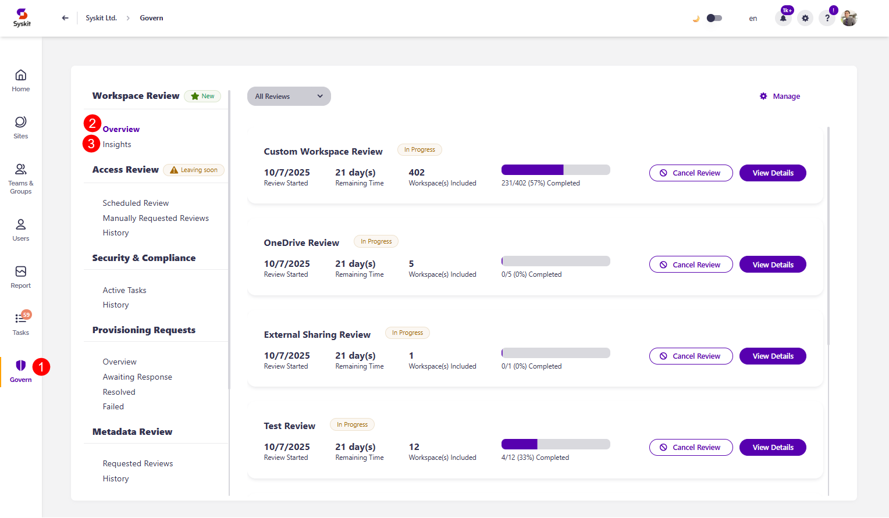

# Monitor Workspace Review

:::warning
**Please note!**\
To monitor workspace reviews, please make sure you have [enabled and configured at least one Workspace Review policy](../setup-workspace-review.md).
:::

The **Workspace Review policy** helps organizations **maintain and secure their Microsoft 365 environment by enabling regular, structured, and recommendation-driven review of the most essential workspace settings**. It provides automated tasks for workspace owners to review and resolve policy violations related to **access, privacy, and sensitivity**. 

Unlike Access Review, which focuses on reviewing users' access, the Workspace Review includes additional governance checks, such as: 

* **Inactive Workspaces** - reviewers can archive or delete workspaces that are no longer in use
* **Minimum Number of Owners** - reviewers can ensure that each workspace has enough active owners
* **Maximum Number of Owners** - reviewers can ensure that workspaces do not have too many owners
* **Privacy and Sensitivity Reviews** - reviewers can ensure that workspaces comply with organizational policies and are correctly labeled

Once you've [created your Workspace Review policies](../setup-workspace-review.md), based on your selected settings, reviewers receive tasks to review and ensure the safety of their workspace regularly.  

The Workspace Review in Syskit Point can be viewed from two different roles:

* **Syskit Point Admin user**, as described in this article
* [Syskit Point Collaborator user](../../../point-collaborators/workspace-review/workspace-review-overview.md)

When working with Workspace Review, Syskit Point Admin users can:

* **Define Workspace Review settings**
* **Decide which workspaces the policy applies to**
* **Monitor Workspace Review progress**

While Syskit Point Collaborators can **perform the Workspace Review on workspaces where they are the owner or admin**.

These two roles have **different reports and actions available** before and during the Workspace Review and receive different emails.

In this article, you can find out how **Syskit Point Admins** can monitor the progress of an active Access Review.

## Workspace Review - Governance

On the start date of the automated Workspace Review, **Workspace Review tasks are created in Syskit Point**, and **email requests are sent to reviewers**.

**Each reviewer gets one Workspace Review task**, and that task includes **all workspaces where the said user is an owner or admin**, based on the [how reviewers were defined for that Workspace Review policy](../../../governance-and-automation/workspace-review/setup-workspace-review.md).

To **track the progress** of currently active Workspace Reviews, **request a Workspace Review** for workspaces **manually**, or **cancel an existing review**, Syskit Point Admins can **use the Governance screen**. 

To access the Governance screen, **click the Govern button (1)** on the left side of the screen.

On the Governance screen, the **Workspace Review** is divided into two sections:
* [Overview](workspace-review-overview.md) (2)
* [Insights](workspace-review-insights.md) (3)

Click the above links to learn more about the Overview and Insight sections of Governance. 

If you are intersted in what happens after a workspace review is completed and the e-mails you can expect to receive, please take a look at the [Workspace Review Completion Summary article](workspace-review-insights.md).

