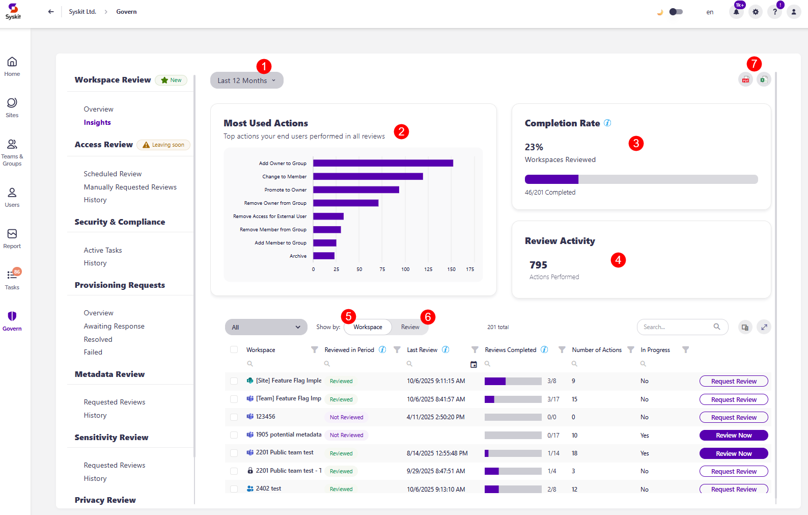

# Workspace Review Governace: Insights

Once you've accessed the Overview screen by clicking Govern > Workspace Review > Insights, you'll find more details on the state of your Workspace Review across a period of time.

* The **filter (1)** in the top left corner lets you **choose the time frame you want to generate the information for**, with the following options available:
  * **Last 3 Months**
  * **Last 6 Months**
  * **Last 12 Months**
  * **This Year**
  * **Custom**

* **The Most Used Actions (2)** shows the list of the most used actions for the workspace review, as well as graphs that indicate the number of times an action was performed 

* **Completion Rate (3)**, which shows the percentage of review completion as well as the number of workspaces the review was completed on out of the number of workspaces the review was requested on, for the duration you selected in the top filter

* **Review Activity (4)**, which shows the number of actions taken for the workspace review for the duration you selected in the top filter

There is also an **overview of workspaces** that the Workspace Review was applied to, which can be viewed in two ways:

* When **shown by Workspace (5)**, the following information is included: 
  * **Workspace** - name of the workspace
  * **Reviewed in Period** - shows whether the workspace was reviewed in the time frame you selected
  * **Last Review** - shows when the last review was performed on the workspace
  * **Reviews Completed** - the number of reviews in the selected time period, showing as N/M, with N being the number of completed reviews, and M the number of requested reviews
  * **Number of Actions** - the number of actions taken on the workspace as part of the workspace review
  * **In Progress** - whether a workspace review is currently active for the workspace
  * **Review Now action** - lets you complete the review on that workspace by yourself 
  * **Request Review action** - lets you immediately request a Workspace Review for that workspace

* When **shown by Review (6)**, the following information is included: 
  * **Policy Name** - the name of the Workspace Review policy that was applied
  * **Status** - the current status of the review for that workspace
  * **Requested Date** - the date the review was requested on 
  * **Completed Date** - the date the review was completed on
  * **Number of Actions** - the number of actions taken as part of the workspace review
  * **View Details button** - clicking this opens the review details screen for that workspace review policy, as was explained earlier in the [Overview section of the article](workspace-review-overview.md)

The Insights screen can be **exported as PDF and XLSX files (7)**.

For more details on what you can expect when your workspace review is completed, take a look at the [Completion Summary article](workspace-review-summary.md).