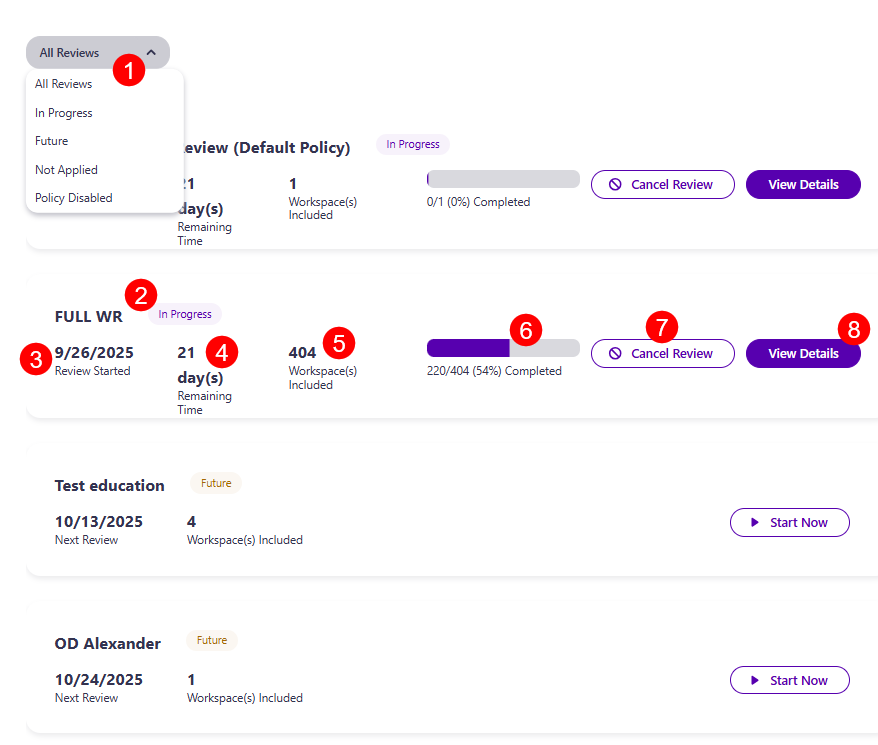
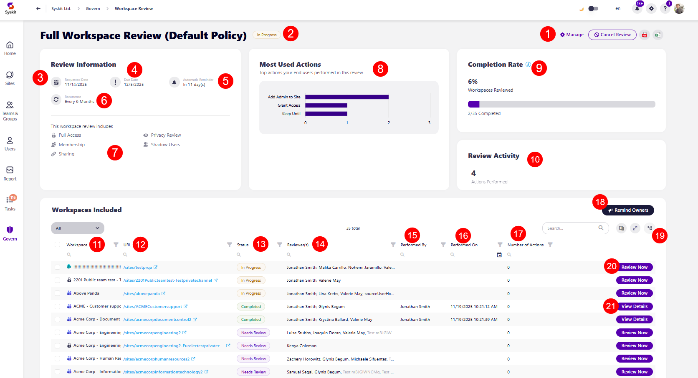

# Workspace Review Governance: Overview

Once you've accessed the Overview screen by clicking Govern > Workspace Review > Overview, you'll find a quick look at the state of your Workspace Review.

* The **filter in the top left corner (1)** lets you select between the view you want applied, with the following options available:
  * **All Reviews** - shows all Workspace Review policies 
  * **In Progress** - shows reviews that are currently in progress 
  * **Future** - shows scheduled reviews that will start sometime in the future
  * **Not Applied** - shows policies that are configured, but are not applied to any workspace
  * **Policy Disabled** - shows Workspace Review policies that are disabled, which means tasks and emails won’t be sent

Each workspace review contains the following: 
* **Name (2)** of the review and the **current state** of the review (example, requested, in progress)
* **Date (3)** the review was started
* **Time left (4)** to complete the review 
* **Number of workspaces (5)** included in this workspace review 
* **Percentage of tasks (6)** complete and number of workspaces where the review was completed out of the number of workspaces where it was requested
* **Cancel Review button (7)** - clicking this opens the confirmation dialog, where you need to confirm the cancellation
  * If you cancel a Workspace Review, the following happens:
    * All workspace review tasks are automatically closed with the status 'Canceled'
    * No emails are sent to workspace owners 
    * The canceled review is visible under Govern > Insights > Show by Review
* **View Details (8)** - clicking this opens the review details screen for that workspace review policy

After clicking the **View Details button**, the Workspace Review details screen appears, where the following can be found:

* **Review Information** which includes:
  * The **Manage button (1)**, which you can use to edit the Workspace Review Policy
  * **Name (2)** of the review and the current status
  * **Date (3)** the review was requested
  * **Due date (4)** by which the review should be completed on
  * **Amount of days (5)** when an automatic reminder is sent
  * **Recurrence time (6)**, which shows how often the workspace review is repeated
  * **A list of what this workspace review includes (7)** out of the following options:
    * Full Access
    * Sensitivity Review
    * Shadow Users
    * Privacy Review
    * Membership
    * Sharing

* **Most Used Actions (8)**, which shows the top actions that end users performed in this review

* **Completion Rate (9)**, which shows the percentage of review completion as well as the number of workspaces the review was completed on out of the number of workspaces the review was requested on

* **Review Activity (10)**, which shows the number of actions taken during this workspace review

* **Workspaces Included**, which provides a list and overview of all workspaces included in the review, with the following columns available:

  * **Workspace (11)** - name of the workspace
  * **URL (12)** - URL for the workspace
  * **Status (13)** - the current status of the review for that workspace
  * **Reviewer(s) (14)** - list of reviewers responsible for that workspace
  * **Performed by (15)** - shows who the review was performed by
  * **Performed on (16)** - shows the date when the review was performed
  * **Number of Actions (17)** - the number of actions taken on the workspace as part of the workspace review
  * **Remind Owners action (18)** - in the top right corner, clicking this sends an email reminder to reviewers for the workspaces where the Workspace Review was not yet completed
  * **Review Now action (19)** - lets you complete the review on that workspace by yourself 

For more details on your Workspace Review, you can proceed to the [Insights](workspace-review-insights.md) section of Governance, or check out the 
[Completion Summary](workspace-review-summary.md) for information on what you can expect when your workspace review is completed. 
