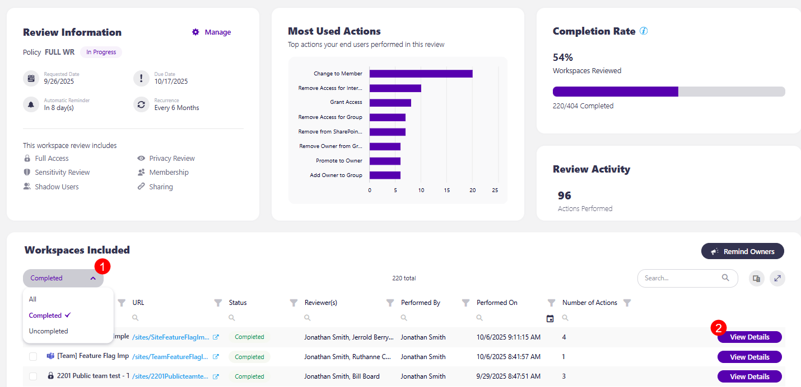
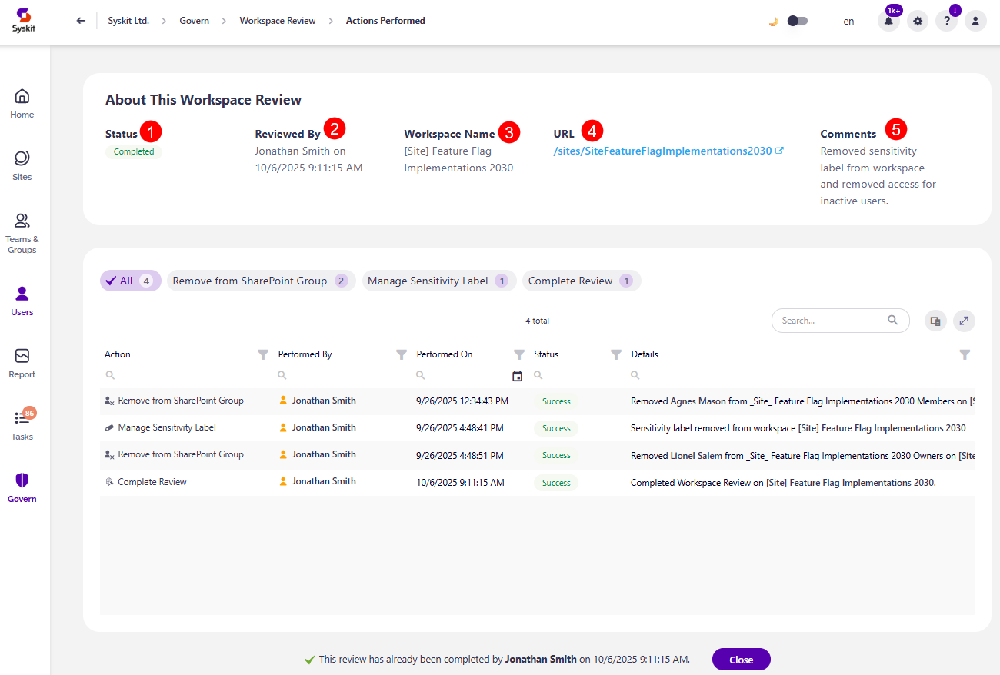
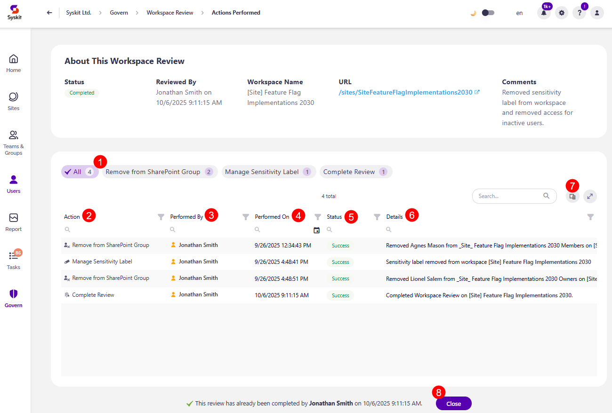
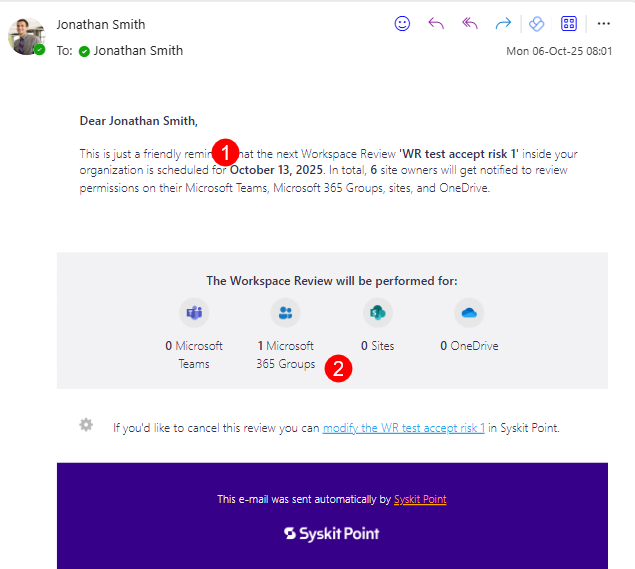

# Workspace Review: Completion Summary

When at least one workspace has its workspace review task completed, you can view the **Actions Performed** screen. Here's how you'll **get a summary of your workspace reviews per workspace**. 

On the **Govern > Workspace Review > Overview > View Details**, scroll to the Workspaces Included section and from the left side filter select **Completed (1)**. 

This lists the workspaces for which the review was completed, and by clicking the **View Details button (2)**, the Actions Performed screen opens for that workspace. 

On the **Actions Performed** screen, the following is available:

* **About This Workspace Review section** that contains information on:
  * **Status (1)** of the review 
  * **Reviewed By (1)** shows who reviewed the workspace and when
  * **Workspace Name (3)** shows the name of the workspace
  * **URL (4)** shows a clickable URL for the workspace
  * **Comments (5)** column shows any comments left by reviewers while resolving the workspace review task for the workspace

* **Actions Performed filter (1)**, which lists all the actions performed on the workspace, along with the number of times it was performed
  * **Clicking on an action filters the actions report below** to reflect only information for the action selected

* **Actions Performed report** with the following columns:
  * **Action (2)** shows what action was performed
  * **Performed By (3)** shows who performed the action
  * **Performed On (4)** shows when the action was performed
  * **Status (5)** shows the status of the action and whether it was performed successfully
  * **Details (6)** shows more details about the action performed

* The additional columns available from the **column chooser (7)** are:
  * **Scope**
  * **Execution End Time**
  * **Name**
  * **URL**
  * **Error**

* At the bottom, you can find information on who completed the review and when, along with a **Close button (8)**. 
  * Clicking on the Close button returns you to the Workspace Review Overview screen. 

# Admin Emails for Workspace Reviews

Syskit Point Admin users receive an email before the very start of the review as a reminder and at the end of the review with a quick summary of reviews completed. 

## Admin Reminder

Three workdays before the start of the automated Workspace Review, the Syskit Point Admin receives a reminder email with the most important information about the upcoming Workspace Review:

* **Start date (1)** of the upcoming Workspace Review
* **The number and type of workspaces (2)** - Microsoft Teams, Microsoft 365 Groups, sites, and OneDrive - which are included in the upcoming Workspace Review

:::warning
**Please note!**\
To ensure that all sites have an owner responsible for the upcoming Workspace Review, set active users as site owners for all orphaned sites.
:::

## Workspace Review Completion

Once the entire Workspace Review is completed or the time frame for the Workspace Review resolution has passed, you receive a **Workspace Review Completion email**. 

In this email, you can find out how many workspace review tasks were completed and how many workspaces were reviewed. 

The following information is provided:
* **Total number of workspaces** for which the Workspace Review was completed
* **Total number of workspaces** where Workspace Review was not completed
* **View Details** button 

Clicking the **View Details** button takes you to the [Overview](workspace-review-overview.md) screen, where you can find more details on each workspace and the actions completed during the review. 

In addition to receiving an email, you can find the completed Workspace Review by clicking the **Govern** button on the left side of the screen. 
