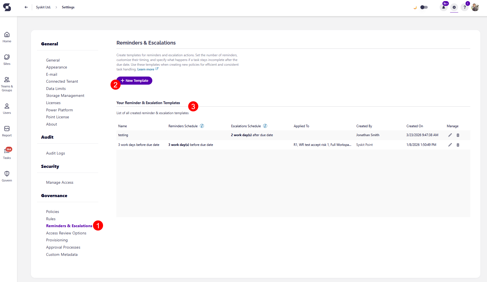
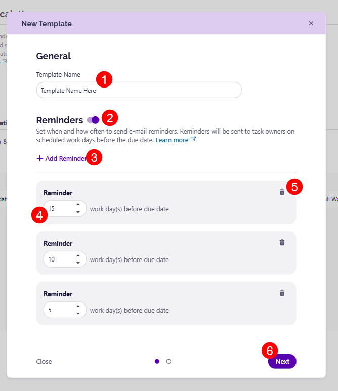

# Reminders Templates 

Reminders help ensure that reviews and policy-related tasks are completed on time, without requiring manual follow-up with reviewers. 

With Reminders, you can create multiple reminder templates that automatically send email notifications to task owners a set amount of time before the task's due date. These templates can then be applied to different policies, allowing you to tailor the frequency of reminders depending on the type of policy and how quickly you need the policy task completed.

:::warning

**Please note:** At this time, **Reminder Templates can only be applied to Workspace Review policies**.  

:::

## Create Reminder Template

To create your Reminder Templates, go to **Settings > Governance > Reminders (1)**. Here, you are able to:
* Create a **New Template (2)**
* View your **current reminder templates (3)** if there are any

Clicking New Template, opens the **New Template dialog** screen where you can:
* When you have decided on a name for your reminder template, enter the **Template Name (1)** in the designated space
* **Decide on the number of workdays (2)** before the due date that a reminder should be sent
* If you want multiple reminders, click the **Add Reminder (3)** button, which adds another Reminder box where you can enter the number of days.
  * This can be useful if you want to ensure multiple reminders for a policy are sent. For example, 15 work days before the due date, 10 work days before the due date, and 5 work days before the due date
* Use the **delete (4)** icon to remove a reminder if you change your mind
* Click **Save (5)** once you are done to store your template

## Apply Reminder Template

Once you've created your Reminder Template, you'll want to apply it to your policies. Currently, you can only apply reminder templates to Workspace Review policies.

To ensure a Reminder Template is included in your workspace review, **please follow [the directions in the set up Workspace Review article](setup-workspace-review.md).** You can apply your reminder template during the second step of the setup process, in the Schedule Review section.