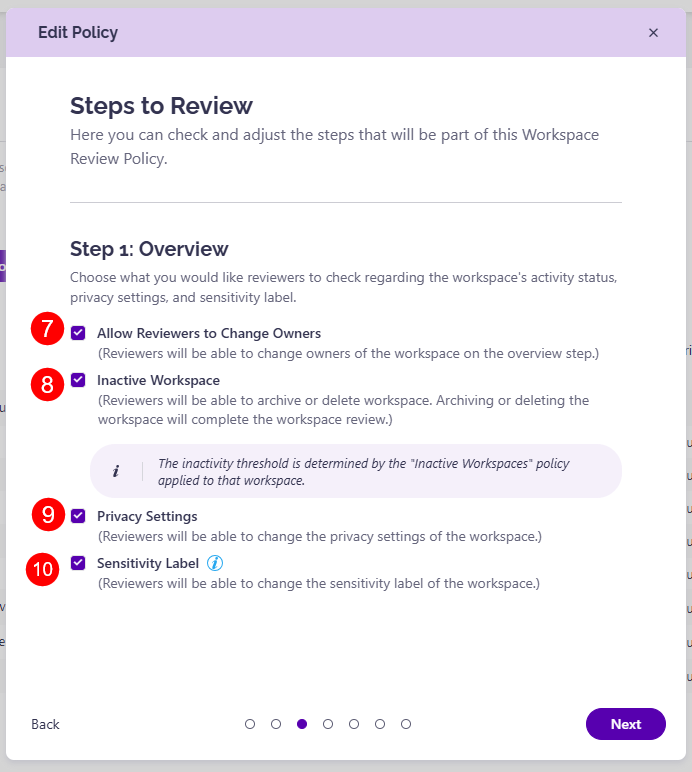
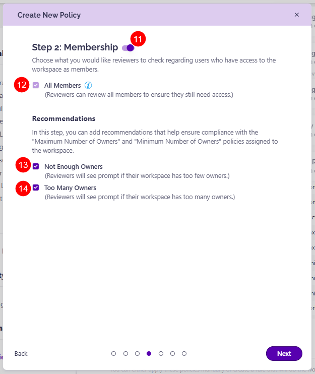
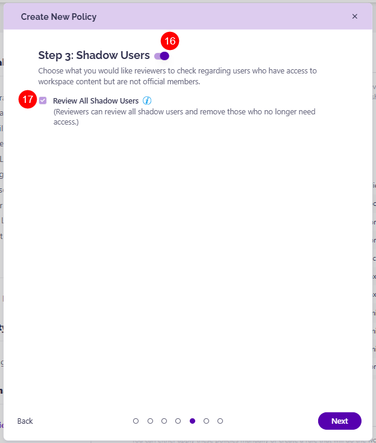
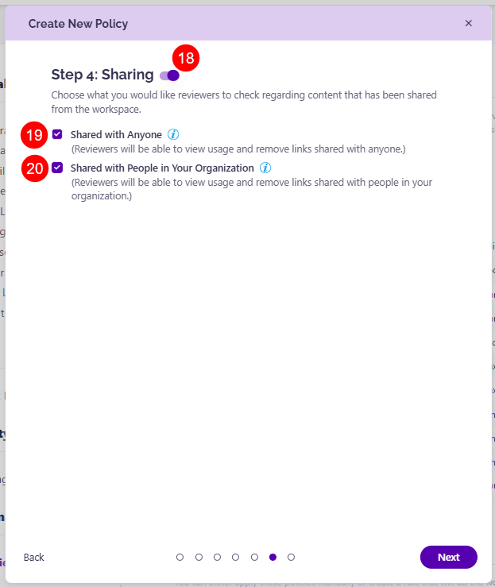

# Configure Workspace Review

The **Workspace Review** policy helps you maintain control over your Microsoft 365 workspaces by **regularly asking workspace owners to confirm the access, activity, and security of their workspaces**. This policy includes a **privacy and sensitivity review, broader governance policies, and introduces smarter, recommendation-driven tasks**. 

Admins can define custom workspace review policies that trigger during specified review cycles, ensuring that workspace owners regularly evaluate their workspaces for inactivity, privacy requirements, sensitivity labels, permissions given, or ownership level.

Here's a quick overview of what setting up and using the Workspace Review looks like: 

* **Admins configure Workspace Review policies**
  * Set the schedule, define the review scope, and select which workspaces should be included 
* **Workspace owners complete reviews**
  * When a review is due, owners receive a task in Syskit Point along with an email notification. Tasks include workspace details and suggested actions (for example, change the privacy or sensitivity label, remove user access, remove sharing link) to simplify their decision-making
* **Admins monitor the review progress**
  * From the Workspace Review dashboard, admins can track which workspaces have been reviewed, see completed actions, and gain insights into the effectiveness of each review cycle 

## Configure Workspace Review Policies

With Workspace Review, you can **ask site owners to perform regular Workspace Reviews on their workspaces**, and depending on the specific needs of a workspace, have different Workspace Reviews active with distinct settings. 

:::warning

**Please note:** A workspace can currently have only one active Workspace Review policy assigned to it. 
:::

To set up your Workspace Review policy, navigate to **Settings > Policies**. 

* **Click the Create New Policy button (1)**
* **Select Workspace Review (2)** from the list of available policies
* **Choose between using a template or building your own** Workspace Review from scratch:
  * **Memberships (3)** - a template to review only workspace members and owners
  * **External Sharing (4)** - a template to review external users, guests, and shared content only
  * **Full Review (5)** - a template to review all users and sharing types during one review 
  * **Start From Scratch (6)** - configure a custom review policy to fit your team's needs. 

While **the steps for the policy setup are the same** for all of the above options, when one of the **template options** is selected, and depending on the template, **certain steps are automatically enabled**. These steps can be turned off while editing the policy.

### Policy Steps

As an example for this article, we will select the Membership template for the Workspace Review policy. 

Selecting the Memberships template gives you the following options:
* **Define the policy name (1)**
* **Choose what to review (2)**:
  * **Internal and External Access** - reviewers will be asked to check both internal and external access
  * **External Access Only** - reviewers will be asked to check external access
    * **Please note** that Membership step recommendations for Minimum and Maximum number of Owners policies are not available if you select this option

* **Select the Review start date and time (3)**
  * The first Workspace Review with these settings will start at the date and time you select here
* **Choose the Recurrence pattern (4)** 
  * Select how often this review should repeat
* **Select the number of work days (5)** reviewers have to complete the task 
  * **Click the checkmark (6)** if you want to:
    * **Send a reminder 3 work days before** the due date
    * **Receive completion emails** - selecting this sends an email every time a reviewer finishes the workspace review
      * The email will be sent to the co-reviewers for that Workspace Review task

* **Choose what you want the reviewers to check** regarding the workspace's activity status, privacy settings, and sensitivity review
  * **Allow Reviewers to Change Owners (7)** - reviewers will be able to change the owners of the workspace on the overview step
  * **Inactive Workspace (8)** - reviewers will be able to archive or delete the workspace. Archiving or deleting the workspace will complete the workspace review
  * **Privacy Settings (9)** - reviewers will be able to change the privacy settings of the workspace
  * **Sensitivity label (10)** - reviewers will be able to change the sensitivity label of the workspace

* For this template, the **Membership toggle is automatically switched on (11)**; however, clicking the toggle turns this step off
  * Here, you **choose what you want the reviewers to check** regarding users who will have access to the workspace as members
    * The **All Members checkbox is automatically selected (12)** as it is a default part of the Membership step and will always be visible in any review where Membership is enabled
    * In this step, you can also **add recommendations that help ensure compliance** with the Minimum Number or Owners and Maximum Number of Owners policies assigned to the workspace
      * **Not Enough Owners (13)** - reviewers will see a prompt if their workspace has too few owners
      * **Too Many Owners (14)** - reviewers will see a prompt if their workspace has too many owners

:::warning

* If the Not Enough Owners and/or Too Many Owners options are selected as part of the Workspace Review and a vulnerability is detected, reviewers cannot move forward from this step and complete the review without resolving the vulnerability.

:::

* Next, **you can turn on Shadow Users by clicking the toggle next to it (16)** if you want reviewers to check on **users that have access to workspace content but are not official members**
  * If you click the toggle and turn the option on, you can find the **Review All Shadow Users (17)** checkbox - with this, reviewers can review all shadow users and remove those who no longer need access
    * The checkbox will be automatically selected as it is a default part of the step

* **Turn on Sharing by clicking the toggle next to it (18)** if you want reviewers to choose what you would like reviewers to check regarding **content that has been shared from the workspace**
  * If you click the toggle and turn the option on, the following options are available:
    * **Shared with Anyone (19)** - clicking the checkbox lets reviewers view usage and remove links shared with anyone
    * **Shared with People in Your Organization (20)** - clicking the checkbox lets reviewers view usage and remove links shared with people in your organization

* Finally, **define the reviewers** by deciding who will be performing workspace reviews on each workspace where this policy is applied: 
  * **For SharePoint Sites (21)**
    * Primary Admin/Owner
    * Site Admins Group
    * Site Owners
  * **For Microsoft 365 Groups and Microsoft Teams (22)**
    * Team Owners
    * Site Admins Groups
  * **For OneDrive (23)**
    * Primary Admin/Owner
    * Site Admins Group
  * **For Private Channels (24)**
    * Team Owners
    * Channel Owners
    
* Click **Finish (25)** once you are done with the policy configuration 

:::warning

**Please note:** To ensure Site Owners and Admins can access Syskit Point and complete their assigned Workspace Review tasks, make sure the **Add users with Full Control** option is selected for the [Syskit Point Collaborators role](../../configuration/enable-role-based-access.md#syskit-point-collaborators). 

:::

## Next Steps

The Workspace Review policy needs to be applied to a workspace either automatically with Rules or manually. [For details on how to apply the policy to your workspaces, take a look at this article.](../automated-workflows/manage-policies.md#apply-policies-1)

Once you are finished with the policy configuration, read the [Monitor Workspace Review](monitor-workspace-review/README.md) article for more details on how to monitor the progress of your workspace reviews.

For information on Syskit Point Collaborators completing Workspace Review tasks, take a look at the [Complete Workspace Review article](../../point-collaborators/workspace-review/workspace-review-overview.md).
