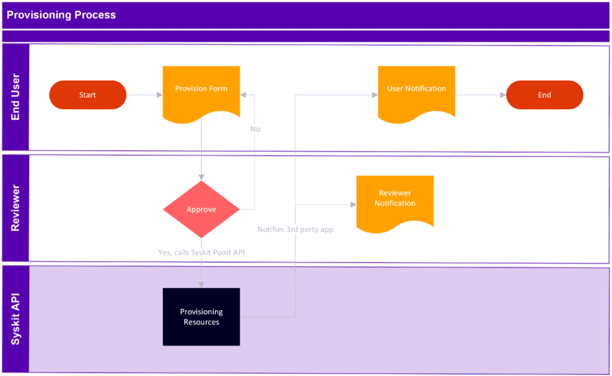

# Webhooks

Webhooks are **push notifications sent by Syskit Point as HTTP requests to a registered webhook endpoint when an event occurs**.

Many businesses rely on **ServiceNow** and **Atlassian Jira** as their central IT service desk solutions. 

While Syskit Point helps streamline the provisioning of Microsoft 365 workspaces, provisioning workflows often involve tasks beyond Microsoft 365, which are not directly managed within Syskit Point.

When an existing service desk is in place, customers often opt to build the approval and provisioning process in the tool their end users are already familiar with. They then rely on Syskit Point to provision the needed workspace.

## Benefits
Here are some benefits of integrating with Service Desk Solutions:

* **Leverage familiar tools** for end-users
* **Design robust, customizable approval workflows** that align with business processes
* **Centralize resource requests**, enabling easier integration with internal systems like billing.

## General Process Flow for 3rd Party Integration
The general process flow for 3rd party integration includes:

* **User Requests** 
  * The user requests a Microsoft 365 workspace via the service desk solution
* **Approval** 
  * Approval occurs entirely within the service desk solution 
* **Provisioning** 
  * Upon approval, Syskit Point is notified via an API call, which triggers the workspace provisioning.

The above image shows a provisioning process where: 
  * End user and Reviewer perform their part of the process in a third-party tool
  * Upon approval, Syskit Point API is called to finish the provisioning of Microsoft 365 resources

## Prerequisites

There are a couple of steps to complete before preparing a 3rd third-party system to integrate with Syskit Point. The following is needed: 

* Create a new Provisioning Template in Syskit Point that the API will use
  * While you can choose other options freely, you must choose an automated approval process for this template.
  * The [provisioning template](../../governance-and-automation/provisioning/templates.md) used by API should have the approval process property set to `Automatically Approve`.

* Follow the instructions in the [Syskit Point API article](../syskit-point-api.md) on how to create an Microsoft Entra ID App used to authenticate against the API
  * This app should have the “Point.Provisioning” privilege selected and consented to

* Make sure you note the following info as it will be needed when configuring integration later on:
  * Syskit Point URL
  * Directory (Tenant) Id
  * Syskit Point API Application (client) ID
  * Client Id
  * Client Secret

* Navigate to the [API Swagger article](../overview.md#swagger-documentation) to familiarize yourself with the API you will be using
  * Use the GET “/v1.0/provision/templates” to retrieve the list of existing provisioning templates and note the template ID you created in Step 1 of this guide

## What’s next

To continue exploring different ways you can integrate Syskit Point with 3rd party tools such as Jira or ServiceNow, take a look at the following articles:

* [Integrate Syskit Point with Service Now](servicenow-example.md) 
* [Integrate Syskit Point with Jira](jira-example.md)  