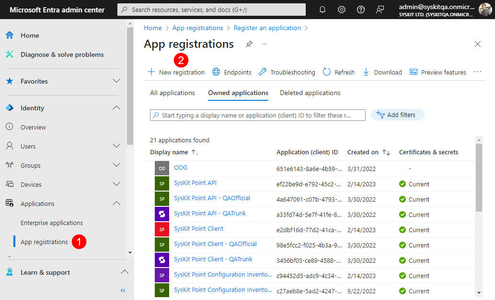
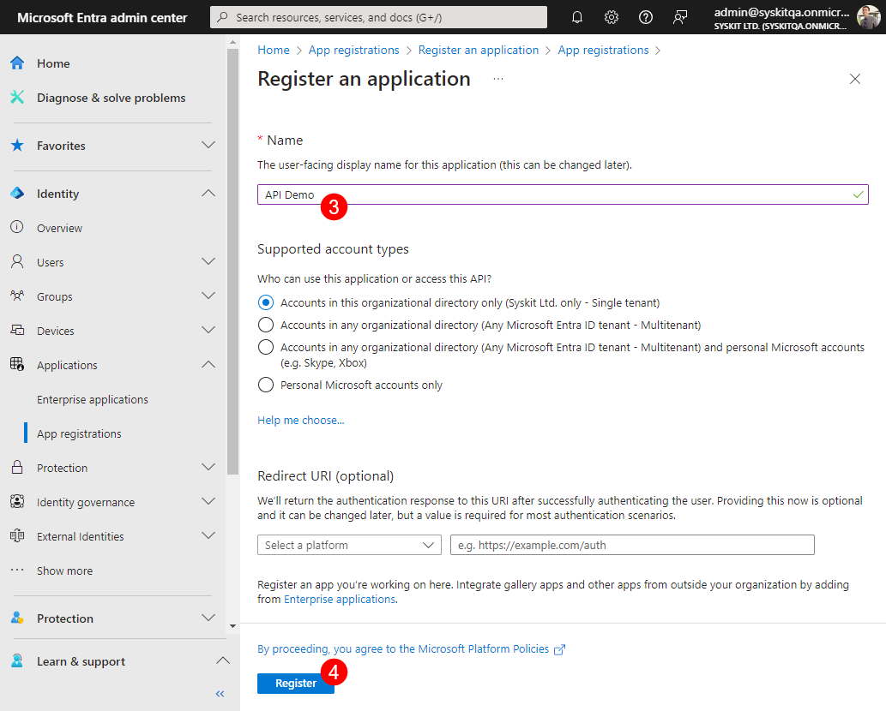
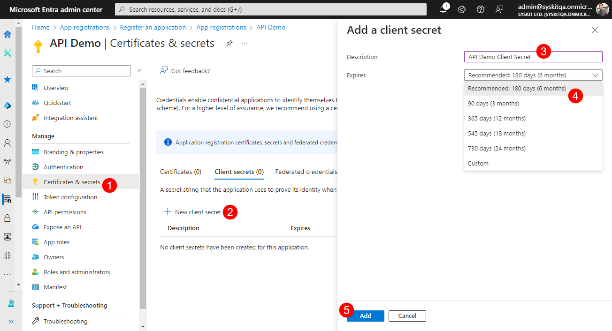
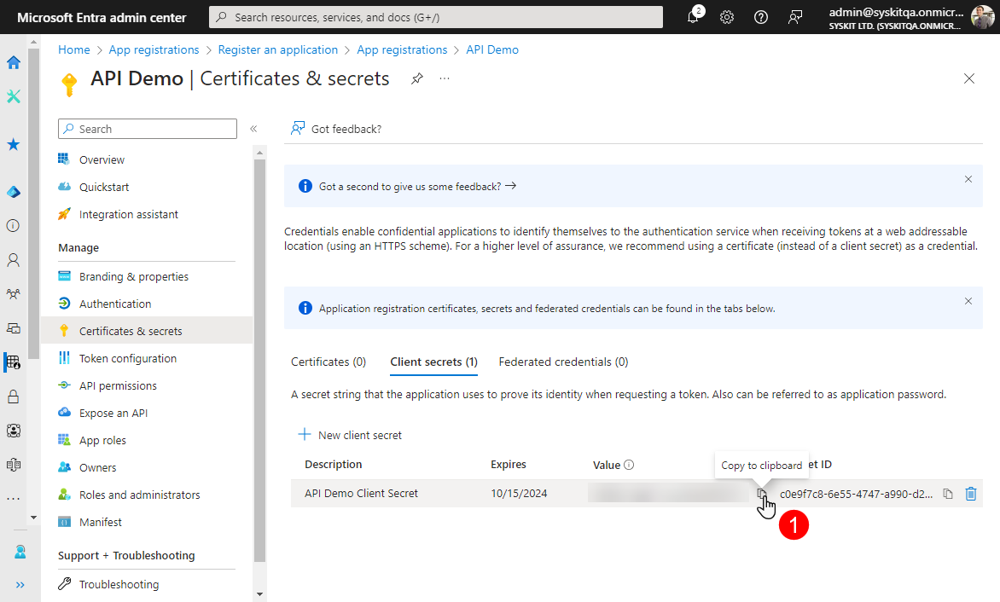
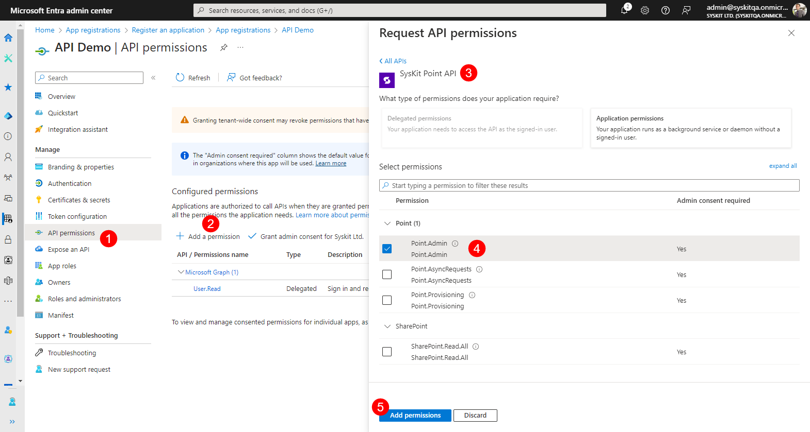
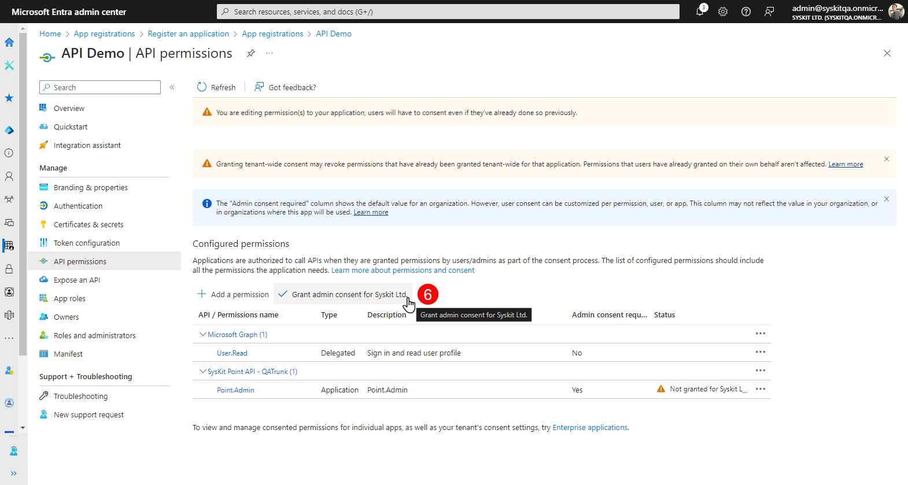
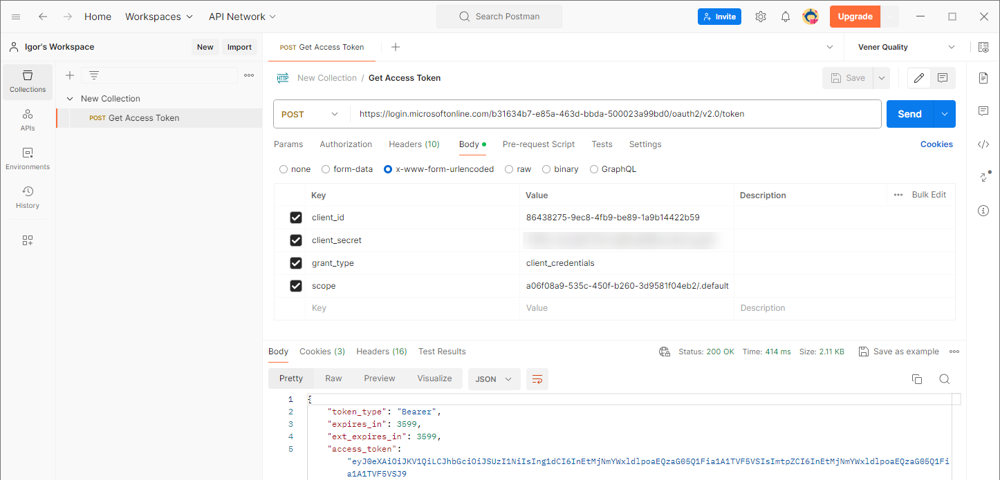
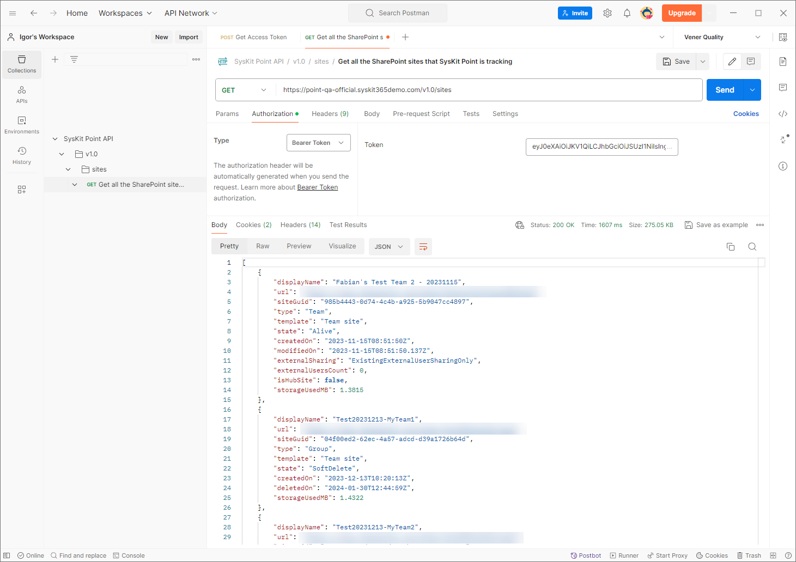

import Tabs from '@theme/Tabs';
import TabItem from '@theme/TabItem';
import HttpMethod from '@site/src/components/HttpMethod';

# Syskit Point API

:::info
**Please note!** To utilize Provisioning via Syskit Point API, the Governance plan or above is required.\
See the [pricing page](https://www.syskit.com/products/point/pricing/) for more details.
:::

In this article, you can find the steps to create your first request to your Syskit Point web app. You will need to perform the following steps:

* **Create and set an app registration in Microsoft Entra ID**
* **Fetch the `access_token`**
* **Send your first request** to Syskit Point

## Prerequisites

To complete the steps described in this article, make sure to have the following:

* **Syskit Point Instance** - running Point Cloud or Enterprise instance
* **Microsoft Entra/Microsoft Entra ID Access** - you should be able to create an App registration in Microsoft Entra ID

## Microsoft Entra Setup

To enable Postman to get access tokens for API requests, you must create and configure an additional App registration in Microsoft Entra.

First, create the New app registration:

* **Navigate to** [Microsoft Entra > Identity > Applications > App registrations](https://entra.microsoft.com/#view/Microsoft_AAD_RegisteredApps/ApplicationsListBlade/quickStartType~/null/sourceType/Microsoft_AAD_IAM) **(1)**
* **Create a new registration** by clicking the **New registration button (2)**
  * **Provide a Name (3)** - e.g., **API Demo**
  * **Click Register (4)**





Second, create a new client secret:

* **Navigate to Manage > Certificates & Secrets (1)**
* **Click the New client secret option (2)** - a sidebar opens where you can:
  * **Enter client secret description (3)**
  * **Define expiration (4)**
  * **Click Add (5)** to finish



:::info
**Please note!** **Once the new client secret is created, immediately copy (1) and save the client secret value to the side.**
:::



Afterward, configure API permissions:

* **Navigate to Manage > API Permissions (1)**
* **Click Add a permission option (2)** - a sidebar opens where you should:
  * **Select the APIs my organization uses tab; search and find Syskit Point API (3) and click to select** - sidebar shows new information
  * **Select the displayed permission (4)**
    * We strongly encourage applying the principle of least privilege and providing the minimum level of permissions required to accommodate your integration requirements
    * [Find more details about available permissions in the Permissions section](syskit-point-api.md#permissions)
  * **Click Add permissions (5)**
* **Click the Grant admin consent option (6)** - confirmation dialog opens: **Click Yes to confirm**





Lastly, **collect the following data and save to the side with the client secret value stored before**:

* **Application (client) ID**
* **Directory (tenant) ID**
* **Syskit Point API Application (client) ID** - find the _Syskit Point API_ app registration and copy the Application (client) ID from the Overview screen

## Permissions

There are 4 permissions providing access to different Syskit Point endpoints:

* **SharePoint.Read.All**
* **Point.AsyncRequests**
* **Point.Provisioning**
* **Point.Admin**

Find the permission required for specific endpoints/requests below.

### WebHooksEndpoint

Required permission: **Point.Admin**

<table><thead><tr><th width="400">Request</th><th>Description</th></tr></thead><tbody><tr><td><HttpMethod method="POST" /> /v1.0/webhook/endpoints</td><td>Add an endpoint to which Syskit Point will post webhook events. Specify a valid URL and list of event types to be notified about.</td></tr><tr><td><HttpMethod method="GET" /> /v1.0/webhooks/endpoints</td><td>Retrieves a list of all webhook endpoints currently registered in Syskit Point. Use this to view all registered webhook endpoints.</td></tr><tr><td><HttpMethod method="DELETE" /> /v1.0/webhooks/endpoints</td><td>Deletes a specific webhook endpoint from Syskit Point. Include the endpoint URL in the request body to identify which endpoint to remove.</td></tr></tbody></table>

### Users

Required permission: **SharePoint.Read.All**

<table><thead><tr><th width="316">Request</th><th>Description</th></tr></thead><tbody><tr><td><HttpMethod method="POST" /> /v1.0/users/access/generate</td><td>Initiate a request to receive information about SharePoint access for a given user.</td></tr></tbody></table>

### SharePointSites

Required permission: **SharePoint.Read.All**

<table><thead><tr><th width="347">Request</th><th>Description</th></tr></thead><tbody><tr><td><HttpMethod method="POST" /> /v1.0/sites/permissions/generate</td><td>Initiate a request to receive information about permissions on a list of SharePoint sites.</td></tr><tr><td><HttpMethod method="GET" /> /v1.0/sites</td><td>Get a list of all SharePoint sites Syskit Point is tracking.</td></tr></tbody></table>

### Groups

Required permission: **SharePoint.Read.All** OR **Point.AsyncRequests**

<table><thead><tr><th width="364">Request</th><th>Description</th></tr></thead><tbody><tr><td><HttpMethod method="POST" /> /v1.0/groups/memberships</td><td>Initiate a request to receive information about group memberships for provided group IDs.</td></tr><tr><td><HttpMethod method="GET" /> /v1.0/groups</td><td>Get the groupID and other relevant information for all groups tracked by Syskit Point.</td></tr><tr><td><HttpMethod method="GET" /> /v1.0/groups/&#123;groupName&#125;</td><td>Get the groupID and other relevant information for a single group based on the provided group name.</td></tr><tr><td><HttpMethod method="GET" /> /v1.0/groups?groupType=&#123;groupType&#125;</td><td>Get the groupID and other relevant information for all groups that match the provided groupType. The following group types are available: DistributionList, UnifiedGroup, SecurityGroup, MailEnabledSecurityGroup</td></tr></tbody></table>

### Provisioning

Required permission: **Point.Provisioning**

<table><thead><tr><th width="357">Request</th><th>Description</th></tr></thead><tbody><tr><td><HttpMethod method="POST" /> /v1.0/provision/teams</td><td>Provision Microsoft Teams based on a provisioning template.</td></tr><tr><td><HttpMethod method="POST" /> /v1.0/provision/groups</td><td>Provision Microsoft 365 Groups based on a provisioning template.</td></tr><tr><td><HttpMethod method="POST" /> /v1.0/provision/sites</td><td>Provision SharePoint sites based on a provisioning template.</td></tr><tr><td><HttpMethod method="POST" /> /v1.0/provision/yammer</td><td>Provision Viva Engage Communities based on a provisioning template.</td></tr><tr><td><HttpMethod method="GET" /> /v1.0/provision/templates</td><td>Get all provisioning templates in Syskit Point.</td></tr><tr><td><HttpMethod method="GET" /> /v1.0/provision/requests/&#123;requestId&#125;</td><td>Get status for a provisioning request with specified request ID.</td></tr></tbody></table>

:::info
**Please note!** To automatically approve provisioning requests created via API requests, use provisioning templates with the Approval Process property set to 'Automatically Approve'.
:::

### Governance

Required permission: **Point.Admin**

<table><thead><tr><th width="400">Request</th><th>Description</th></tr></thead><tbody><tr><td><HttpMethod method="POST" /> /beta/governance/metadata/update</td><td>Bulk update custom metadata on multiple SharePoint sites using a JSON request body.</td></tr><tr><td><HttpMethod method="POST" /> /beta/governance/metadata/update/upload</td><td>Bulk update custom metadata on multiple SharePoint sites using a <code>.csv</code> or <code>.json</code> file upload.</td></tr></tbody></table>

For request body schemas, file formats, and the polling pattern, see [Bulk Metadata Update](syskit-point-api.md#bulk-metadata-update).

### Options

Required permission: **Point.Admin**

<table><thead><tr><th width="192">Request</th><th>Description</th></tr></thead><tbody><tr><td><HttpMethod method="GET" /> /v1.0/options</td><td>Get options available for use with Syskit Point API and Webhooks.</td></tr></tbody></table>

### AsyncRequests

Required permission: **SharePoint.Read.All** OR **Point.AsyncRequests**

<table><thead><tr><th width="342">Request</th><th>Description</th></tr></thead><tbody><tr><td><HttpMethod method="GET" /> /v1.0/requests/&#123;requestId&#125;/status</td><td>Get the status of a request with the specified request ID.</td></tr><tr><td><HttpMethod method="GET" /> /v1.0/requests/&#123;requestId&#125;/result</td><td>Get the result of a request with the specified request ID.</td></tr></tbody></table>

While a request has `Status = InProgress`, the status response may include an optional `progress` object that reports how far a long-running job has advanced:

<Tabs>
<TabItem value="in-progress" label="InProgress">
```json
{
  "progress": {
    "processedSites": 3500,
    "totalSites": 10000
  }
}
```
</TabItem>
</Tabs>

The `progress` field is **omitted from the payload** (not returned as `null`) when progress information is not available for the request.

## Fetch the `access_token`

Here, you can find an example of how to fetch the `access_token` using Postman.

Create a new POST request:

<HttpMethod method="POST" /> `https://login.microsoftonline.com/<tenant-id>/oauth2/v2.0/token`

Replace the `<tenant-id>` in your request with your Directory (tenant) ID saved in the previous step.

**Body** Include the following parameters in the request body

<table><thead><tr><th width="189">Name</th><th width="104">Type</th><th>Description</th><th>Example Value</th></tr></thead><tbody><tr><td><code>client_id</code></td><td>string</td><td>Application (client) ID of the created app registration</td><td>0a1948f2-b37b-4c38-8430-2c3ad19ba71c</td></tr><tr><td><code>client_secret</code></td><td>string</td><td>Client secret created in the previous step</td><td>Ma8QhffkTUrO53J8XpKQWl-rnsw.4l~_AG-arJ</td></tr><tr><td><code>grant_type</code></td><td>string</td><td>Enter the string 'client_credentials'</td><td>client_credentials</td></tr><tr><td><code>scope</code></td><td>string</td><td>Combine the Application (client) ID of Syskit Point API app registration and string '/.default'</td><td>ee22be9d-e792-45c2-8955-deb8fd565aa5/.default</td></tr></tbody></table>

Click Send and wait for the response.

The provided example is shown in the image below:



Copy the `access_token` property from the response to use in further requests to your Syskit Point web app.

## Example Request

Using Postman, let's create the first request to your Syskit Point web app.

Create a new GET request:

<HttpMethod method="GET" /> \{\{pointWebAppUrl\}\}/v1.0/sites

Under Authorization > Type, select `Bearer Token` and paste the `access_token` retrieved in the previous step.

Click Send and wait for the response.

The provided example is shown in the image below:



## Bulk Metadata Update

The Governance endpoints allow you to apply custom metadata across many SharePoint sites in a single asynchronous request, instead of updating each workspace individually.

:::warning
**Please note!**\
The application used to run bulk metadata updates needs to have the `Point.Admin` app role.
:::

You can submit an update in two ways:

* **Using a JSON request body**
* **Using a `.csv` or `.json` file upload**

Both requests return a `202 Accepted` response with a `RequestStatus`. Use the returned request ID to poll for progress and results, as described in [Poll for Status and Result](syskit-point-api.md#poll-for-status-and-result).

### Update Metadata Using a JSON Body

To update metadata using a JSON request body, use the following POST request:

<HttpMethod method="POST" /> &#123;&#123;pointWebAppUrl&#125;&#125;/beta/governance/metadata/update

#### Headers

| Name          | Value              |
| ------------- | ------------------ |
| Content-Type  | `application/json` |
| Authorization | `Bearer <token>`   |

**Body**

| Name       | Type  | Description                                                               |
| ---------- | ----- | ------------------------------------------------------------------------ |
| `siteUrls` | array | URLs of the SharePoint sites to update.                                  |
| `metadata` | array | Metadata definitions to apply, each as a `name` and `value` pair.        |

<Tabs>
<TabItem value="example" label="Example">

```json
{
  "siteUrls": ["https://contoso.sharepoint.com/sites/finance"],
  "metadata": [{ "name": "Department", "value": "Finance" }]
}
```

</TabItem>
</Tabs>

### Update Metadata Using a File Upload

To update metadata using a file, use the following POST request with a `multipart/form-data` body that contains a single `.csv` or `.json` file:

<HttpMethod method="POST" /> &#123;&#123;pointWebAppUrl&#125;&#125;/beta/governance/metadata/update/upload

#### Headers

| Name          | Value                   |
| ------------- | ----------------------- |
| Content-Type  | `multipart/form-data`   |
| Authorization | `Bearer <token>`        |

**CSV file format**

When uploading a `.csv` file, follow these rules:

* The **first column header** must be `SiteUrl` (case-insensitive).
* Each **subsequent column header** is the name of a custom metadata definition, and each cell holds the value to apply to that site.
* An **empty cell** skips that metadata field for that row.

<Tabs>
<TabItem value="csv" label="Sample CSV">

```csv
SiteUrl,Department,CostCenter,DataOwner
https://contoso.sharepoint.com/sites/finance,Finance,CC-1001,Jane Doe
https://contoso.sharepoint.com/sites/hr,HR,CC-2002,John Smith
https://contoso.sharepoint.com/sites/legal,Legal,,Ana Kelly
```

</TabItem>
</Tabs>

**JSON file format**

When uploading a `.json` file, use the same schema as the JSON request body and send it as the file part of the request.

<Tabs>
<TabItem value="json-file" label="Sample JSON">

```json
{
  "siteUrls": [
    "https://contoso.sharepoint.com/sites/finance",
    "https://contoso.sharepoint.com/sites/hr"
  ],
  "metadata": [
    { "name": "Department", "value": "Finance" },
    { "name": "CostCenter", "value": "CC-1001" }
  ]
}
```

</TabItem>
</Tabs>

### Poll for Status and Result

Bulk metadata updates run asynchronously. After the request returns a `202 Accepted` response, use the request ID to follow the job to completion:

* **Submit** the update to `/beta/governance/metadata/update` or `/beta/governance/metadata/update/upload`, then read the request ID from the returned `RequestStatus`.
* **Poll** the status endpoint until the status changes. While the status is `InProgress`, the response may include a `progress` object, as described in the [AsyncRequests](syskit-point-api.md#asyncrequests) section.

  <HttpMethod method="GET" /> &#123;&#123;pointWebAppUrl&#125;&#125;/v1.0/requests/&#123;requestId&#125;/status
* **Retrieve the result** once the status is `Succeeded`. The status endpoint then returns a `302` redirect to the result location.

  <HttpMethod method="GET" /> &#123;&#123;pointWebAppUrl&#125;&#125;/v1.0/requests/&#123;requestId&#125;/result

### Result Payload

The result of a bulk metadata job summarizes how many sites succeeded or failed:

<Tabs>
<TabItem value="result" label="Result">

```json
{
  "totalSites": 10000,
  "successCount": 8000,
  "failedCount": 2000,
  "errorsTruncated": false,
  "errors": [
    { "siteUrl": "https://contoso.sharepoint.com/sites/unknown", "error": "Site not found in SysKit Point" }
  ]
}
```

</TabItem>
</Tabs>

The `errors` array lists the sites that could not be updated:

* The array is capped at **1000** entries. When more sites fail than that, `errorsTruncated` is set to `true` to indicate the list was truncated.
* Common error messages include:
  * `Site not found in SysKit Point`
  * `Metadata definition '<name>' not found`

## Syskit Point API Documentation

To find more information about the Syskit Point API, navigate to the provided Swagger documentation. You can find it on the following URL:

* `<YourSyskitPointWebAppURL/swagger>`
* For example, `contoso.syskit365demo.com/swagger`
