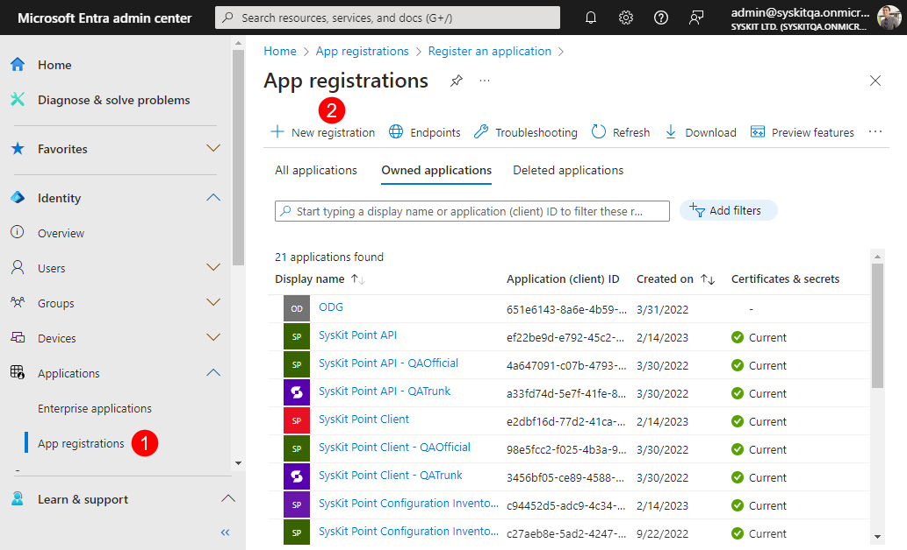
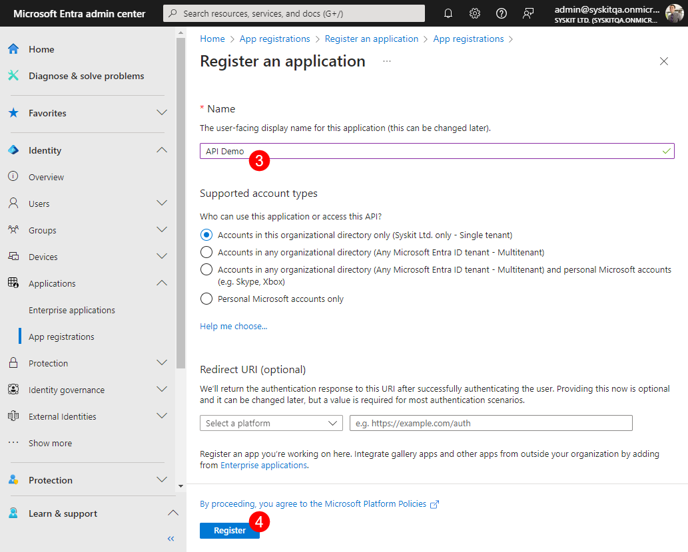
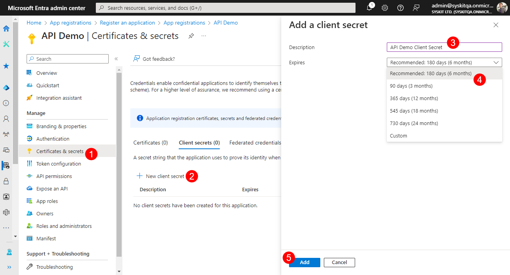
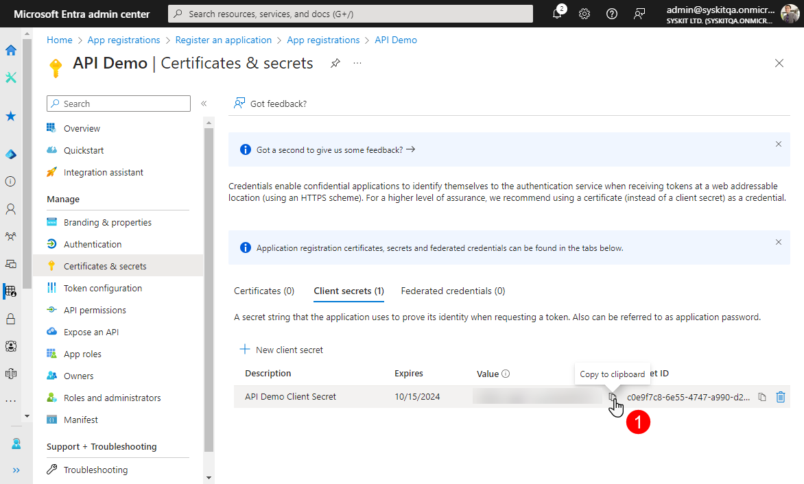
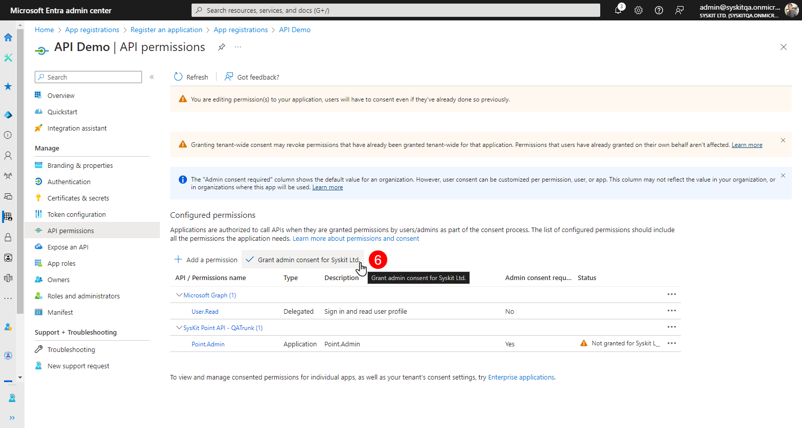
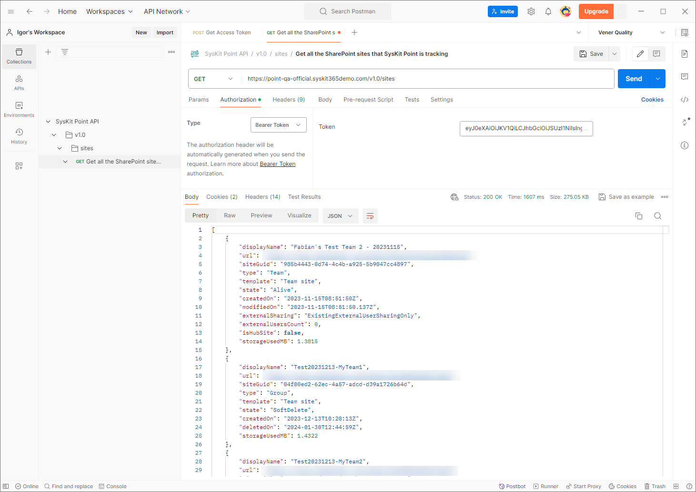

# Syskit Point API

:::info
**Please note!** To utilize Provisioning via Syskit Point API, the Governance plan or above is required.\
See the [pricing page](https://www.syskit.com/products/point/pricing/) for more details.
:::

In this article, you can find the steps to create your first request to your Syskit Point web app. You will need to perform the following steps:

* **Create and set an app registration in Microsoft Entra ID**
* **Fetch the `access_token`**
* **Send your first request** to Syskit Point

## Prerequisites

To complete the steps described in this article, make sure to have the following:

* **Syskit Point Instance** - running Point Cloud or Enterprise instance
* **Microsoft Entra/Microsoft Entra ID Access** - you should be able to create an App registration in Microsoft Entra ID

## Microsoft Entra Setup

To enable Postman to get access tokens for API requests, you must create and configure an additional App registration in Microsoft Entra.

First, create the New app registration:

* **Navigate to** [Microsoft Entra > Identity > Applications > App registrations](https://entra.microsoft.com/#view/Microsoft_AAD_RegisteredApps/ApplicationsListBlade/quickStartType~/null/sourceType/Microsoft_AAD_IAM) **(1)**
* **Create a new registration** by clicking the **New registration button (2)**
  * **Provide a Name (3)** - e.g., **API Demo**
  * **Click Register (4)**

Second, create a new client secret:

* **Navigate to Manage > Certificates & Secrets (1)**
* **Click the New client secret option (2)** - a sidebar opens where you can:
  * **Enter client secret description (3)**
  * **Define expiration (4)**
  * **Click Add (5)** to finish

:::info
**Please note!** **Once the new client secret is created, immediately copy (1) and save the client secret value to the side.**
:::

Afterward, configure API permissions:

* **Navigate to Manage > API Permissions (1)**
* **Click Add a permission option (2)** - a sidebar opens where you should:
  * **Select the APIs my organization uses tab; search and find Syskit Point API (3) and click to select** - sidebar shows new information
  * **Select the displayed permission (4)**
    * We strongly encourage applying the principle of least privilege and providing the minimum level of permissions required to accommodate your integration requirements
    * [Find more details about available permissions in the Permissions section](syskit-point-api.md#permissions)
  * **Click Add permissions (5)**
* **Click the Grant admin consent option (6)** - confirmation dialog opens: **Click Yes to confirm**

Lastly, **collect the following data and save to the side with the client secret value stored before**:

* **Application (client) ID**
* **Directory (tenant) ID**
* **Syskit Point API Application (client) ID** - find the _Syskit Point API_ app registration and copy the Application (client) ID from the Overview screen

## Permissions

There are 4 permissions providing access to different Syskit Point endpoints:

* **SharePoint.Read.All**
* **Point.AsyncRequests**
* **Point.Provisioning**
* **Point.Admin**

Find the permission required for specific endpoints/requests below.

### WebHooksEndpoint

Required permission: **Point.Admin**

| Request | Description |
|---------|-------------|
| <mark style={{color: 'green'}}>`POST`</mark> /v1.0/webhook/endpoints | Add an endpoint to which Syskit Point will post webhook events. Specify a valid URL and list of event types to be notified about. |
| <mark style={{color: 'blue'}}>`GET`</mark> /v1.0/webhooks/endpoints | Retrieves a list of all webhook endpoints currently registered in Syskit Point. Use this to view all registered webhook endpoints. |
| <mark style={{color: 'red'}}>`DELETE`</mark> /v1.0/webhooks/endpoints | Deletes a specific webhook endpoint from Syskit Point. Include the endpoint URL in the request body to identify which endpoint to remove. |

### Users

Required permission: **Point.AsyncRequests**

<table><thead><tr><th width="316">Request</th><th>Description</th></tr></thead><tbody><tr><td><mark style={{color: 'green'}}><code>POST</code></mark> /v1.0/users/access/generate</td><td>Initiate a request to receive information about SharePoint access for a given user.</td></tr></tbody></table>

### SharePointSites

Required permission: **SharePoint.Read.All**

<table><thead><tr><th width="347">Request</th><th>Description</th></tr></thead><tbody><tr><td><mark style={{color: 'green'}}><code>POST</code></mark> /v1.0/sites/permissions/generate</td><td>Initiate a request to receive information about permissions on a list of SharePoint sites.</td></tr><tr><td><mark style={{color: 'blue'}}><code>GET</code></mark> /v1.0/sites</td><td>Get a list of all SharePoint sites Syskit Point is tracking.</td></tr></tbody></table>

### Groups

Required permission: **SharePoint.Read.All** OR **Point.AsyncRequests**

<table><thead><tr><th width="364">Request</th><th>Description</th></tr></thead><tbody><tr><td><mark style={{color: 'green'}}><code>POST</code></mark> /v1.0/groups/memberships</td><td>Initiate a request to receive information about group memberships for provided group IDs.</td></tr><tr><td><mark style={{color: 'blue'}}><code>GET</code></mark> /v1.0/groups</td><td>Get the groupID and other relevant information for all groups tracked by Syskit Point.</td></tr><tr><td><mark style={{color: 'blue'}}><code>GET</code></mark> /v1.0/groups/&#123;groupName&#125;</td><td>Get the groupID and other relevant information for a single group based on the provided group name.</td></tr><tr><td><mark style={{color: 'blue'}}><code>GET</code></mark> /v1.0/groups?groupType=&#123;groupType&#125;</td><td>Get the groupID and other relevant information for all groups that match the provided groupType. The following group types are available: DistributionList, UnifiedGroup, SecurityGroup, MailEnabledSecurityGroup</td></tr></tbody></table>

### Provisioning

Required permission: **Point.Provisioning**

<table><thead><tr><th width="357">Request</th><th>Description</th></tr></thead><tbody><tr><td><mark style={{color: 'green'}}><code>POST</code></mark> /v1.0/provision/teams</td><td>Provision Microsoft Teams based on a provisioning template.</td></tr><tr><td><mark style={{color: 'green'}}><code>POST</code></mark> /v1.0/provision/groups</td><td>Provision Microsoft 365 Groups based on a provisioning template.</td></tr><tr><td><mark style={{color: 'green'}}><code>POST</code></mark> /v1.0/provision/sites</td><td>Provision SharePoint sites based on a provisioning template.</td></tr><tr><td><mark style={{color: 'green'}}><code>POST</code></mark> /v1.0/provision/yammer</td><td>Provision Viva Engage Communities based on a provisioning template.</td></tr><tr><td><mark style={{color: 'blue'}}><code>GET</code></mark> /v1.0/provision/templates</td><td>Get all provisioning templates in Syskit Point.</td></tr><tr><td><mark style={{color: 'blue'}}><code>GET</code></mark> /v1.0/provision/requests/&#123;requestId&#125;</td><td>Get status for a provisioning request with specified request ID.</td></tr></tbody></table>

:::info
**Please note!** To automatically approve provisioning requests created via API requests, use provisioning templates with the Approval Process property set to 'Automatically Approve'.
:::

### Options

Required permission: **Point.Admin**

<table><thead><tr><th width="192">Request</th><th>Description</th></tr></thead><tbody><tr><td><mark style={{color: 'blue'}}><code>GET</code></mark> /v1.0/options</td><td>Get options available for use with Syskit Point API and Webhooks.</td></tr></tbody></table>

### AsyncRequests

Required permission: **SharePoint.Read.All** OR **Point.AsyncRequests**

<table><thead><tr><th width="342">Request</th><th>Description</th></tr></thead><tbody><tr><td><mark style={{color: 'blue'}}><code>GET</code></mark> /v1.0/requests/&#123;requestId&#125;/status</td><td>Get the status of a request with the specified request ID.</td></tr><tr><td><mark style={{color: 'blue'}}><code>GET</code></mark> /v1.0/requests/&#123;requestId&#125;/result</td><td>Get the result of a request with the specified request ID.</td></tr></tbody></table>

## Fetch the `access_token`

Here, you can find an example of how to fetch the `access_token` using Postman.

Create a new POST request:

<mark style={{color: 'green'}}>`POST`</mark> https://login.microsoftonline.com/\&lt;tenant-id&gt;/oauth2/v2.0/token

Replace the &lt;tenant-id&gt; in your request with your Directory (tenant) ID saved in the previous step.

**Body** Include the following parameters in the request body

<table><thead><tr><th width="189">Name</th><th width="104">Type</th><th>Description</th><th>Example Value</th></tr></thead><tbody><tr><td><code>client_id</code></td><td>string</td><td>Application (client) ID of the created app registration</td><td>0a1948f2-b37b-4c38-8430-2c3ad19ba71c</td></tr><tr><td><code>client_secret</code></td><td>string</td><td>Client secret created in the previous step</td><td>Ma8QhffkTUrO53J8XpKQWl-rnsw.4l~_AG-arJ</td></tr><tr><td><code>grant_type</code></td><td>string</td><td>Enter the string 'client_credentials'</td><td>client_credentials</td></tr><tr><td><code>scope</code></td><td>string</td><td>Combine the Application (client) ID of Syskit Point API app registration and string '/.default'</td><td>ee22be9d-e792-45c2-8955-deb8fd565aa5/.default</td></tr></tbody></table>

Click Send and wait for the response.

The provided example is shown in the image below:

Copy the `access_token` property from the response to use in further requests to your Syskit Point web app.

## Example Request

Using Postman, let's create the first request to your Syskit Point web app.

Create a new GET request:

<mark style={{color: 'blue'}}>`GET`</mark> \{\{pointWebAppUrl\}\}/v1.0/sites

Under Authorization > Type, select `Bearer Token` and paste the `access_token` retrieved in the previous step.

Click Send and wait for the response.

The provided example is shown in the image below:

## Syskit Point API Documentation

To find more information about the Syskit Point API, navigate to the provided Swagger documentation. You can find it on the following URL:

* `<YourSyskitPointWebAppURL/swagger>`
* For example, `contoso.syskit365demo.com/swagger`
