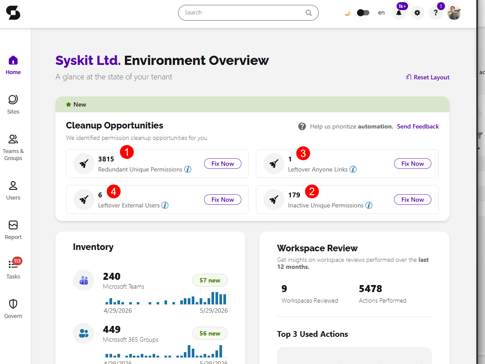
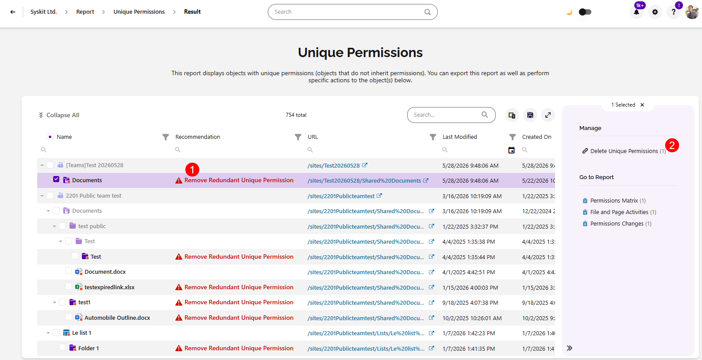
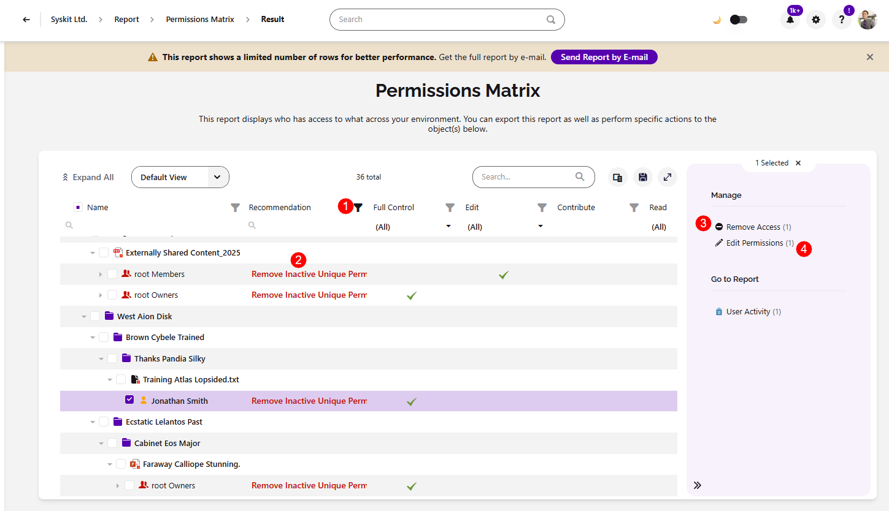
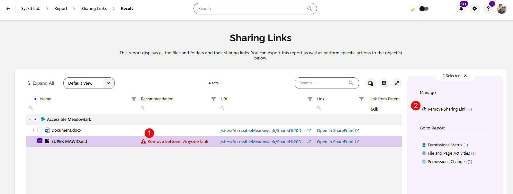
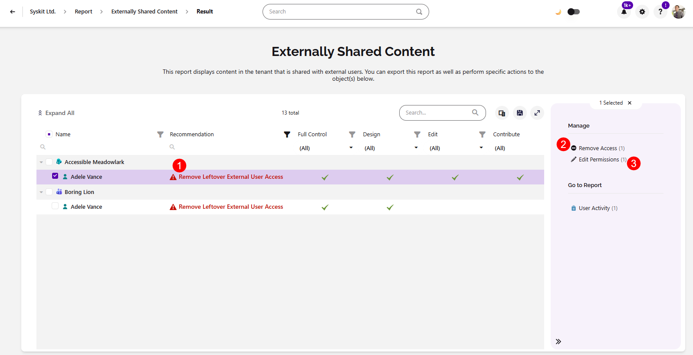

# Cleanup Opportunities 

The **Cleanup Opportunities** tile on the Syskit Point Dashboard shows any permission cleanup opportunities such as, stale unique permissions from expired links, access that violates your current sharing policies, and files with permissions that haven't been used in a long time.

The tile gives you a single place to see how many of these issues exist in your tenant and lets you take action on them directly, without having to search through reports.

The Cleanup Opportunities tile shows the state for four categories:

* **[Redundant Unique Permissions](#redundant-unique-permissions) (1)** - these are items where unique permissions match the parent so removing them simplifies your structure without changing anyone’s access.
* **[Inactive Unique Permissions](#inactive-unique-permissions) (2)** - these are files with unique permissions that haven’t been accessed or modified within the defined inactivity period.
* **[Leftover Anyone Links](#leftover-anyone-links) (3)** - these are anyone links that now violate your external sharing policy because your external sharing settings have since become more restrictive.
* **[Leftover External Users](#leftover-external-users) (4)** - these are external users whose access now violates your external sharing policy because your settings became more restrictive.

Clicking any of the counts in the tile opens the relevant report, where you can review the findings and take action.

## Redundant Unique Permissions

**After sharing links expire, get deleted, or access is granted ad hoc, unique permissions are often left behind** even when they're no longer needed. Over time, they accumulate silently: permission reviews become harder to complete, SharePoint performance degrades on heavily affected sites, and admins lose a clear picture of who actually has access. Removing these redundant unique permissions simplifies your permission structure without changing anyone's access.

On the dashboard tile, you'll see the number of redundant unique permissions ready to be cleaned up, simply **click Fix Now** to start. 

After selecting Fix Now, the **information dialog** opens, providing more details on Redundant Unique Permissions and leaves you with two options: 
* **Clicking the Request Automation** button lets you send us a request for this feature to be automated, which helps us prioritize the improvements you're requesting
* **Clicking Resolve Manually** opens the [**Unique Permissions** report](../reporting/access-reports.md#unique-permissions-report)
  * After generating the report, you'll see the **recommendation to Remove Redundant Unique Permissions (1)**, where applicable
  * Selecting that object lets you complete the **Delete Unique Permissions action (2)**

## Inactive Unique Permissions

Files shared for ad hoc collaborations, one-off requests, or short-term projects often retain unique permissions long after the work is done. With no activity, no views or edits, the access just sits there unchallenged, with no signal to tell admins which grants are still needed and which have simply been forgotten. Over time, inactive unique permissions accumulate and create real risk: standing access to files that no one is actively monitoring.

On the dashboard tile, you'll see the number of inactive unique permissions ready to be cleaned up, simply **click Fix Now** to start. 

After selecting Fix Now, the **information dialog** opens, providing more details on Inactive Unique Permissions and leaves you with two options: 
* **Clicking the Request Automation** button lets you send us a request for this feature to be automated, which helps us prioritize the improvements you're requesting
* **Clicking Resolve Manually** opens the [**Permissions Matrix** report](../reporting/access-reports.md#permissions-matrix-report)
  * After generating the report, use the **filter next to the recommendations column (1)** to search for **Remove Inactive Unique Permissions (2)**
  * Selecting that object lets you complete the **Remove Access (3)** and **Edit Permissions (4)** actions

## Leftover Anyone Links

When external sharing settings become more restrictive, SharePoint blocks existing Anyone links, but doesn't delete them. These links were valid when created, but they remain preserved in the background, and the moment settings are relaxed or accidentally reverted, every one of them becomes active again instantly. Admins have no visibility into how many of these links exist or what they point to.

On the dashboard tile, you'll see the number of leftover anyone links ready to be cleaned up, simply **click Fix Now** to start. 

After selecting Fix Now, the **information dialog** opens, providing more details on Leftover Anyone Links and leaves you with two options: 
* **Clicking the Request Automation** button lets you send us a request for this feature to be automated, which helps us prioritize the improvements you're requesting
* **Clicking Resolve Manually** opens the [**Sharing Links** report](../reporting/access-reports.md#unique-permissions-report)
  * After clicking the report, you'll see the workspaces where there are leftover sharing links, and selecting them lets you **generate the report**
  * Once the report is generated, you'll see the **recommendation to Remove Leftover Anyone Link (1)**, where applicable
  * Selecting object lets you **complete the Remove Sharing Link (2)** action

## Leftover External Users

When external sharing settings become more restrictive, SharePoint blocks existing guest users, but doesn't remove them. These users had valid access when it was granted, but their accounts remain preserved, and the moment settings are relaxed or accidentally reverted, every one of them regains access instantly. Admins have no visibility into how many of these accounts exist or what they can reach.

On the dashboard tile, you'll see the number of leftover external users ready to be cleaned up, simply **click Fix Now** to start. 

After selecting Fix Now, the **information dialog** opens, providing more details on Leftover External Users and leaves you with two options: 

* **Clicking the Request Automation (1)** button lets you send us a request for this feature to be automated, which helps us prioritize the improvements you're requesting
* **Clicking Resolve Manually (2)** opens the [**Externally Shared Content** report](../reporting/access-reports.md#unique-permissions-report)
  * After clicking the report, you'll see the workspaces that include leftover external users, and selecting them lets you generate the report
  * Once the report is generated, you'll see the **recommendation to Remove Leftover External User Access (1)**, where applicable
  * Selecting that user lets you **complete the Remove Access (2) and Edit Permissions (3)** actions

