# Control Your Microsoft 365 Environment

The **Dashboard** screen provides you with the information needed to see the whole picture of your **Microsoft 365 environment**.

You can use Dashboard to:

* **See what was happening in your Microsoft 365 environment** at a glance.
* **Find summary data** on your workspaces, internal and external users, sharing links, and used storage - all numbers are drillable, taking you to the related reports, which will show more details.
* **Detect potential issues**, for example, if your environment has inactive or orphaned workspaces.

The Dashboard is the home page of Syskit Point and shows as soon as you log in. 

The **Syskit Point** Dashboard shows Syskit Point administrators the following information in the tiles:
* Inventory
* Users
* Storage
* Security & Compliance
* Copilot Readiness
* External Collaboration
* Active Access Review
* Inactive Workspaces 
* Microsoft 365 Licenses
* Power Platform
* Workspace Sensitivity
* SharePoint Agents

The **Syskit Point** Dashboard shows Syskit Point collaborators the following information in the tiles:
* Inventory
* Users
* External Collaboration

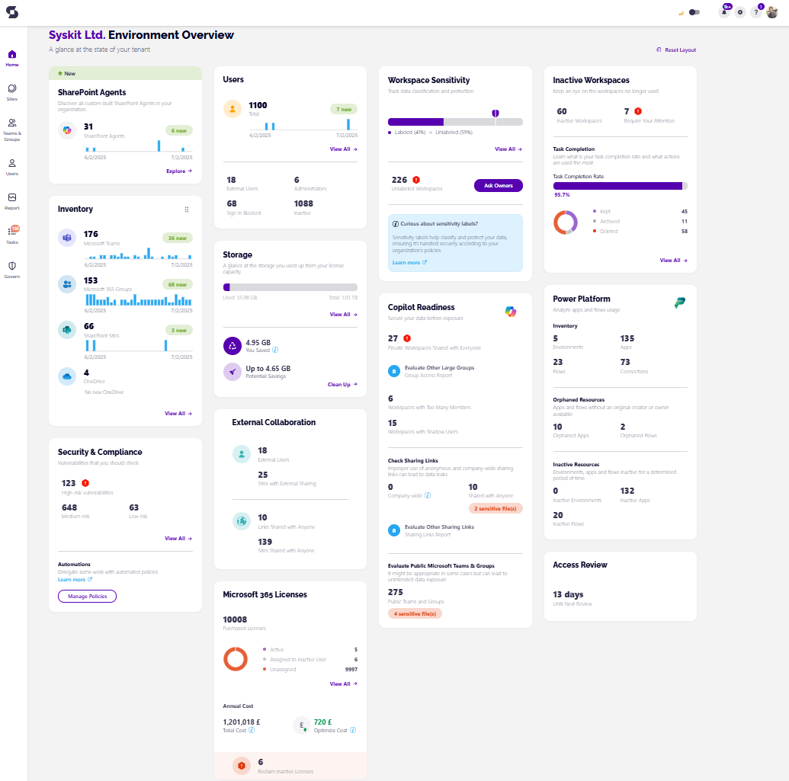

Below, each tile is described in more detail.

## Inventory

In Inventory, you can find the information about the total number of:

* **Microsoft Teams** 
* **Microsoft 365 Groups** 
* **SharePoint Sites** 
* **OneDrive**

Each of these numbers is drillable and, once clicked, opens the Sites Overview screen filtered to show appropriate data.

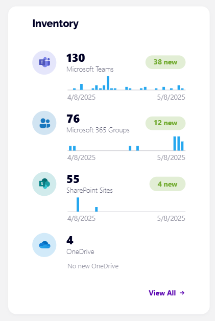

For the **period of the last 30 days**, you can find the number of new items for each workspace type.

If you **hover over a bar**, which represents a newly added workspace, a **tooltip will appear** with the exact date.

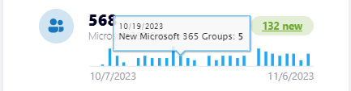

To see more details about all workspaces, click the **View All** link, which opens the **Sites Overview** screen.

You can find more details on your workspaces by taking a look at the:

* [Microsoft Teams & Groups article](../microsoft365-inventory/microsoft-teams-and-groups.md)
* [Sites article](../microsoft365-inventory/sites.md)

## Users

This tile contains the following information:

* **The total number of users** in your environment
* **The number of newly added users** in the past 30 days
* **The number of external users**, **administrators**, **inactive users**, and **users with blocked sign-in**
* **The View All** link

To access detailed information about all users, click the total number of users or the **View All** link, which opens the **Users Overview** screen.

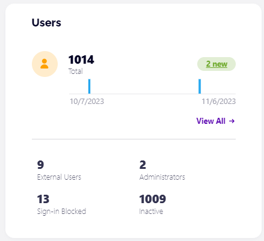

Each of the numbers drills to the appropriate view in the **Users Overview** screen, where you can perform further actions on each user by selecting them and choosing an action from the side panel.

[You can find more details about the users overview screen in the Users article.](../microsoft365-inventory/users.md)

## Storage

This tile provides the following storage metrics:

* **Total storage**
* **Used storage**
* **Free storage**

The **View All** link opens the **Storage Metrics report** showing tenant-wide storage usage, usage trend through time, and the largest sites in your tenant.

You can also find information on:
* How much storage you saved
* How much storage you could save

The **Clean Up** link opens the **Storage Metrics report**, where you can select the workspaces on which you want to perform a storage clean-up.

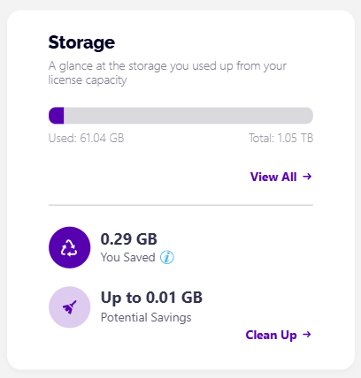


**Hint!**  
The used storage number is calculated for all files, including those in the recycle bin and archived files. OneDrive storage is not included in the metrics.



**Please note!**  
Storage data displayed on the Dashboard can differ from the data provided by the **SharePoint admin center** since it doesn't include changes made within the last 24-48 hours, as described [here](https://docs.microsoft.com/en-us/sharepoint/manage-site-collection-storage-limits).


[For more details on Storage Management for SharePoint Online, take a look at the Storage Management Overview article.](../storage-management/storage-management-overview.md)

## Security & Compliance

The Security and Compliance Checks tile shows the most important vulnerabilities and misalignments in your environment. These checks keep you up-to-date so you can react quickly and efficiently to keep your environment secure and under control.

The tile on the Dashboard shows:
* The number of high-risk vulnerabilities
* The number of medium-risk vulnerabilities
* The number of low-risk vulnerabilities

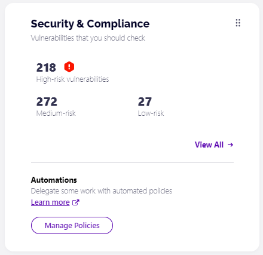

Clicking on **View All** redirects you to the Security and Compliance checks screen. 

The following information is tracked and available there:

* **Orphaned Workspaces**
* **Inactive Guest Users**
* **Tenant Storage Limit**
* **Blocked Users with Assigned Licenses**
* **Workspaces with Not Enough Owners**
* **Orphaned Users**
* **Workspaces with Too Many Owners**

Syskit Point performs regular security and compliance checks for you and presents the results directly on your home screen.

[For more details on Security and Compliance checks, take a look at this article.](../governance-and-automation/security-compliance-checks/security-compliance-checks.md)

## Copilot Readiness

The Copilot Readiness tile on the Syskit Point dashboard **helps businesses as they prepare to integrate Copilot into their workflow** or those that want to stay on top of policy vulnerabilities or overshared workspaces that could pose a security risk. By providing a **clear and comprehensive Copilot Readiness score**, you can quickly **identify vulnerabilities**.

The tile on the Dashboard shows:
* Number of vulnerabilities detected for the Workspaces **Shared with Everyone policies (1)**, the Workspaces with **Too Many Members (2)**, Workspaces with **Shadow Users (3)**
* The **Group Access (4) and Sharing Links reports (5)**
* The number of **company-wide sharing links (6)** as well as **company-wide sharing links that contain sensitive files (7)**
* The number of **links shared with anyone (8) and links shared with anyone that contain sensitive files (9)**
* The number of **public workspaces (10)** and the **public workspaces with sensitive files (11)**

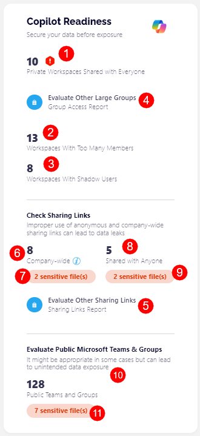

[For more details on how to navigate the Copilot Readiness tile, take a look at this article.](../microsoft365-inventory/copilot-readiness.md)

## External Collaboration

You can supervise external sharing within your environment with this tile.

Here you can find the total number of:

* **External users** 
* **Sites with External Sharing**
* **Links Shared with Anyone**
* **Sites Shared with Anyone**  

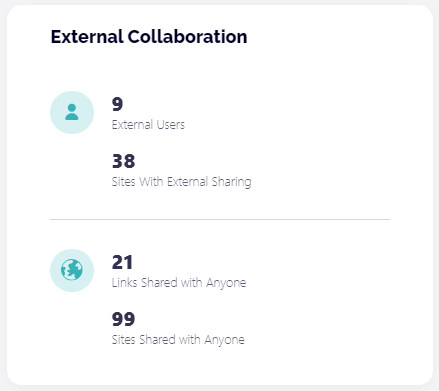

Clicking the External users opens the **Users Overview** screen with filtered external/ad-hoc users.

Drill on the **Sites With External Sharing** number opens the **External Sharing** view on the **Sites Overview** screen. Here, you can find Microsoft Teams, Microsoft 365 Groups, sites, and OneDrive with **external sharing setting set to any other value than 'Only people in your organization'**.

Clicking the **Anonymous Links** number opens the **Sharing Links** report in the Report Center. Here, only links shared with anyone are displayed. You can remove specific links with the help of actions available in the side panel.

The last information on this tile is the number of **Sites With Anonymous Sharing**. The drill opens the **Anonymous Sharing view** on the Sites Overview screen. Here, only workspaces with the external sharing settings set to **'Anyone'** are displayed.

## Access Review

The **Access Review** tile shows the progress of current automated tasks.

If the Access Review automation is not configured, the tiles will help you navigate to the settings screen by clicking the **Configure Now** button.

* For more details, see the [Enable Automated Access Review article](../governance-and-automation/permissions-review/enable-permissions-review.md)!

When the Access Review is configured, the tile shows information about the upcoming Review, previous Review, or the current active Review, depending on the Access Review's current state.

Below, you can see the information for the active Access Review. The **View All** link guides you to the **Governance screen**, where additional information about the active Access Review is provided.

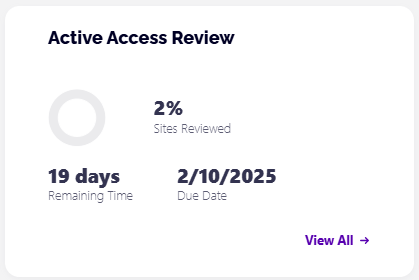

## Inactive Workspaces

The **Inactive Workspaces** tile shows the progress of your current Inactive Workspaces tasks.

The **Inactive Workspaces** policy is turned on by default, so the Inactive Workspaces tile shows data based on the default configuration. 

You can change the Settings for your Inactive Workspaces policy to suit your needs better or create new ones. Learn how in the [Enable Inactive Workspaces policy](../governance-and-automation/automated-workflows/inactive-workspaces-admin.md) article.

The following information can be found on the tile:

* **Number of Inactive Workspaces** - shows the number of Inactive Workspaces that were detected based on the policy settings
  * Clicking this opens the Inactive Workspaces screen in the Security and Compliance section
* **Workspaces that Require Your Attention** - the number of Inactive Workspaces that need to be reviewed
  * Clicking this opens the Inactive Workspaces screen in the Security and Compliance section with the Require Attention view applied
* **Task completion** - provides an overview of your task completion status and shows the number of:
  * **Kept** workspaces
  * **Archived** workspaces
  * **Deleted** workspaces

The **View All** link opens the **Governance** section, showing the **Vulnerabilities History Details** screen with additional information.

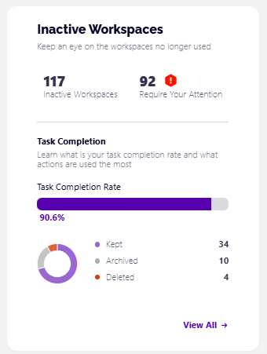


**Please note!**  
The number of inactive workspaces **will be visible 10 days after the first installation of Syskit Point.**


## Microsoft 365 Licenses

The Microsoft 365 Licenses tile shows an overview of the paid licenses used for your Syskit Point subscription. 

You can find the following information on the tile screen:
 
* Number of active licenses
* Number of licenses assigned to inactive users
* Number of unassigned licenses
* The total annual cost for your licenses
* The amount you can save annually by removing inactive licenses 

You can also click the View All button, which takes you to the Licenses Overview report screen.

For more information on the license reports available, take a look at the [Licenses Reports article](../reporting/licenses-reports.md).

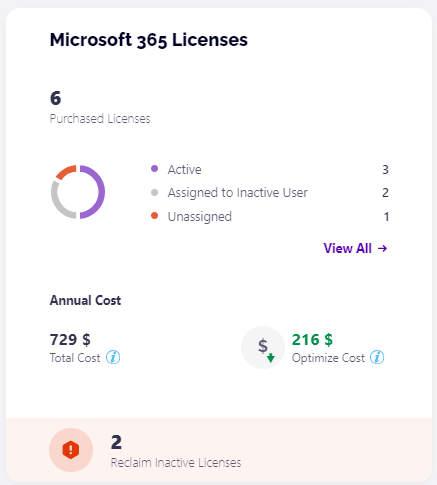

## Power Platform 


**Please Note!** Power Platform is **now available as an add-on** purchase to your Syskit Point subscription. 

To enable the use of Power Platform for Syskit Point, [please contact us](https://www.syskit.com/contact-us-power-platform/).



The Power Platform tile on the Syskit Point dashboard **provides an overview of your Power Platform environments, apps, flows, and connections**.

The tile on the Dashboard shows:
* **Inventory** - which provides a quick overview of your Power Platform inventory and shows the numbers of
  * Environments
  * Apps
  * Flows
  * Connections

* **Orphaned Resources** - shows the number of apps and flows without an original creator or owner available
  * Clicking the **Orphaned Apps** number opens the Power Apps Inventory report with the Orphaned Apps filter applied
  * Clicking the **Orphaned Flows** number opens the Power Automate Inventory report with the Orphaned Flows filter applied
* **Inactive Resources** - provides an overview of inactive apps and flows to help you determine which are no longer necessary 
  * Clicking the **Inactive Apps** number opens the Power Apps Inventory report with the Inactive Apps filter applied
  * Clicking the **Inactive Flows** number opens the Power Automate Inventory report with the Inactive Flows filter applied

* For more details [on the Power Platform reports, take a look at this article.](../power-platform/power-platform-reports/README.md)

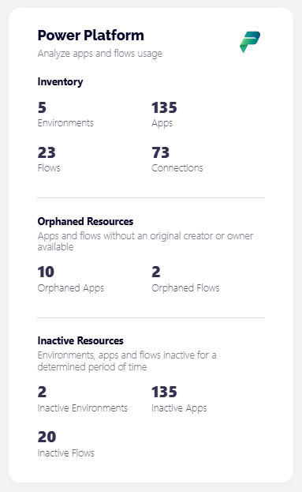

If Power Platform is not enabled for Syskit Point, the tile on the Dashboard asks you to [contact us](https://www.syskit.com/contact-us-power-platform/).

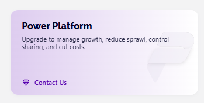

## Workspace Sensitivity 

The Workspace Sensitivity tile provides an **overview of workspaces without a Sensitivity Label** applied to them. 

The tile on the Dashboard shows:

* **An overview of Labeled and Unlabeled workspaces** - this bar provides quick overview of:
  * How many of your workspaces have a sensitivity label applied 
  * How many of your workspaces are still unlabeled 
  * A recommendation that at least 80% of your workspaces should have a label applied, represented as a shield icon

* **View All** button, which opens the Sites overview screen with the Workspace Sensitivity filter applied

* **Not Enough Sensitivity Labels** - this section only shows up if your organization does not have enough sensitivity labels, with the recommended minimum being 4

* **The number of Unlabeled Workspaces** - clicking on this or the **Ask Owners** button next to it opens the Workspaces Without a Sensitivity Label screen in the Security and Compliance checks section, where you can perform the **Apply Label** or **Ask Owners** actions.
  * [For details on how to resolve the Workspaces without a Sensitivity Label vulnerability, take a look at this article.](../governance-and-automation/security-compliance-checks/workspaces-without-sensitivity.md)

* **Infomation box** - this provides some additional information on sensitivity labels in general as well as a link to an article that explains it in more detail

* [For details on how to enable Sensitivity Labels in Point, take a look at this article.](../governance-and-automation/provisioning/enable-sensitivity-labels.md)

* [If you want to learn how to manage your Sensitivity Labels in Point, take a look at this article.](../governance-and-automation/manage-sensitivity-labels.md)

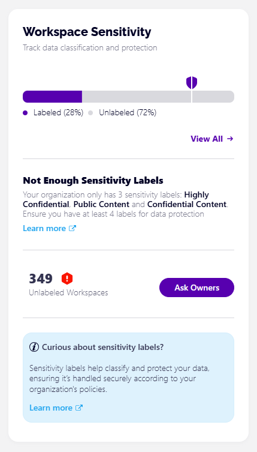

## SharePoint Agents 

The SharePoint Agents tile provides an **overview of all custom-built SharePoint Agents in your organization**. 

The tile on the Dashboard shows:

* **The total number of custom SharePoint Agents** in your environment
* **The number of newly added custom SharePoint Agents** in the past 30 days
* **The Explore** button

Clicking the Explore button opens the Custom SharePoint Agents Inventory report. [For more details on the report, take a look at this article.](../reporting/ai-agents-reports.md) 

