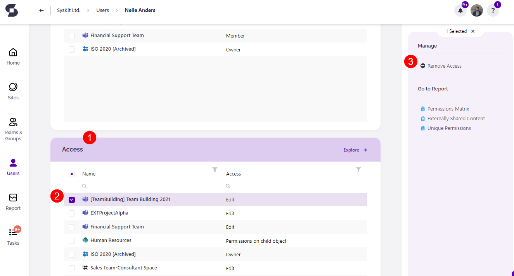
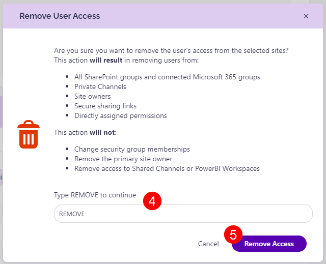

# Manage Users



You can only **manage users you are in charge of and who belong to the workspaces where you are the owner**.



Syskit Point enables you to **manage users' activity and permissions** in your Microsoft 365 workspaces. 

You can **add or remove users to groups** and set up **alerts to notify you** when specific users complete certain actions. **Reports can also be generated** to gain deeper insight into a specific user's access and activity. 

This can be useful for situations when a **user leaves a specific project** and no longer needs access to a workspace or to **keep track of a user's activity** in order to better optimize what permissions are given. If a user is no longer needed in your workspaces, you'll have a quick overview of all of your workspaces that the user has access to and be able to remove them with one quick click. 

Alternatively, let's say there's a new team member joining your ranks, and you're in charge of onboarding them. You can easily add them to your workspaces and assign the required access level. This ensures all your team members can access relevant content and communicate effectively, for example, through your Microsoft Teams.

To manage your users: 

* In your Syskit Point, click the **Users** button located on the left side of the screen
  * This opens the Users page with a list of all users to who you have access as a manager or workspace owner 

Here you will be able to **Schedule Report or export it** as a PDF or Excel file.

There are several other actions you can complete here in order to manage your users, so take a look at your options in the sections below. 

## Add to Groups & Generate Reports

When on the Users screen, you can add users to groups you are the owner of or create user reports.

To start, do the following: 

  * **Select one of more users** by clicking the checkbox next to their name 
  * On the right side of the screen, **click the Add to Groups button**
    * This will open the Add User to Groups pop-up
  * Here, you can **type the name of the group** or groups you want to add the selected users to  
     * If you want to make the selected users owners, click the designated checkbox
  * **Click the Add button** to confirm and add the users to the selected group

On the right side of the screen, you will also see the ability to generate relevant user reports. To generate the reports, click the report name to be redirected to the generate report screen. 

The available reports are:
  * User Access
  * User Activity 

## Configure Alerts

Alerts help you stay up to date with actions your users take in the Microsoft 365 environment. 

To configure alerts, complete these steps: 

  * **Select a user** by clicking the checkbox next to their name 
     * You can only set up alerts on individuals by selecting one at a time
  * On the right side of the screen, **click the Configure Alerts button**
    * This will open the Configure Alerts pop-up
  * Here, you can configure the preset alerts: **User Logged In** and **User Login Failed**
     * To set up these alerts, click the slider next to the name of the alert; it should turn orange when active
  * **Click the Save button** to confirm your set alerts

You can create your alerts based on the specific actions you want to keep track of. 

[For more details on how to set up and customize alerts in Syskit Point, take a look at this article.](../../governance-and-automation/configure-alerts.md) 

## User Details Page

Clicking on a user's name will open their details page with more information about the user. 

On this page, you will also be able to complete additional actions.  

Scroll down the **Access section (1)**, where you will see a list of all workspaces the user is a part of and where you are the owner.

To remove access to this user:

  * **Select one or more workspaces (2)** by clicking the checkbox next to them
  * On the right screen side, **click the Remove Access button (3)**
    * The Remove User Access pop-up will open
  * **Type Remove (4)** in the provided space to confirm
  * **Click the Remove Access button (5)** to finalize the changes

Under the **Microsoft Teams & Group Memberships (1)** section, you are able to promote the users to owner status or remove them from the group.

To promote users to owners:

  * **Select one or more groups (2)** by clicking the checkbox next to them
  * On the right screen side, click the **Promote to Owner button (3)**
    * The Promote User to Microsoft 365 Group Owner pop-up will open
  * **Click the Promote** button to confirm the change from member to owner

To remove a user from the group:

  * **Select one or more groups** by clicking the checkbox next to them
  * On the right screen side, click the **Remove from Group button (4)**
    * The Remove from Group pop-up will open
  * **Click the Remove** button to confirm the removal of the user from the selected group or groups

