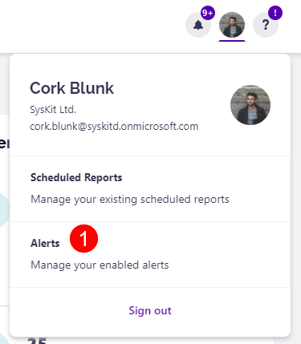
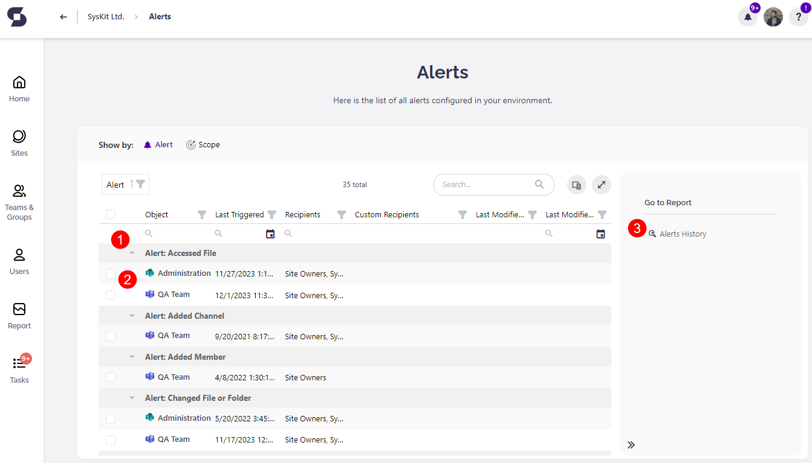
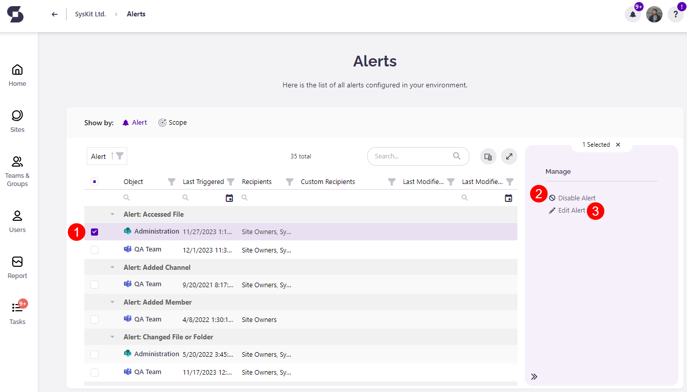

# Alerts

If, for example, your team wants to keep close attention to a particularly sensitive item shared among the members. The best way to stay up to date with what's happening is to proactively monitor that particular file and specific actions performed on it. 

That's one of the situations that the Alerts feature can help you with. 

The **Alerts** feature in Syskit Point **allows you to monitor events** that are collected within **Microsoft 365 audit logs**, which means that you can work proactively and **be notified about an action almost instantly** after it happens.

Be the first one to **learn when a team's privacy or sharing settings have been changed**. Keep an extra close eye on your organization's sensitive collaboration spaces and **monitor the ins and outs through personalized alerts**. 

For example, you can set up an alert to **be notified when content has been externally shared**, or you can monitor relevant events in a particular Site or Team, e.g., Changed File or Folder. If somebody **deleted a very important file** you're working on, you could **get notified immediately** instead of wondering what happened to that file. 

You can **enable alerts on the following screens**:

* **Sites overview screen**
* **Microsoft Teams & Groups overview screen**
* **Users overview screen**
* **Specific SharePoint site**; to monitor events that occurred on the selected site; additionally, when exploring site content, you can set alerts on the following:
  * **Subsite**
  * **Document library**
  * **Folder**
  * **Document**
* **Specific user**; to monitor events caused by a specific user

:::warning
**Please note!**

You can only set up **Alerts for workspaces where you are the owner** and for users to whom you are the manager.

:::

[To learn how to set up an alert, take a look at this article.](../../governance-and-automation/configure-alerts.md#enabling-and-customizing-alerts)

## Manage Alerts

You can manage the alerts you have set up by **clicking Alerts button (1)** on the profile section of your Syskit Point. 

This will open the **Alerts screen**, which shows:

* A list of alerts which explains the **type of alert set (1)** and **the workspaces (2)** it is applied to 
* On the right side, there is the option to view **Alerts History (3)**
  * **Selecting Alerts History** opens a screen that shows all the alerts that have previously occurred in your environment 
  * There, you can select an alert, and on the right side of the screen, you have the option to **Mark as Resolved** of **View Details** on the alert

* Navigating back to the Alerts screen, you can also **select a workspace (1)** which provides the following options:
  * **Disable Alert (2)** - disables the alert for the selected workspace
  * **Edit Alert (3)** - lets you edit the alert for the selected workspace
    * If more than one workspace is selected at the same time, you can only disable the alerts for those workspaces

