# Resolve Inactive Workspaces Tasks

**This article shows how you can resolve the Inactive Workspaces policy vulnerability** when Syskit Point detects an inactive workspace. 

This policy helps you ensure there are no inactive workspaces, which is important for security and resource optimization. If these workspaces are left unattended, they can pose security risks and lead to compliance issues. By regularly resolving inactive workspace tasks, you ensure data safety and effectiveness for all of your workspaces.

In this article, you can find information on the following:

* [Inactive Workspaces Emails](#inactive-workspaces-e-mails)
* [Inactive Workspaces Tasks](#inactive-workspaces-tasks)
* [Inactive Workspaces Actions](#inactive-workspaces-actions)

Workspaces in Microsoft 365 usually display the following lifecycle stages:

* **Creation**; for example, when an admin creates a new workspace (Microsoft Team), or end-users request a new workspace from a menu of templated options created by admins in SysKit Point. 
* **Maintenance**; users collaborate and use said workspace, chat, and create files; enforcing continuous reviews with automated flows provides an easy way to manage ownership and access to your assets.
* **Cleanup**; SysKit Point automatically detects inactive workspaces and lets you decide if you wish to keep, archive, or delete the data; after a team is dismissed or a product is retired, the previously used workspace becomes stale and is no longer needed.

**When a workspace has reached the third stage**, a team owner for that workspace needs to decide:

* Whether to **keep** the workspace available,
* **Archive** the produced content, or
* **Delete** the workspace and all of its content.

To help with this process, **Syskit Point provides the Inactive Workspaces policy** and reduces the management to the previously described decision-making.

After a Syskit Point Admin [enables task delegation for Inactive Workspaces](../../governance-and-automation/automated-workflows/inactive-workspaces-admin.md), **site owners and admins will be notified via e-mail** when some of their workspaces are inactive for a period longer than the one [defined in the Inactive Workspaces policy settings](../../governance-and-automation/automated-workflows/inactive-workspaces-admin.md).

## Inactive Workspaces E-mails

Once Syskit Point recognizes that a workspace – Microsoft Team, Microsoft 365 Group, or a site – is inactive, an e-mail is sent to the owner or admin of said workspace.

The e-mail provides the following:

* **Workspace name and type (1)**
* **Inactivity period (2)**
* **Keep, Archive and Delete actions (3)**
* **Link to the Inactive Workspaces task in Syskit Point (4)**

Clicking any of the **action buttons (3)** redirects to the **Inactive Workspaces task** of the workspace in Syskit Point.

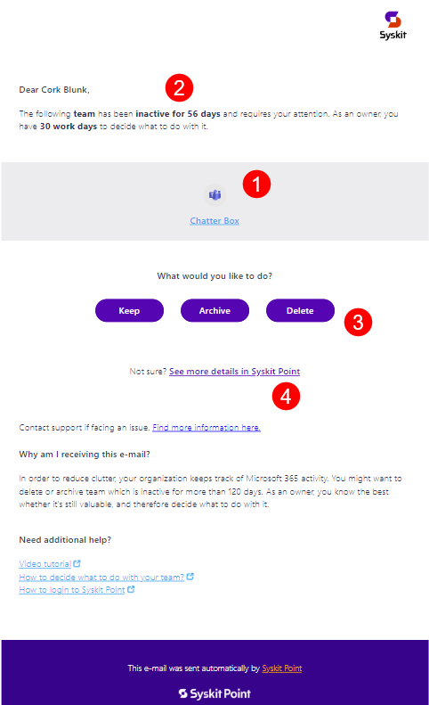

The Inactive Workspaces task screen provides the option to **include additional information on the workspace and execute the selected action**.

Once clicked, the **task details screen opens** with the appropriate action dialog visible.

* For example, if the **Delete action button** is clicked, the screen shown in the image below opens.

The following can be:

* **Comment (1)** on why you’re performing the action
* **Run the action (2)**

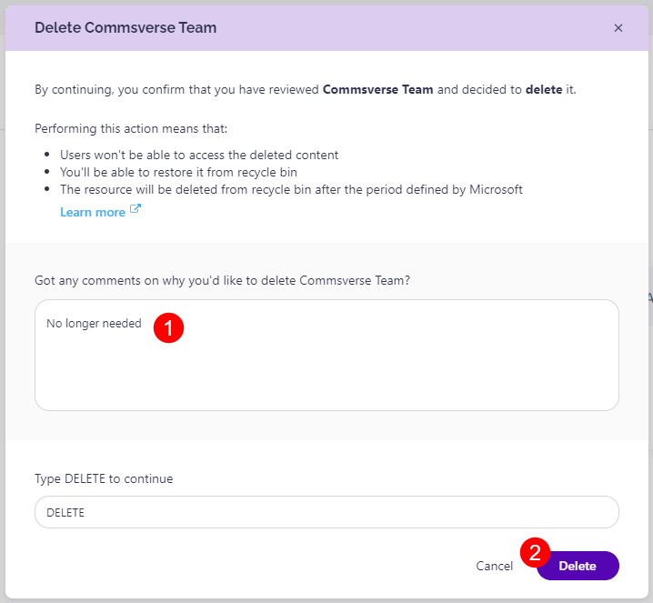

After the action is executed, **the information is displayed in the bottom ribbon of the Inactive Workspaces** task for the viewed workspace.

All Inactive Workspaces tasks assigned to you can be found on the **My Tasks screen**.

### Reminder E-mails

By default, site owners will receive two additional e-mails reminding them to complete their Inactive Workspaces task.

Syskit Point automatically sends these e-mails:

* **three days before they're due**
* **on the due date**

The e-mails display an appropriate message depending on the time left to complete the task and provide all the available Inactive Workspaces actions.

* Choosing one of the Inactive Workspaces actions is necessary for task completion.

## Inactive Workspaces Tasks

To view the Inactive Workspace Tasks, click the **My Tasks tile** on the Home screen. The red **notification bubble** that can be seen in the top right corner shows the number of tasks assigned to you.

The My Tasks screen shows:

* **Active Inactive Workspaces tasks (1)**
* **Completed Inactive Workspaces tasks (2)**
* **Resolve button (3)** to open the task details screen

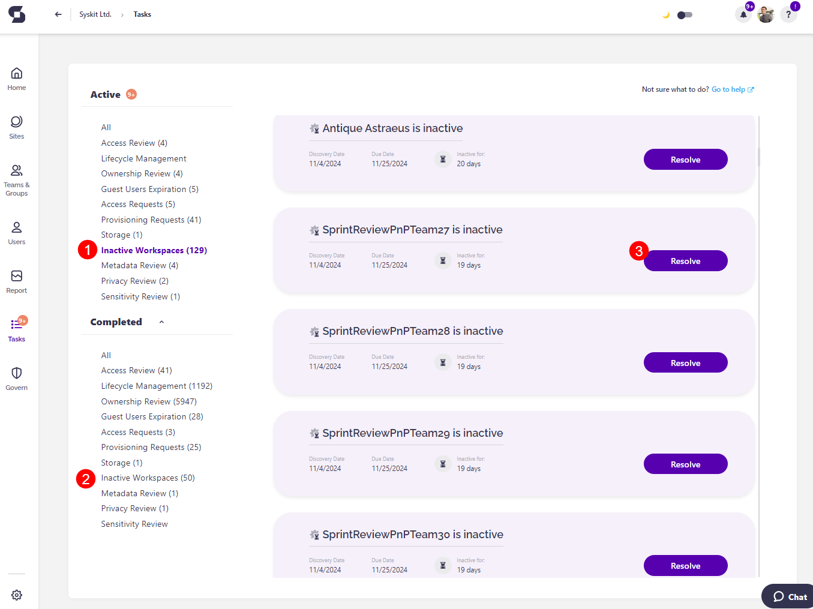

### Inactive Workspaces Task Details

On the task details screen, the following information is available:

* **Owner(s) list (1)**
* **Additional info (2)** 
* **General workspace information (2)**
  * Description
  * Creation date
  * Workspace sharing policy
  * Workspace type

* **Last Activity**, **All Users**, and **All Files tile (3)**;
  * The All Users and All Files tile redirects to the relevant reports where more information can be found on the users and content in that workspace.
* **Actions (4)**; This section provides options on what to do with the inactive workspace
* **Activity Timeline (5)** that shows who the task was assigned to and when the policy vulnerability was detected

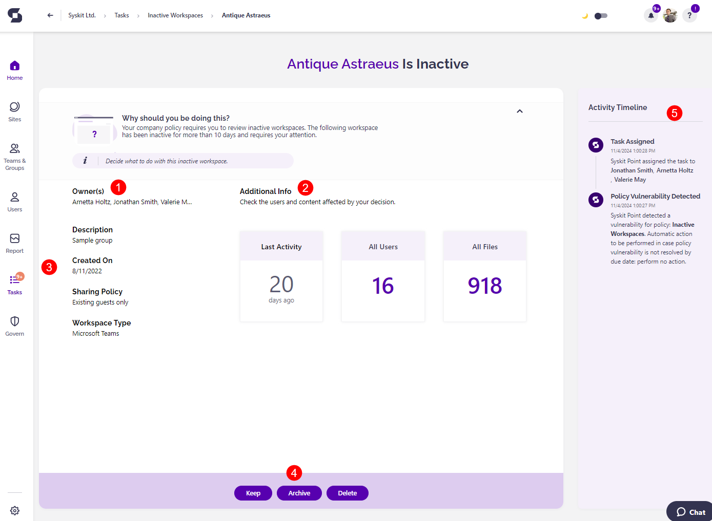

**After successfully running an Inactive Workspaces action, Syskit Point automatically completes the Inactive Workspaces task for the reviewed workspace.**

## Inactive Workspaces Actions

Syskit Point includes a set of Inactive Workspaces actions that can be executed on Microsoft 365 workspaces - Microsoft Teams, Microsoft 365 Groups, and sites. 

The following actions are available:

* **Keep**
* **Archive**
* **Delete**
* **Restore**

Each action can be executed by **Syskit Point Admin** and **Workspace Owners**.  

When resolving the **Inactive Workspaces task**, actions are **displayed in a ribbon**.

The **Restore** action is **available for deleted and archived workspaces only.** You can find these workspaces on the overview screens by selecting the **Deleted/Archived Sites/Groups view**.

On the view, additional columns are available:

* **Deleted By**
* **Deleted On**
* **Can be Restored** – A green checkmark is displayed for workspaces currently in the Recycle Bin and can be restored
* **Restore action** is available in the side panel, as already described.

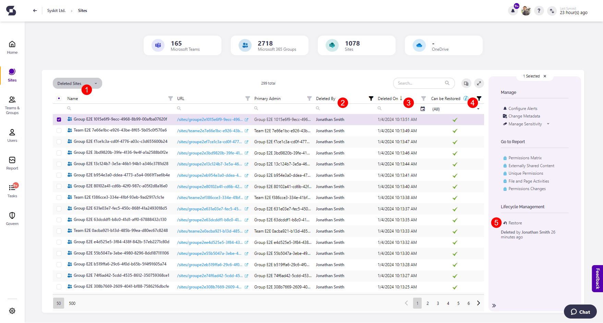

:::info
**Hint!**  
On the Sites overview screen and the Microsoft Teams & Groups overview screen, you **run the Restore action on workspaces in bulk** by selecting multiple workspaces and clicking the wanted action from the side panel.
:::

Inactive Workspaces actions are also available in e-mails that Syskit Point sends to site owners and admins as a part of the Inactive Workspaces task delegation. Still, **actions can be executed in Syskit Point only**.

Below, you can find all of the actions described in greater detail.

### Keep

The **Keep** action is run to **mark that the selected workspace is being used**. As a result, the **kept workspace** will be **considered active** for a selected amount of time.

When executing this action, you can:

* **Select the period (1)** for which the workspace should be kept
  * The selected period cannot exceed the defined number of days after for keeping a workspace, which can be changed in the [Inactive Workspaces policy](../../governance-and-automation/automated-workflows/inactive-workspaces-admin.md)
 settings.
  * Available options: Default Period (as defined in settings) or Custom
  * The **Custom** option opens a date picker where you can choose a specific date in the future to keep a workspace and consider it active. 
    * This amount cannot extend the allowed period 
* **Leave a comment \(2\)** on why you want to keep this workspace
* **Confirm the action** by clicking the **Keep button \(3\)**

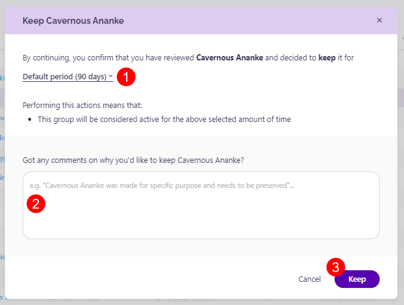

As a result of this action, you can see the workspace getting a new activity state – **Kept** – visible in the **Activity column (1)** on overview screens. 

Kept workspaces are depicted with a yellow circle. **On hover (2)**, the circle provides additional information on who said to keep the workspace and how long.

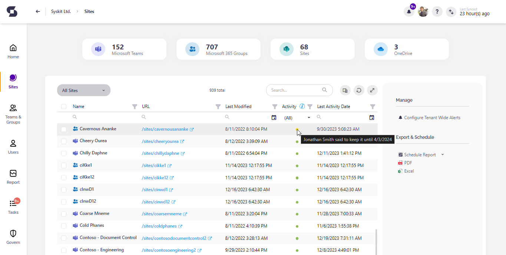

:::warning
**Please note!**  
The Keep action can be executed for inactive workspaces only!
:::

### Archive

The **Archive action** has additional options available that are set up according to the administrator’s preference. More information on that can be found in the [Inactive Workspaces policy article](../../governance-and-automation/automated-workflows/inactive-workspaces-admin.md).

Archiving a workspace within Syskit Point results in the following:
* **If the In-place Archival method is selected**, the workspace goes into a **read-only state**
  * **Note that archival of Private and Shared channels can be accomplished by archiving the parent team.**
  * **When the parent team is archived:**
    * Users can no longer access Private and Shared channels via Teams app.
    * Further channel activity in Teams app is not possible.
  * **Direct archival of Private and Shared channels is not possible due to Microsoft's limitation.**
* **If the Microsoft 365 Archive option is selected**, the workspace is placed into the **cold storage archive** of Microsoft 365
* **If the Remove Access option was enabled and depending on the parameters set by the admin, access to the workspace is removed for**:
  * **Members**; all members are removed when a workspace is archived
   * **Owners**; all owners are removed when a workspace is archived; when this option is set up, **at least 1 owner will still exist for all workspaces** as set by the admin.
* **The permissions inheritance is restored on all objects**
* If selected in settings, **the archived workspace's group is hidden** from your organization's global address list
* **All sharing links** are removed from all SharePoint content
* **All memberships** on the workspace **are removed in Microsoft 365**
* **All memberships are saved in the Syskit Point database** to support the Restore action
* **The workspace is renamed to include the Prefix and/or Suffix that was set by the admin**; if this option is enabled in settings

After selecting the Archive option for a workspace, it opens the Archive action dialog where you can:

* **Enter a comment (1)**
* **Confirm the action by typing ARCHIVE (2)**
* **Execute the action by clicking the Archive button (3)**

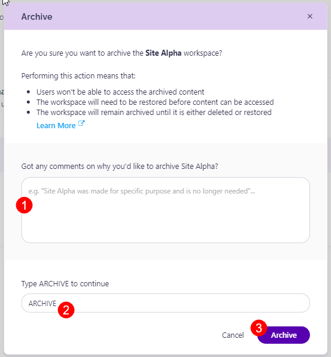

:::warning
**Please note!**  
This action can be executed only on workspaces that are not archived or deleted. 
:::

:::info
**Hint!**  
As described in the introduction, you can find the archived workspaces by switching to the **Archived view on the overview screens**.

The Archive Status column shows what method was used to archive a workspace. The In-place archival method can be completed only through Syskit Point. The Microsoft 365 Archive can be completed through both Syskit Point and Microsoft 365. **You can restore the workspace through Syskit Point regardless of which method was used to archive it**. 

[To learn more about Microsoft 365 Archive, take a look at their article.](https://learn.microsoft.com/en-us/microsoft-365/archive/archive-overview?view=o365-worldwide)

:::

### Delete

With this action, you can easily delete a workspace inside Microsoft 365.

:::warning
**Please note!**  
This action **does not delete** a workspace **permanently**.  
**The deleted workspace is moved to the Recycle Bin**, and **you can restore it within the period defined by Microsoft**. Microsoft 365 keeps your sites for **93 days**, and after that, they are deleted permanently. Microsoft 365 Groups are kept in the Recycle Bin for **30 days**.
:::

:::warning
**Please note!**  
You can find more about Microsoft’s retention policies on the following links:

* [Microsoft 365 Groups](https://docs.microsoft.com/en-us/microsoft-365/admin/create-groups/restore-deleted-group?view=o365-worldwide)
* [SharePoint Online](https://support.microsoft.com/en-us/office/restore-items-in-the-recycle-bin-that-were-deleted-from-sharepoint-or-teams-6df466b6-55f2-4898-8d6e-c0dff851a0be?ui=en-us&rs=en-us&ad=us#ID0EAADAAA=Online)
:::

When running the delete action, do the following:

* **Enter a comment (1)**
* **Confirm the action by typing DELETE (2)**
* **Execute the action by clicking the Delete button (3)**

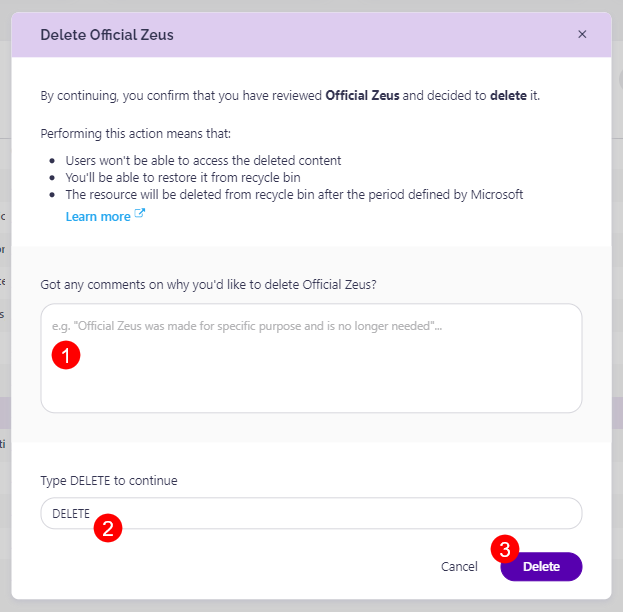

:::warning
**Please note!**  
This action can be executed on workspaces that are not deleted or archived.
:::

### Restore

The **Restore action** can be executed on archived and deleted workspaces.

* **When restoring a deleted workspace**, the action results in the following:
* **The workspace is removed from the Recycle Bin**
* **The workspace is considered active**
* **When restoring an archived workspace**, the action results in the following:
* **All memberships are be restored**
* If applying naming rules was enabled, **the suffix \[Archive\] is removed from the workspace name**;

When running the Restore action, a confirmation dialog appears. To execute the action, click the **Restore button**.

[To learn more about Microsoft 365 Archive, take a look at their article.](https://learn.microsoft.com/en-us/microsoft-365/archive/archive-overview?view=o365-worldwide).

:::info
**Hint!**  
There is no time limit for **performing the Restore action on the Archived workspace**. 
:::

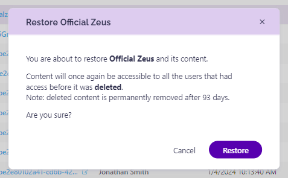

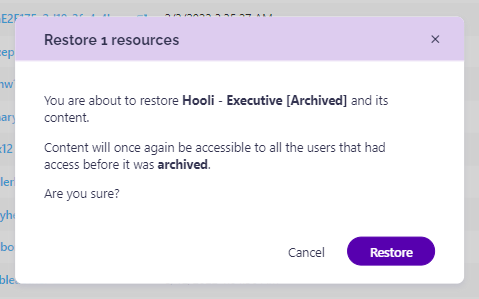

## Relevant Articles

* [**Inactive Workspaces Policy**](../../governance-and-automation/automated-workflows/inactive-workspaces-admin.md)
* [**Security & Compliance Checks: Inactive Workspaces**](../../governance-and-automation/security-compliance-checks/inactive-workspaces.md)