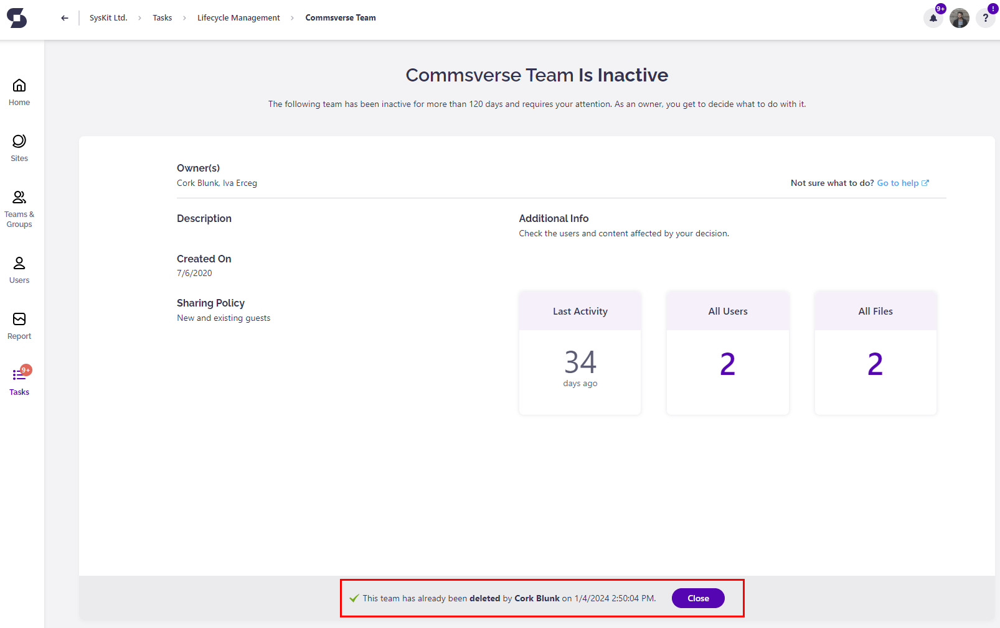
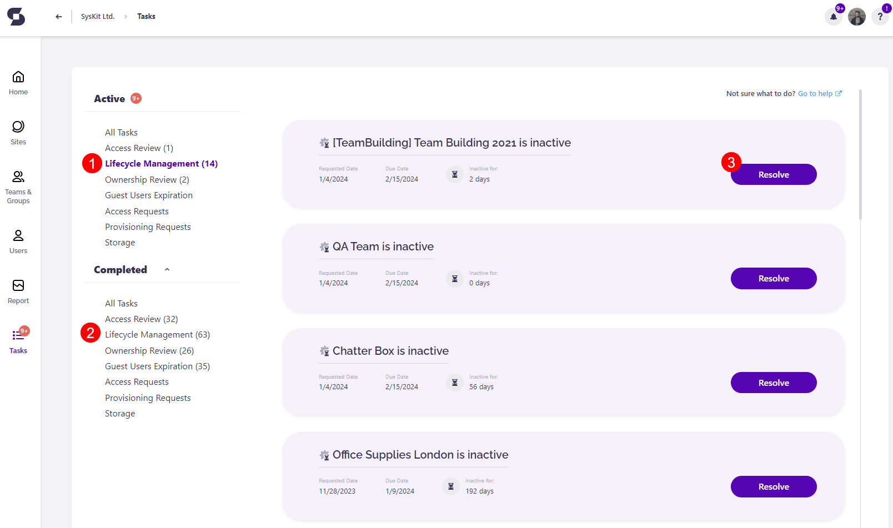
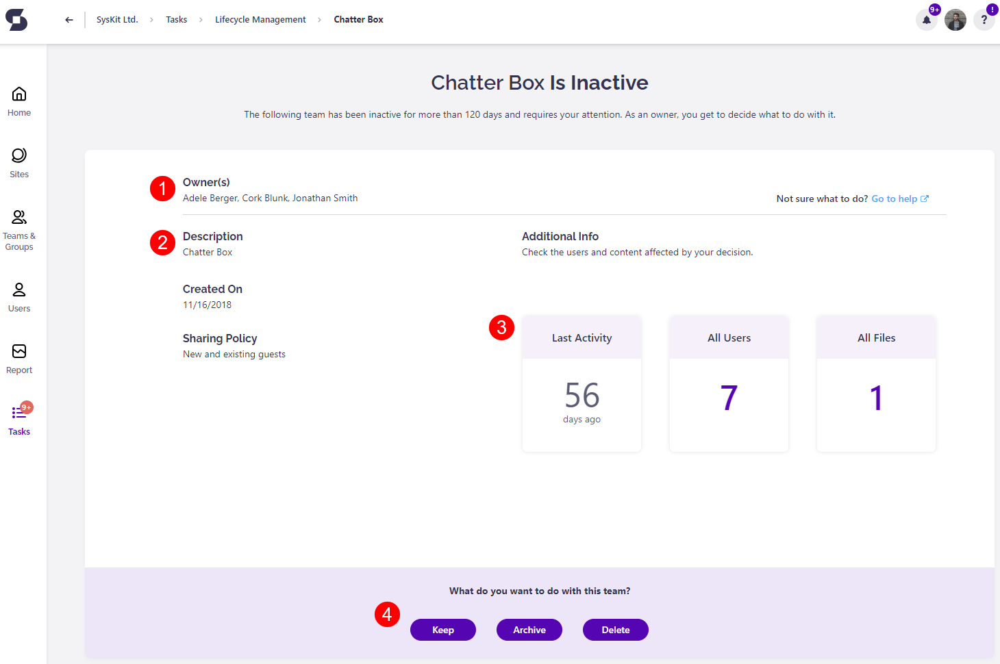
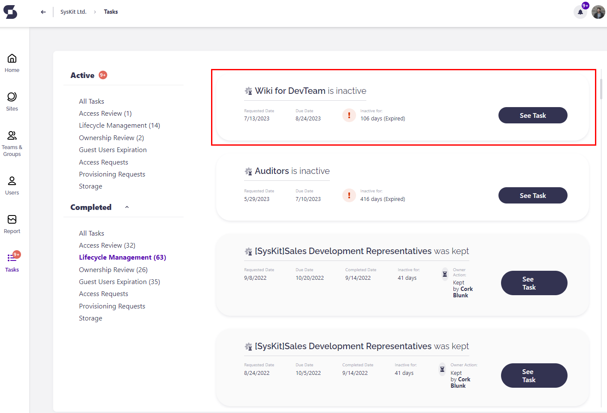

# Resolve Lifecycle Management Tasks

:::warning
**Lifecycle Management Automation** will be deprecated and replaced by the [Inactive Workspaces policy](../resolve-governance-tasks/inactive-workspaces.md). After approximately two months, the feature will be fully removed from Syskit Point.
:::

Workspaces in Microsoft 365 usually display the following lifecycle stages:

* **Creation**; for example, when an admin creates a new workspace (Microsoft Team) or end-users request a new workspace from a menu of templated options created by admins in SysKit Point. 
* **Maintenance**; users collaborate and use said workspace, chat, and create files; enforcing continuous reviews with automated flows provides an easy way to manage ownership and access to your assets.
* **Cleanup**; SysKit Point automatically detects inactive workspaces and lets you decide if you wish to keep, archive, or delete the data; after a team is dismissed or a product is retired, the previously used workspace becomes stale and is no longer needed.

**When a workspace has reached the third stage**, a team owner for that workspace needs to decide:

* Whether to **keep** the workspace available,
* **Archive** the produced content, or
* **Delete** the workspace and all of its content.

To help with this process, **Syskit Point provides the Lifecycle Management Automation feature** and reduces the management to the previously described decision-making.

After a Syskit Point Admin [enables and configures Lifecycle Management Automation](../../governance-and-automation/lifecycle-management/enable-lifecycle-management.md), **site owners and admins will be notified via email** when some of their workspaces are inactive for a period longer than the one [defined in Syskit Point settings](../../governance-and-automation/lifecycle-management/inactive-content.md#define-what-is-inactive).

## Inactive Workspace Email

Once Syskit Point recognizes that a workspace – Microsoft Team, Microsoft 365 Group, or a site – is inactive, an email is sent to the owner or admin of said workspace.

The email provides the following:

* **Workspace name and type (1)**
* **Inactivity period (2)**
* **Keep, Archive and Delete actions (3)**
* **Link to the Lifecycle Management task in Syskit Point (4)**

Clicking any of the **action buttons (3)** redirects to the **Lifecycle Management task** of the workspace in Syskit Point.

The Lifecycle Management task screen provides the option to **include additional information on the workspace and execute the selected action**.

Once clicked, the **task details screen opens** with the appropriate action dialog visible.

* For example, if the **Delete action button** is clicked, the screen shown in the image below opens.

The following can be:

* **Comment (1)** on why you’re performing the action
* **Run the action (2)**

After the action is executed, **the information is displayed in the bottom ribbon of the Lifecycle management** task for the viewed workspace.

* An example of this is shown in the image below.

:::warning
**Please note!**\
You can find more detailed information on all Lifecycle Management actions available in Syskit Point [here](../../governance-and-automation/lifecycle-management/lifecycle-management-actions.md).
:::

All Lifecycle Management tasks assigned to you can be found on the **My Tasks screen**.

## Lifecycle Management Tasks

To view the Lifecycle Management Tasks, click the **My Tasks tile** on the Home screen or the **My Tasks section** in the user profile menu. The red **notification bubble** that can be seen in the top right corner shows the number of tasks assigned to you.

My Tasks screen shows:

* **Active Lifecycle Management tasks (1)**
* **Completed Lifecycle Management tasks (2)**
* **Resolve button (3)** to open the task details screen

## Lifecycle Management Task Details

On the task details screen, the following information is available:

* **Owner(s) list (1)**
* **General workspace information (2)**
  * Description
  * Creation date
  * Workspace sharing policy
* **Last Activity**, **All Users**, and **All Files tile (3)**;
  * The All Users and All Files tile redirects to the relevant reports where more information can be found on the users and content in that workspace.
* **Actions (4)**; this section provides options on what to do with the inactive workspace

**After successfully running a Lifecycle Management action, Syskit Point automatically completes the Lifecycle Management task for the reviewed workspace.**

## Reminder Emails

By default, site owners will receive two additional emails reminding them to complete their Lifecycle Management task.

Syskit Point automatically sends these emails:

* **three days before they're due**
* **on the due date**

The emails display an appropriate message depending on the time left to complete the task and provide all the available Lifecycle Management actions.

* Choosing one of the Lifecycle Management actions is necessary for task completion.

## Overdue Tasks

If the opportunity to decide what to do with the inactive workspace is missed, **Owners can still complete the overdue tasks** for all policies.

**Collaborators** can find the overdue task under Active tasks in their My Tasks section, but it will show as Overdue.

They can be found on the **My Tasks screen** under the Active Lifecycle Management view.

# Resolve Lifecycle Management Tasks

* **Watch this short video for a quick start on Lifecycle Management tasks in Syskit Point**.

  <iframe 
    src="https://www.youtube.com/embed/VnUb48kjYeo?si=jC9SId-f6EVVRNS3" 
    title="YouTube video player" 
    frameBorder="0" 
    allow="accelerometer; autoplay; clipboard-write; encrypted-media; gyroscope; picture-in-picture; web-share" 
    referrerPolicy="strict-origin-when-cross-origin" 
    allowFullScreen
    style={{position: 'absolute', top: 0, left: 0, width: '100%', height: '100%'}}
  />

## Related Topics

* [Learn more about lifecycle management](https://docs.microsoft.com/en-us/microsoftteams/plan-teams-lifecycle)
* [Learn how to Resolve Access Review Tasks](access-review.mdx)
