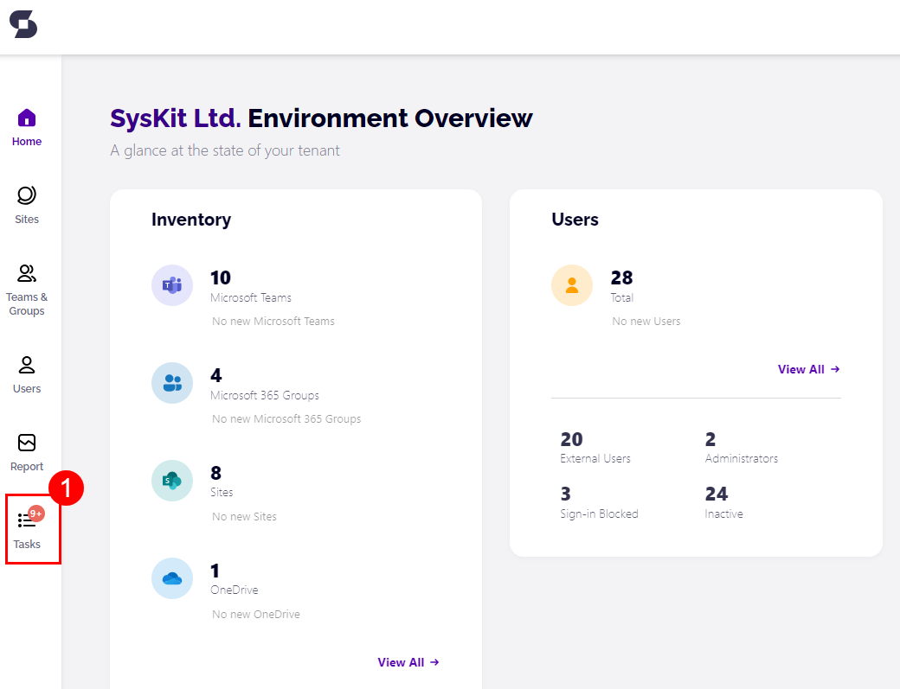
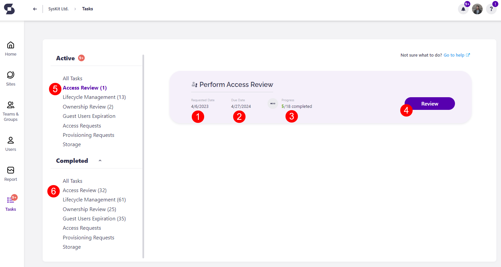

# My Tasks

The **Tasks** tile is located on the left side of Syskit Point, and a notification bubble displays the number of tasks that need to be reviewed.

To view tasks assigned to you, click the **Tasks button (1)** in your Syskit Point.

**Tasks** screen displays the active Access Review task with the most important information:

* **Requested date (1)**
* **Due date (2)**
* **Completion progress (3)**
* **Review button (4)**
* **Task categories (5)**
* **Completed tasks categories (6)**

Click **Review** to continue. The **Access Review Task** screen opens - the same screen that can be accessed from email, as explained in the previous section.

The same can be done for any type of task assigned to you, for example, [lifecycle management](../resolve-governance-tasks/lifecycle-management.md), or others.  

On the screen that opens, click the **link in the Task column** to continue and review a site.

## Related Articles

* [Complete Access Review Tasks](access-review.md)
* [Complete Metadata Review Tasks](metadata-review.md)
* [Perform Lifecycle Management Tasks](lifecycle-management.md)
* [Resolve Inactive Guest Users Tasks](guest-users-expiration.md)
* [Resolve Minimum Number of Owners Tasks](minimum-number-of-owners.md)
* [Resolve Maximum Number of Owners Tasks](maximum-number-of-owners.md)
* [Resolve Orphaned Workspaces Tasks](orphaned-resources.md)
* [Resolve Tenant Storage Limit Task](tenant-storage-limit.md)