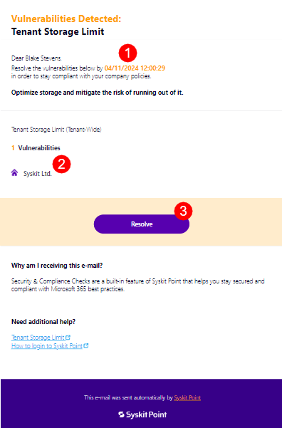
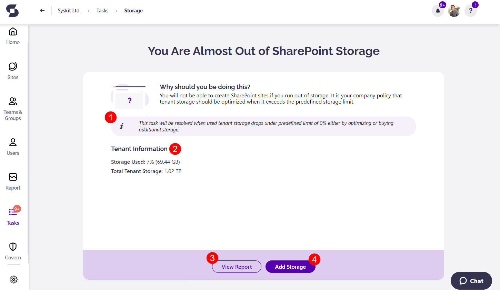

# Resolve Tenant Storage Limit Tasks

**This article shows how Syskit Admins or custom recipients, as set in the [Tenant Storage Limit policy settings](../../governance-and-automation/automated-workflows/tenant-storage-admin.md), can resolve a policy vulnerability regarding the tenant storage limit**.

This task notifies you when **your storage percentage gets close to the limit that was set**. 

If you run out of storage, you are **not able to create any more SharePoint sites**. Optimizing your storage usage or adding more storage ensures your organization can continue working seamlessly and efficiently. 

:::tip
By default, **Syskit Point notifies the Syskit Point admins** of this vulnerability. However, the Syskit Point admin can customize this policy to include custom recipients instead. Learn more about how to
[configure your tenant storage limit policy in this article.](../../governance-and-automation/automated-workflows/tenant-storage-admin.md)
:::

## Policy Vulnerability E-mail

When Syskit Point detects that you reached the storage limit for your tenant, as predefined by your storage tenant limit policy, **you will receive an e-mail to resolve the policy vulnerability**.

You can find the following information in the e-mail:
* **The date by which the policy vulnerability needs to be resolved (1)**
* **The location where the policy vulnerability happened (2)**
* **The Resolve button (3)** takes you to Syskit Point, where you can resolve the policy vulnerability

**Click the View details button to open the policy vulnerability task** in Syskit Point.

## Policy Vulnerability Task

Along with the e-mail, **Syskit Point creates a policy vulnerability task** that provides you with all the information and actions needed to resolve the policy vulnerability. 

The following are available on the task screen:
* The **information box (1) that explains what actions can be completed to resolve the task** and ensure your tenant storage drops below the limit predefined by the policy:
  * Adding additional storage
  * Optimizing your current storage
  * Or increasing the Tenant Storage Limit policy percentage 
* **Tenant information on your storage (2)**:
  * Storage used shown as amount and percentage
  * Total tenant storage available shown as amount and percentage
* **View Report button (3)** which redirects you to the [Storage Metrics Report](../../storage-management/storage-reports.md#storage-metrics)
* **Add Storage button (4)** which redirects you to [Microsoft documentation](https://learn.microsoft.com/en-us/microsoft-365/commerce/add-storage-space?view=o365-worldwide) detailing how to add storage through Microsoft

The task is resolved when your tenant storage drops below the limit set for the [Tenant Storage Limit policy](../../governance-and-automation/automated-workflows/tenant-storage-admin.md). 

## Related Articles

* [Storage Management](../../storage-management/storage-management-overview.md)
* [Configure Tenant Storage Limits Policy](../../governance-and-automation/automated-workflows/tenant-storage-admin.md)
* [Tenant Storage Security & Compliance Check](../../governance-and-automation/security-compliance-checks/tenant-storage.md)
* [Storage Reports](../../storage-management/storage-reports.md)