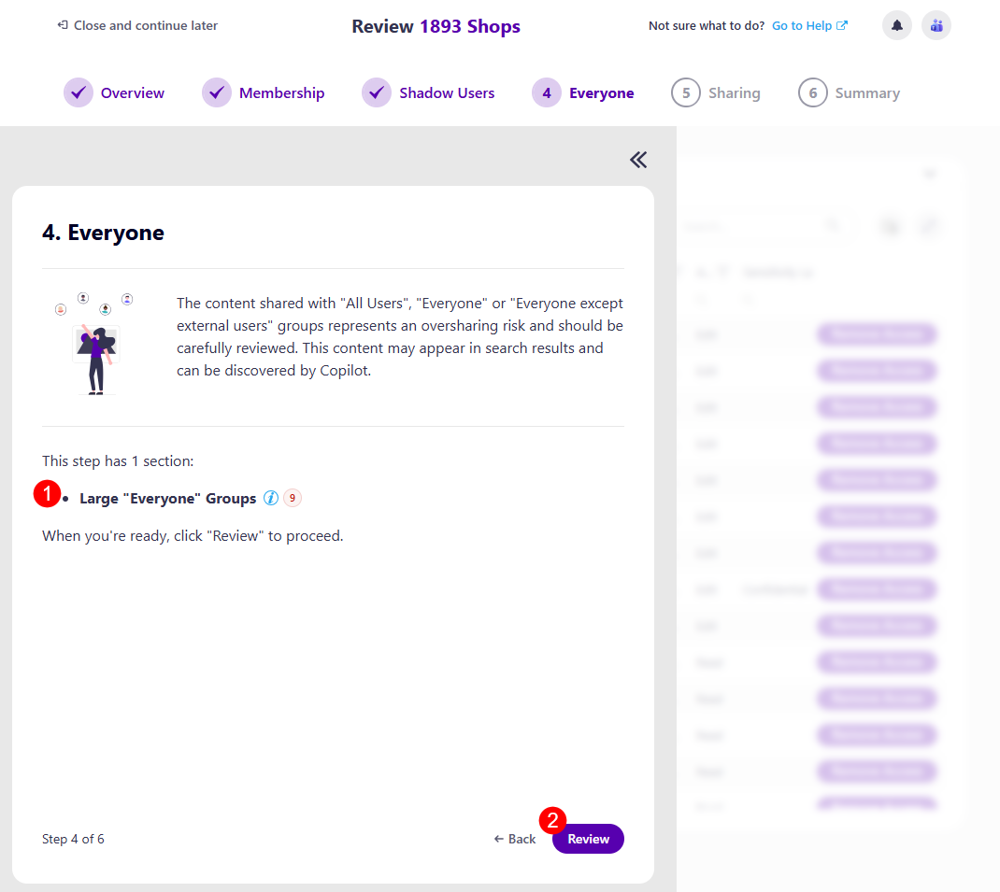
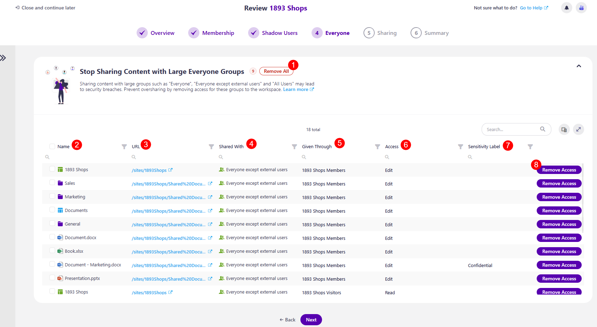

# Workspace Review Everyone

:::warning
**Please note!** 

If there is no content shared with large "Everyone" Groups to report, this step in the review is automatically skipped.

:::

The first screen on the Everyone step is the task overview. Here, you can find information on what is expected of you for this step:

* You will be asked to **review content shared with "All Users", "Everyone", or "Everyone Except External Users"**. 
  * This content represents an oversharing risk and should be carefully reviewed. 

* Explanation of how many sections this step has: **Large "Everyone" Groups (1)**

* **Review button (2)** you can click when ready to start your review.

After **clicking the Review button**, the Everyone step opens. On this screen, the following information and actions are available:

* The **Remove All (1)** action button next to the name of the workspace, which removes access for all content shared with Large "Everyone" Groups

* **Name (2)** - the name of the resources shared with Large "Everyone" Groups
* **URL (3)** - the URL for the resource shared with Large "Everyone" Groups
* **Shared With (4)** - shows who the resource was shared with
* **Given Through (5)** - shows how the resource was shared, who shared it
* **Access (6)** - the level of access given for the resource
* **Remove Access (8)** action
  * Clicking this action opens the Remove Access confirmation modal, where you have to confirm the removal of access to the selected resource

Once you have completed the actions you decide to take, clicking Next takes you to the next step, [Sharing](sharing-step.md).

:::info
**Please note!** 

If you are unsure of what to do at any point and want to **consult your co-reviewers, you can start a chat with them by clicking the Microsoft Teams icon in the top right corner** of the Syskit Point app. 

:::