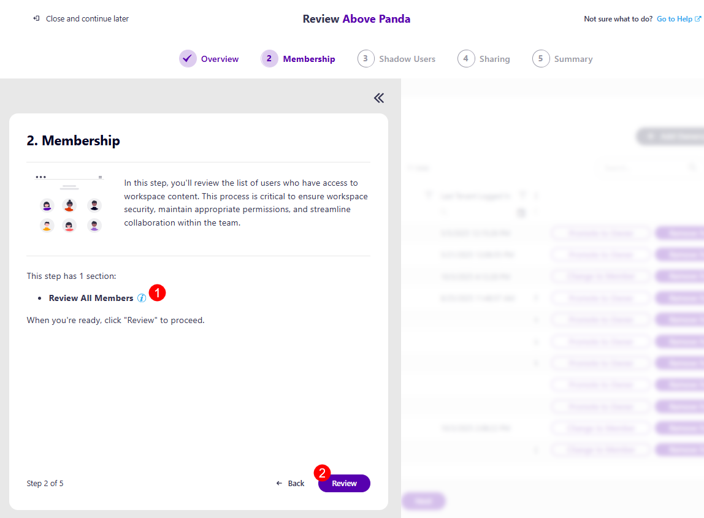

# Workspace Review Membership

The first screen on the Membership step is the task overview. Here, you can find information on what is expected of you for this step:

* You will be asked to **review the list of users who have access to workspace content**, which is critical to ensuring workspace security, maintaining appropriate permissions, and streamlining collaboration within the team. 

* Explanation of how many sections this step has: 
  * [**Blocked Members (1)**](#remove-blocked-members) - this section is only available if the admin selected it when [setting up the Workspace Review policy](../../governance-and-automation/workspace-review/setup-workspace-review.md)
  * [**Inactive Guests (2)**](#remove-inactive-guests) - this section is only available if the admin selected it when [setting up the Workspace Review policy](../../governance-and-automation/workspace-review/setup-workspace-review.md)
  * [**Review All Members (3)**](#review-all-members) - this section is available by default when the Membership step is selected, you are still able to review blocked members and inactive guests during this section

* The **Review button (4)** – click this when you are ready to start your review.

## Remove Blocked Members

If the Blocked Members option was selected for this policy, after clicking the Review button, the Remove Blocked Members section opens, where the following can be found: 

* **Remove All (1)** action button next to the name of the workspace, which removes all blocked members in bulk

* On the left side, there are three **filters (2)** you can use to view the list with:
  * **All** users 
  * **Owners** only 
  * **Members** only 

* The columns available are: 
  * **Name (3)** - the name of the user
  * **Username (4)** - the e-mail address of the user
  * **Role (5)** - the role of the user in the workspace
  * **Department (7)** - the department of the user
  * **Last Tenant Logged In (6)** - last date the tenant with the user was logged in
  * **Recommendation (8)** - this section provides a recommendation from Syskit Point on what actions should be taken if any notable recommendations can be made. The following recommendations could be suggested:
    * **Remove Blocked Members** - a blocked member is someone whose sign-in access has been disabled by an admin. Blocked members cannot log in, and you can safely remove them from your workspace 
* **Promote to Owner (9)** action
  * Clicking this action promotes the user from member status to owner status
* **Remove from Group (10)** action
  * Clicking this action removes the user from the workspace

**Selecting more than one workspace** lets you perform these two actions on multiple members at once.

## Remove Inactive Guests
 
If the Inactive Guests option was selected for this policy, after clicking Next, the Remove Inactive Guests section opens, where the following can be found: 

* **Remove All (1)** action button next to the name of the workspace, which removes all inactive guests in bulk 

* On the left side, there are three **filters (2)** you can use to view the list with:
  * **All** users 
  * **Guests** only 

* The columns available are: 
  * **Name (3)** - the name of the user
  * **Username (4)** – the e-mail address of the user
  * **Role (5)** - the role of the user in the workspace
  * **Department (6)** - the department of the user
  * **Last Tenant Logged In (7)** - last date the tenant with the user was logged in
  * **Recommendation (8)** - this section provides a recommendation from Syskit Point on what actions should be taken if any notable recommendations can be made. The following recommendations could be suggested:
    * **Remove Inactive Guests** - An inactive guest user is someone outside your organization who was inactive during the period defined in the Inactive Guest Users policy 
* **Remove from Group (9)** action
  * Clicking this action removes the user from the workspace

**Selecting more than one workspace** lets you perform these two actions on multiple guests at once.

## Review All Members

Clicking Next opens the Review All Members section. On this screen, the following information and actions are available:

* At the top right corner, there is a **Add Owners/Members button (1)**
  * Clicking this opens the Add Owners/Members dialog, where you can add additional members or owners to the workspace.

* On the left side, there are three **filters (2)** you can use to view the list with:
  * **All** users 
  * **Owners** only 
  * **Members** only 

* The columns available are: 
  * **Name (3)** - the name of the user
  * **Username (4)** - the e-mail for the user
  * **Role (5)** - the role of the user in the workspace
  * **Last Tenant Logged In (6)** - last date the tenant with the user was logged in
  * **Department (7)** - the department of the user
  * **Recommendation (8)** - this section provides a recommendation from Syskit Point on what actions should be taken if any notable recommendations can be made. The following recommendations could be suggested:
    * **Remove Blocked Members** - a blocked member is someone whose sign-in access has been disabled by an admin. Blocked members cannot log in, and you can safely remove them from your workspace. 
    * **Remove Inactive Guests** - An inactive guest user is someone outside your organization who was inactive during the period defined in the Inactive Guest Users policy. 
* **Promote to Owner (9)** action
  * Clicking this action promotes the user from member status to owner status
* **Change to Member (10)** action
  * Clicking this action promotes the user from owner status to member status
* **Remove from Group (11)** action
  * Clicking this action removes the user from the workspace

**Selecting more than one workspace** lets you perform these two actions on multiple workspaces at once

:::warning
* If the [Minimum Number of Owners](../resolve-governance-tasks/minimum-number-of-owners.md) and/or [Maximum Number of Owners](../resolve-governance-tasks/maximum-number-of-owners.md) policies were assigned as part of the Workspace Review by the Administrator, and a vulnerability on the workspace was detected, you will not be able to move forward without resolving the vulnerability. 
:::

Once you have completed the actions you decide to take, clicking Next takes you to the next step, [Shadow Users](shadow-users-step.md).

:::info
**Please note!** 

If you are unsure of what to do at any point and want to **consult your co-reviewers, you can start a chat with them by clicking the Microsoft Teams icon in the top right corner** of the Syskit Point app. 

:::