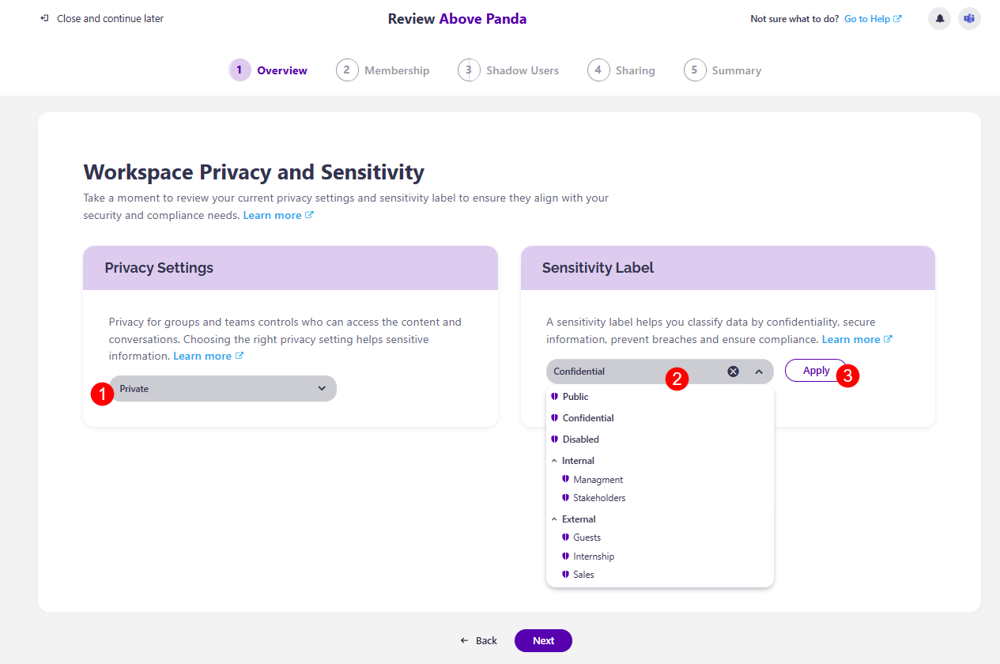

# Workspace Review Privacy and Sensitivity

If Sensitivity and Privacy reviews were set up as a part of the Workspace Review, they will be a part of the Overview step. 

* For more details on what a privacy review entails outside of a Workspace Review, [take a look at the Complete Privacy Review article.](../resolve-governance-tasks/privacy-review.md)

* For more details on what the sensitivity review looks like outside of a Workspace Review, [take a look at the Complete Sensitivity Review article.](../resolve-governance-tasks/sensitivity-review.md)

**Clicking Next** after the Overview step opens the **Workspace Privacy and Sensitivity screen**. 

**Privacy (1)** for groups and teams controls who can access the content and conversations, and choosing the right privacy settings helps protect sensitive information. 
* From the **drop down bar**, you can select between two options:
  * **Private** - private groups or teams are only accessible to approved members, keeping files, chats, and information visible only to these members.
  * **Public** - public groups or teams are open to everyone in your organization - they can find and join them without approval.

A **Sensitivity Label (2)** helps you classify data by confidentiality, lets you secure information, prevent breaches, and ensure compliance. 
* From the **drop-down bar**, you can select between the sensitivity label options available for your company.
* **Click the Apply button (3)** next to the drop-down bar to apply your chosen sensitivity label

Once you've made your changes, click Next to proceed to the next step, [Membership](membership-step.md).

