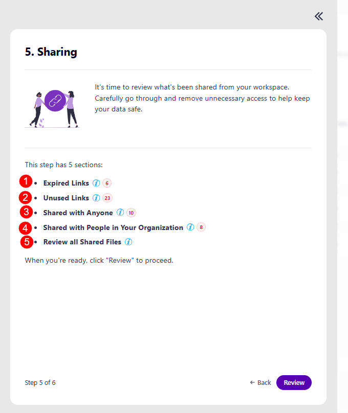
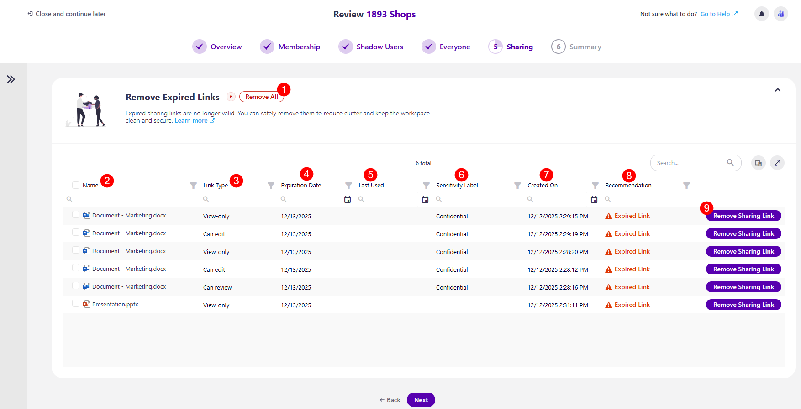
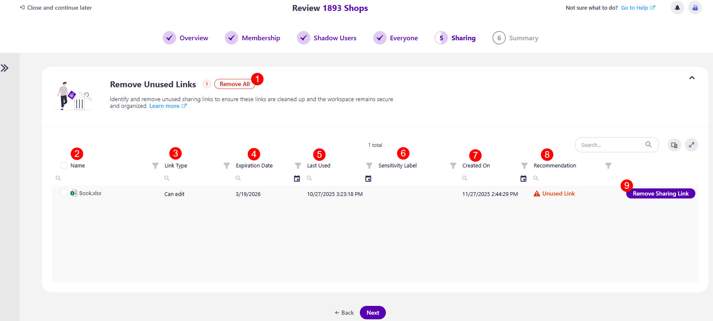
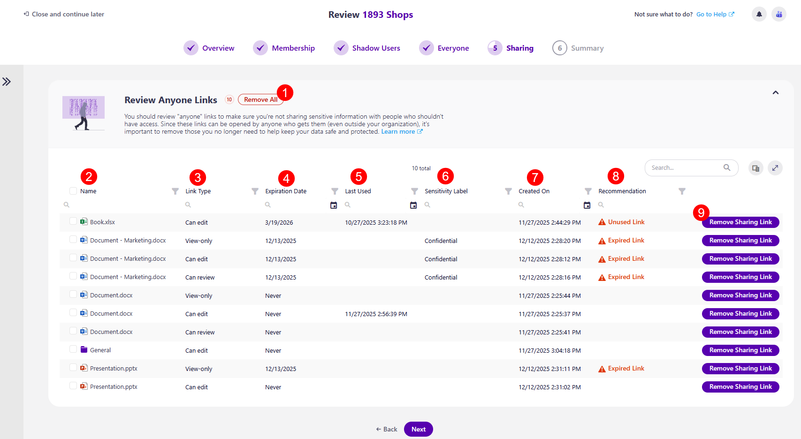
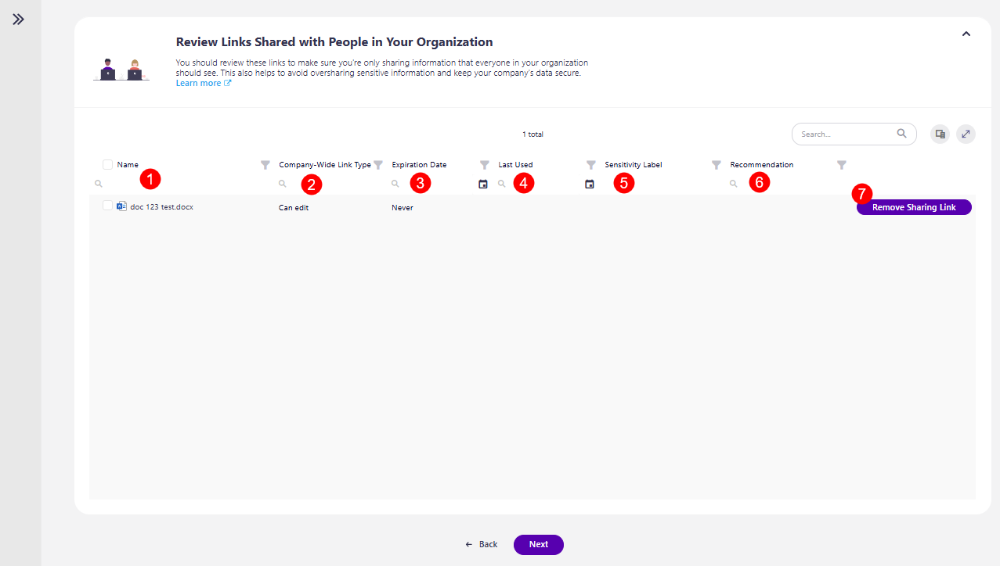
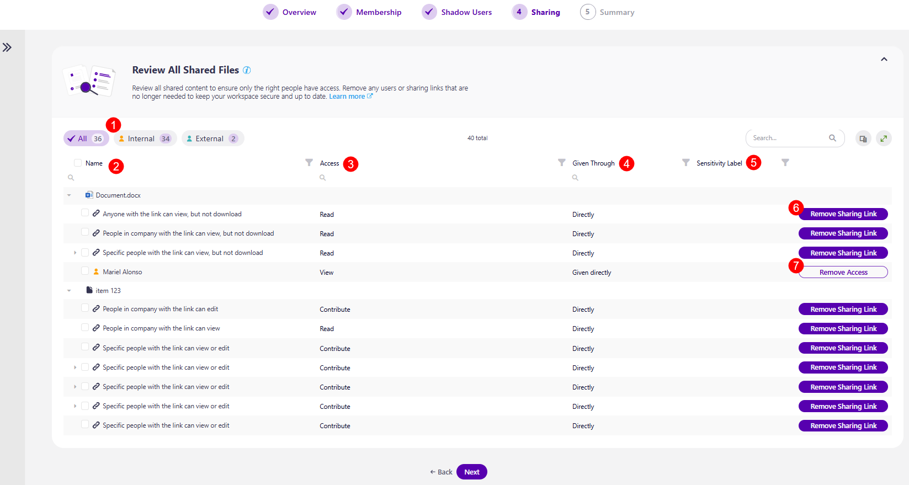

# Workspace Review Sharing

The first screen on the Sharing step is the task overview. This step heavily depends on what [sections were selected during the setup process of the Workspace Review policy.](../../governance-and-automation/workspace-review/setup-workspace-review.md) 

If a **checkbox isn't selected, this section does not appear during the Sharing step**.

On the task overview screen, you can find information on what is expected of you for this step:

* You'll be asked to **review what's been shared from your workspace**. 
  * Carefully going through and removing unnecessary access helps keep your data safe. 

* Explanation of how many sections this step has: 
  * [**Expired Links (1)**](#remove-expired-links) 
  * [**Unused Links (2)** ](#remove-unused-links) 
  * [**Shared with Anyone (3)**](#review-anyone-links) 
  * [**Shared with People in Your Organization (4)**](#review-links-shared-with-people-in-your-organization) 
  * [**Review All Sharing Links (5)** ](#review-all-shared-files)
    * Please note, if a section was not selected during setup, it will not appear here

* The **Review button (5)**, which you can click when you're ready to start your review.

:::warning
**Please note!**\
If there are no Sharing Links to report, this step in the review is automatically skipped. Each section that does not have data to report is automatically skipped. 
:::

## Remove Expired Links

After **clicking the Review button**, the Remove Expired Links section opens where you can review and remove **expired sharing links that are no longer valid**. 

On this screen, you can find the following:

* **Remove All (1)** action button next to the name of the workspace, which removes all blocked shadow users in bulk

The columns available are: 

* **Name (2)** of the content shared 
* **Link Type (3)** - the level of sharing given through the link, for example, view-only, password-protected (edit), etc.
* **Expiration Date (4)** - shows when the link is set to expire
* **Last Used (5)** - the date the content was last used
* **Sensitivity label (6)** - shows if there is a sensitivity label assigned to the content
* **Created On (7)** - shows when the content was originally created
* **Recommendation (8)** - this section provides a recommendation from Syskit Point on what actions should be taken if there are any notable recommendations to be made. The following recommendation could be suggested:
   * **Expired Links** - expired sharing links are no longer valid. You can safely remove them to reduce clutter and keep your workspace clean and secure 
* The **Remove Sharing Link (9)** action
  * Clicking this action opens the Remove Sharing Link modal, where you need to confirm the removal of the sharing link
  

Once you've completed the actions you want to take, clicking Next takes you to the next section of this step.

## Remove Unused Links

On the **Remove Unused Links** sections, you can identify and remove **unused sharing links to ensure links are cleaned up and the workspace remains secure**. 

On this screen, you can find the following:

* **Remove All (1)** action button next to the name of the workspace, which removes all unused links

The columns available are: 

* **Name (2)** of the content 
* **Link Type (3)** - the level of sharing given through the link, for example, view-only, password-protected (edit), etc.
* **Expiration Date (4)** - shows when the link is set to expire
* **Last Used (5)** - the date the content was last used
* **Sensitivity label (6)** - shows if there is a sensitivity label assigned to the content
* **Created On (7)** - shows when the content was originally created
* **Recommendation (8)** - this section provides a recommendation from Syskit Point on what actions should be taken if there are any notable recommendations to be made. The following recommendation could be suggested:
   * **Unused Link** - unused links are links that haven't been used in the last 30 days
* The **Remove Sharing Link (9)** action
  * Clicking this action opens the Remove Sharing Link modal, where you need to confirm the removal of the sharing link
  

Once you've completed the actions you want to take, clicking Next takes you to the next section of this step.

## Review Anyone Links

On the **Links Shared with Anyone** section, you can review **anyone links to ensure you're not sharing sensitive information with people who shouldn't have access**.

On this screen, you can find the following:

* **Remove All (1)** action button next to the name of the workspace, which removes access to all links shared with anyone

The columns available are: 
* **Name (2)** of the content 
* **Link Type (3)** - the level of sharing given through the link, for example, view-only, password-protected (edit), etc.
* **Expiration Date (4)** - shows when the link is set to expire
* **Last Used (5)** - the date the content was last used
* **Sensitivity label (6)** - shows if there is a sensitivity label assigned to the content
* **Created On (7)** - shows when the content was originally created
* **Recommendation (8)** - this section provides a recommendation from Syskit Point on what actions should be taken if there are any notable recommendations to be made. The following recommendation could be suggested:
   * **Expired Links** - expired sharing links are no longer valid, you can safely remove them to reduce clutter and keep your workspace clean and secure 
   * **Unused Link** - unused links are links that haven't been used in the last 30 days
* The **Remove Sharing Link (9)** action
  * Clicking this action opens the Remove Sharing Link modal, where you need to confirm the removal of the sharing link
  

Once you've completed the actions you want to take, clicking Next takes you to the next section of this step.

## Review Links Shared with People in Your Organization

On the **Links Shared with People in Your Organization** section, you can review **links to ensure you're only sharing information that everyone in your organization should see**.

On this screen, you can find the following:

* **Remove All (1)** action button next to the name of the workspace, which removes access to all links shared with people in your organization

The columns available are: 

* **Name (2)** - of the content 
* **Company-Wide Link Type (3)** - the level of sharing given through the link, for example, can edit, view-only, etc.
* **Expiration Date (4)** - shows when the link is set to expire
* **Last Used (5)** - shows when the link was last used
* **Sensitivity label (6)** - shows if there is a sensitivity label assigned to the content
* **Created On (7)** - shows when the content was originally created
* **Recommendation (8)** - this section provides a recommendation from Syskit Point on what actions should be taken if there are any notable recommendations to be made. The following recommendation could be suggested:
   * **Expired Links** - expired sharing links are no longer valid, you can safely remove them to reduce clutter and keep your workspace clean and secure 
   * **Unused Link** - unused links are links that haven't been used in the last 30 days
* **Remove Sharing Link (9)** action
  * Clicking this action opens the Remove Sharing Link modal, where you need to confirm the removal of the sharing link

Once you've taken all the necessary actions, clicking Next takes you to the last step, [Summary](summary-step.md).

:::warning
**Please note!**\
If you are unsure of what to do at any point and want to **consult your co-reviewers, you can start a chat with them by clicking the Microsoft Teams icon at the top right corner** of the Syskit Point app. 
:::

## Review All Shared Files

If the Review All Shared Files option was selected for this policy, after clicking Next, the section opens where you can review all shared content to ensure only the correct people have access. 

Here you can find the information: 

* On the left side, there are three **filters (1)** you can use to view the list with:
  * **All** files 
  * **Internal** shows only internally shared files
  * **External** shows only externally shared files

The columns available are: 

* **Name (2)** - of the files 
* **Access (3)** - the level of access given for that file
* **Given Through (4)** - shows how the file was shared
* **Sensitivity label (5)** - shows if there is a sensitivity label assigned to the file
* **Remove Sharing Link (6)** action
  * Clicking this action opens the Remove Sharing Link modal, where you need to confirm the removal of the sharing link
* **Remove Access (7)** action
  * Clicking this opens the Remove Access modal, where you need to confirm the removal of access for this user
  * This action removes access for that specific user to the file that was shared

