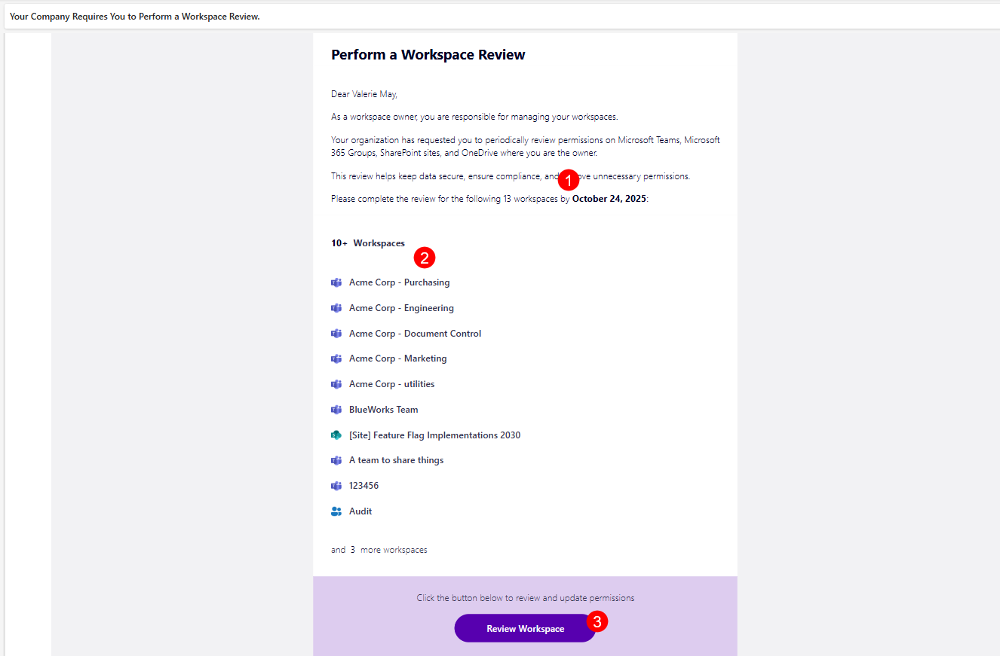
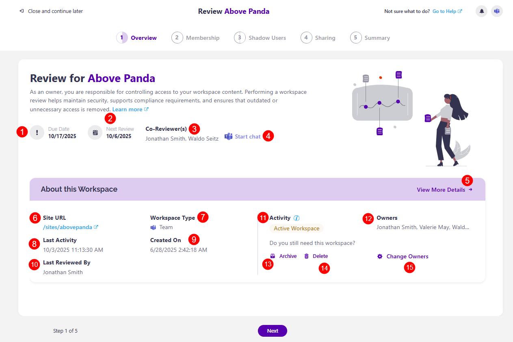

# Workspace Review Overview

**The Workspace review**, in the context of the Microsoft 365 environment, is a scheduled review for Microsoft 365 workspaces that ensures each workspace follows your organization's governance policies.

The **Workspace Review task is usually performed by a workspace owner**; however, reviewers for workspace review policies can be defined by the Syskit Point Admins. Depending on the [settings for the workspace review policy](../../governance-and-automation/workspace-review/setup-workspace-review.md), you might be asked to:
* Confirm or edit workspace ownership
* Review external sharing and guest access
* Check file and folder sharing
* Accept or resolve any policy vulnerabilities
* Decide if a workspace should be kept or deleted

Two different roles can view and complete the Workspace Review in Syskit Point:

* **Workspace Owners with the Syskit Point Collaborator** role assigned in Syskit Point who were set as reviewers in the policy settings, as described in this article
* [Syskit Point Admin users](../../governance-and-automation/workspace-review/monitor-workspace-review/README.md)

When working with Workspace Review, Syskit Point Collaborators can **perform the Workspace Review on workspaces where they are an owner or admin**.

If you've been asked to complete a Workspace Review task and you want some guidance as you go through the steps, you can find more details in these step-specific articles:
* [Membership](membership-step.md)
* [Shadow Users](shadow-users-step.md)
* [Sharing](sharing-step.md)
* [Summary](summary-step.md)

This article explains how the Workspace Review task begins and where you can complete it. 

## Workspace Review E-mail Request

If you receive a request to review your workspace, your organization has most likely **created a Workspace Review policy**. This means that periodically, **you are asked to review the sites, teams, and groups you're responsible for**.  

Ensuring your workspace review tasks are resolved on time is important and can **determine how overall exposed your organization is to potential security risks or outdated sharing practices and unauthorized permissions**. Syskit Point is here to help you along the way and ensure you complete every step as effectively as possible. 

When the Workspace Review starts, workspace owners receive an e-mail request to review permissions on their site(s). The e-mail contains the following important data:

* **The number of workspaces and the due date for the Workspace Review completion (1)**
* **The list of workspaces an owner needs to review (2)**
* **The Review Workspace button (3)**

The **Review Workspace** button opens the **Workspace Review Task** screen once clicked. 

This screen can also be accessed within Syskit Point by selecting **My Tasks**. [You can learn more about the My Tasks section by taking a look at this article.](../resolve-governance-tasks/my-tasks.md) 

## Workspace Review Wizard Overview Step

The first step of the Workspace Review is the Overview. Here, you can find the following information:

* **Due date (1)** for the resolution of the workspace review task
* **Next review date (2)**, which shows when the next workspace review ocurs
* **Co-reviewer(s) (3)**, shows who the other reviewers are for this workspace review
* **Start Chat button (4)**, which lets you start a Microsoft Teams chat with your co-reviewers to discuss the workspace review task

:::warning
**Please note!**\
When a **workspace is inactive**, you'll see an information box here, asking if you still need the workspace. You can then complete the **Keep, Archive, or Delete** actions on the workspace. 
:::

In the About this Workspace section, you can see the following:
* **View More Details button (5)** - clicking on this opens the workspace details screen
* **Site URL (6)** - shows the workspace URL
* **Workspace Type (7)** - shows what type of workspace it is
* **Last Activity (8)** - shows when the last activity date was
* **Created On (9)** - shows when the workspace was created
* **Last Reviewed By (10)** - shows who last reviewed the workspace
* **Activity (11)** - shows the current activity status of the workspace
* **Owners (12)** - shows who the owners of the workspace are
* **Archive button (13)** - clicking this archives the workspace
* **Delete button (14)** - clicking this delete the workspace
* **Change Owners button (15)** - clicking this opens the Change Owners modal, where you can add or remove owners from the workspace

The **Workspace Review Wizard** has a total of five steps: 

* **Overview**, which includes the **[Privacy and Sensitivity](privacy-sensitivity.md) review** if they were enabled in settings
* [Membership](membership-step.md) (for Microsoft 365 Groups and Microsoft Teams), or **Users** (for sites)
  * This step is not available for OneDrive
* [Shadow Users](shadow-users-step.md)
* [Sharing](sharing-step.md)
* [Summary](summary-step.md)

These steps are explained in more detail in their designated articles, linked above.
