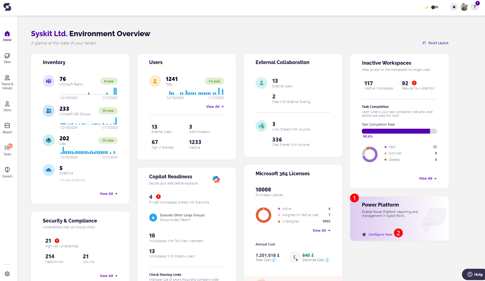
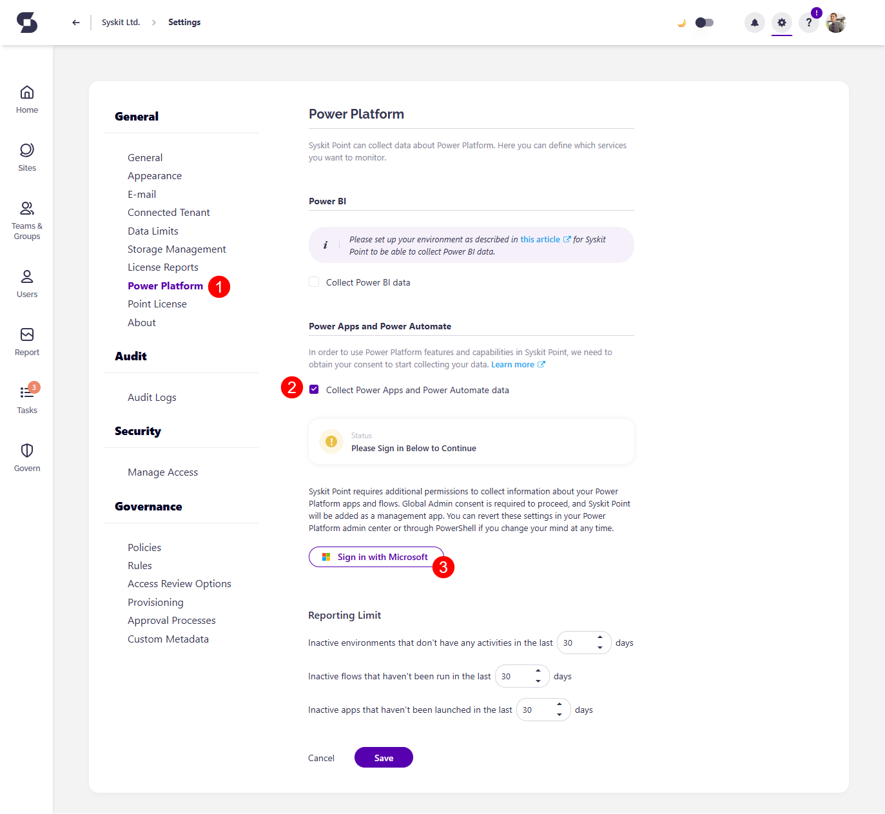
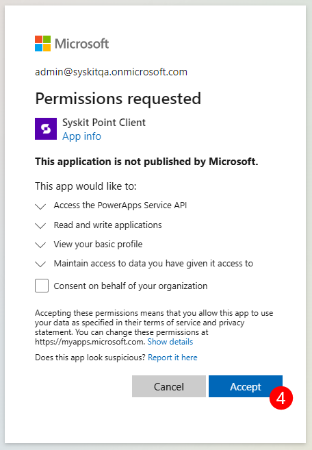
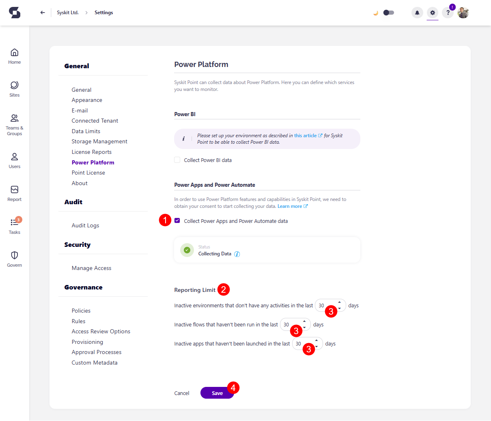

---
description: This article explains how to enable and set up Power Platform data collection for Syskit Point.
---

# Enable Power Platform Data Collection

In order to start **collecting and monitoring Power Apps, Power Flows, Power Platform Environments,** you need to first connect your Power Platform to Syskit Point. This helps you keep track of your Power Platform resources in one place to manage them more effectively. 

In this article, you can find details on:

* [Enabling Power Platform Data Collection](#enable-data-collection)
* [Configuring Reporting Limits](#configure-reporting-limits)
* [Assigning Syskit Point Power Platform Admins](#syskit-point-power-platform-admins)
* [Power Platform Sync Limits](#power-platform-sync-limits)

:::info
**Please Note!** Power Platform is **now available as an add-on** purchase to your Syskit Point subscription. 

To enable the use of Power Platform for Syskit Point, [please contact us](https://www.syskit.com/contact-us-power-platform/).

:::

## Enable Data Collection

:::warning
**Please Note!** 
Syskit Point currently doesn't support Power Platform data collection for GCC and GCC High tenants.
:::

Configuring the Power Platform feature in Syskit Point starts the Power Platform data collection, which enables you to generate Power Platform reports for a detailed overview of your Power Platform resources.

To enable the Power Platform data collection in Syskit Point, complete the following:

* Before the set up, the **Power Platform tile (1)** on the Dashboard shows the **Configure Now button (2)**

* Clicking the button redirects you to the **Power Platform section of Settings (1)** 
* Under Power Apps and Power Automate, **select the checkbox** next to **Collect Power Apps and Power Automate data (2)**

To collect Power Platform data, you need to **consent** for Syskit Point to start collecting it.

* **Click the Login with Microsoft Authentication flow (3)** button and **log in with the Global Administrator account**
  * The confirmation modal appears, listing the permissions required for the Power Platform data collection
  * For more information about the permissions, check the [Permission Requirements article](../requirements/permission-requirements.md#syskit-point-client)
* **Click Accept (4)** to start collecting Power Platform data in Syskit Point

:::warning
**Please note!**
The Read and Write applications permission (Graph/Application.ReadWrite.All) is used only once to update the Syskit Point Client app registration with the required PowerApps Service/User permission. After the permission is added, you can remove the Application.ReadWrite.All permission from the Syskit Point Client enterprise app.
:::

* [For details on how to enable Power BI data collection, take a look at this article.](../power-platform/enable-powerBI-data-collection.md)

Once the permissions are granted, you can see the **Status** in the Settings change to **Collecting Data** with a **green** checkbox next to it. 

If the box is unchecked, the Status shows the 'Please Enable Data Collection Above to Continue' warning message.

Once this is enabled, the first Power Platform data sync starts. When completed, summary data will show on the Power Platform dashboard tile. From there, you can drill to open specific reports, which provide more details about selected Power Platform resources.

For more details, [take a look at the Power Platform reports article](power-platform-reports/README.md)

:::info
To stop the Power Platform data collection, uncheck the Collect Power Apps and Power Automate Data checkbox and save the change.
:::

## Configure Reporting Limits

After **enabling the Power Platform data collection (1)**, additional settings are displayed, which affect the Power Platform reports and dashboard tile.

* You can set **Reporting Limits (2)** for how long environments, flows, or apps must be inactive before being flagged as such in the reports. The following can be set:
  * Inactive environments that don't have any activities in the last XX days
  * Inactive flows that haven't been run in the last XX days
  * Inactive apps that haven't been launched in the last XX days
* **Enter the number of days (3)** in the designated space
  * The number of days selected here is **reflected when showing data on the Power Platform reports** and the Power Platform **Dashboard tile**
  * The default/minimum number of days set as the inactivity period is 30 days
* **Click Save (4)** to store your preferences

 
## Power Platform Sync Limits

Syskit Point collects data for the Power Platform resources listed below.

### Power Platform Connections

* Syskit Point **displays all existing connections** but can only **show relationships between connections and flows**. 

* Relationship data for apps is not available due to Microsoft API limitations. 

### Environments with Dataverse Enabled

| Resource |	Type	| Is synced |
| ----- |----- |----- |
| Solution	| All types	| No |
| App |	A part of unmanaged solutions |	Yes |
| App |	Imported from managed solutions |	Yes |
| App |	Imported from unmanaged solutions |	Yes |
| App |	Part of a Common Data Service Default solution | Yes |
| App |	Model-driven app that is apart of a solution |	No |
| App |	Model-driven app that is not a part of a solution |	No |
| Flow | Imported from unmanaged solutions | Yes |
| Flow | Created in unmanaged solution | No |
| Flow | Imported with managed solutions | No |
| Flow | Part of a Common Data Service Default solution |	No |
| Flow | Desktop flow	| No |

### Managed Environments
The same rules apply as with Environments with [Dataverse enabled](#environments-with-dataverse-enabled) listed above.

### Environments with Dataverse Disabled

| Resource |	Type	| Is synced |
| ----- | ----- | ----- |
| App |	All types |	Yes |
| Flow |	All types |	Yes |

:::warning
**Please note!**\
Solutions cannot exist in environments without dataverse.\
Desktop flows cannot exist in environments without dataverse.
:::

## Syskit Point Power Platform Admins

In Syskit Point, **role-based access ensures that users can only see and manage the resources they are responsible for**. To manage Power Platform resources in Point, you need to **enable access for Power Platform admins**. 

:::warning
**Please note!**

* Assigning the **Power Platform Admin role in Syskit Point** to users **does not grant the Power Platform Administrator role in Entra ID** 
* **To successfully run actions** on Power Platform environments, apps, and flows, **Power Platform Admins in Syskit Point must have the Power Platform Administrator role assigned in Entra ID**
:::

When signed in to Syskit Point, Syskit Point Power Platform Admins can:
* **Access all data related to Power Platform environments, apps, and flows**
* **Perform actions on Power Platform environments, apps, and flows, given they have the Power Platform Administrator role assigned in Entra ID**

The **Syskit Point Power Platform Admins** role enables users to:

* **View and manage Power Platform Settings** in Syskit Point
* **Access Syskit Point Power Platform reports**
* **Schedule Power Platform reports**
* **Perform Power Platform actions** on environments, apps, and flows
    * Note that the Power Platform Administrator Entra ID role must be assigned to successfully run actions on Power Platform environments, apps, and flows
* **Have access to the Power Platform Dashboard tile**
