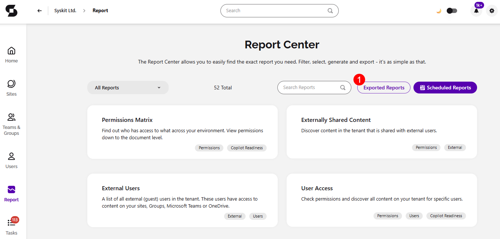
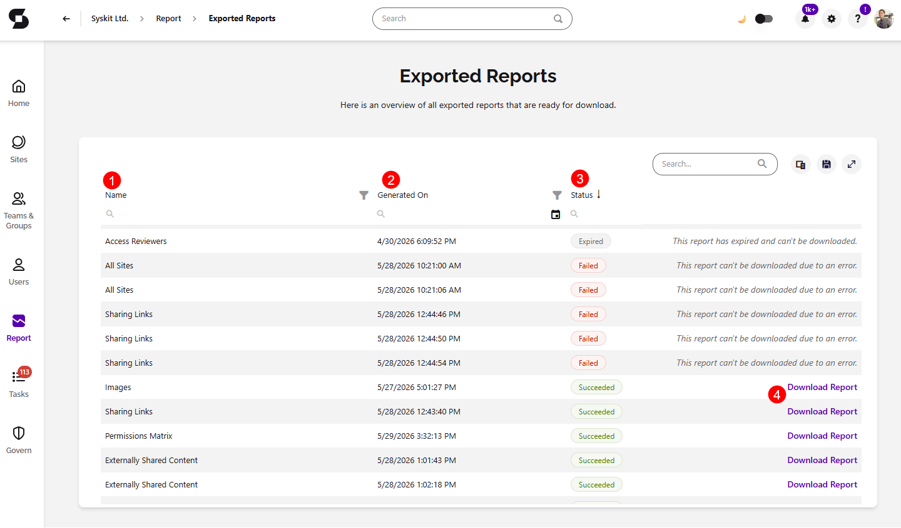

# Exported Reports

:::info

When a report takes too long to generate or contains too much data, Syskit Point now offers to generate the export in the background and send it to you by e-mail when it's ready. **The Exported Reports page is where you go to download those reports**.

:::

The **Exported Reports screen in Syskit Point gives you a central place to access and download reports** that have been generated and are ready for you. 

From the Exported Reports screen, you can:

* View all reports currently available for download
* Download a report directly from the list
* See when a report has expired and is no longer available for download

You can find it by going to the Reports screen, and **clicking the Exported Reports button (1)**, located in the right screen corner.

This opens the Exported Reports screen, where you can find the following:

* **Name (1)** shows the name of the report that was generated
* **Generated On (2)** shows the date and time when the report was generated
* **Status (3)** shows whether the report download **Succeeded**, **Failed**, or **Expired**
  * When a report status states failed, instead of the Download action, the text will state that the **report cannot be downloaded due to an error**.
  * When a report status states expired, instead of the Download action, the text will state that the **report has expired and cannot be downloaded**.
* **Download button (4)** lets you download all available reports.

:::info

After receiving a **report delivery e-mail and clicking the link**, you are taken directly to **this page and the download starts automatically**.

:::