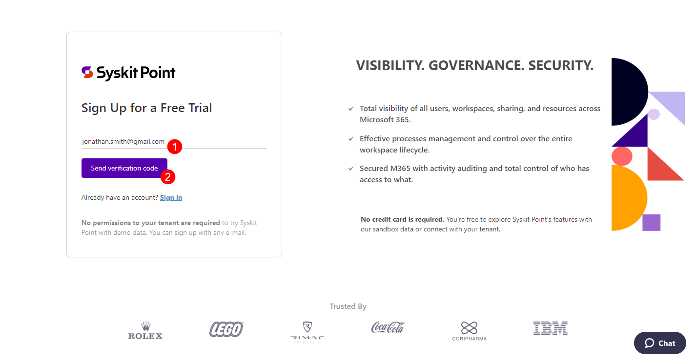
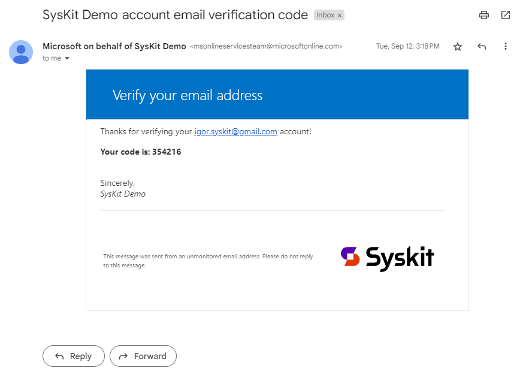
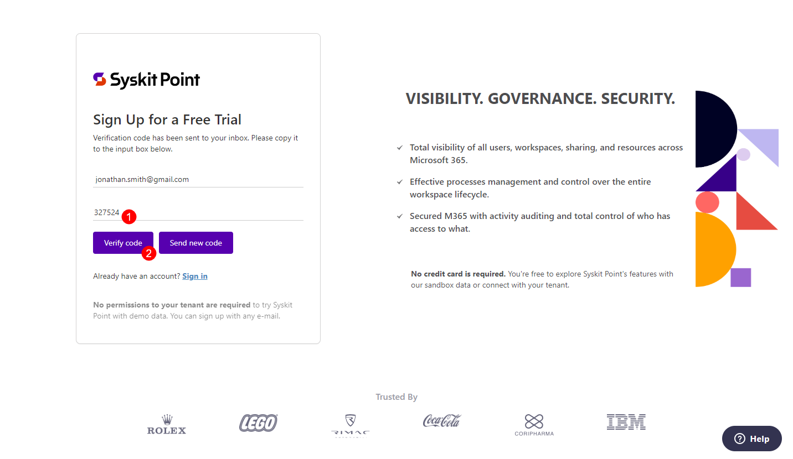
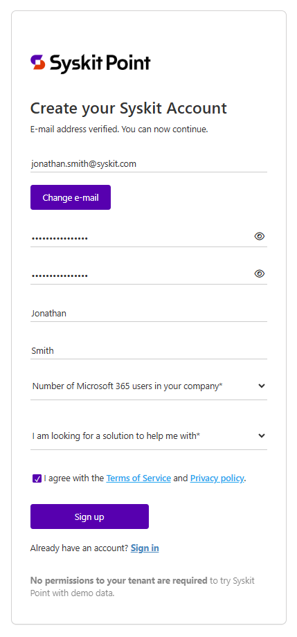

# Explore Syskit Point with Demo Data

Syskit Point lets you explore its features immediately with demo data — no Microsoft 365 tenant connection or Global Admin consent needed. Sign up with any email and get started right away.

When you're ready to try Syskit Point with your own organization's data, follow the [Free Trial article](free-trial.md) to connect your tenant.

## Get Syskit Point with Demo Data

Syskit Point with demo data enables you to explore the main features and capabilities without connecting your Microsoft 365 tenant. With demo data, you can:

* Browse the full workspace inventory (Sites, Teams, Microsoft 365 Groups, OneDrive)
* Run reports and explore the Security & Compliance dashboard
* Navigate governance tasks and see how Access Review and policy workflows look
* Get familiar with the Syskit Point interface before connecting your real environment

:::info
**Please note!**\
The following is not available when using demo data:
* **Syskit Point settings** - connect your Microsoft 365 tenant to access settings
* **Running actions** - connect your Microsoft 365 tenant to perform actions
:::

To get started:
* **Navigate to the [Free Trial start page](https://www.syskit.com/products/point/free-trial/)**
* **Click the Start a Free Trial button**; you are redirected to a Sign Up form 
* **Enter your e-mail (1)**
* **Click the Send verification code button(2)**

You will receive an e-mail with the verification code.

Copy the verification code and return to the Sign Up form:
* **Paste the received verification code (1)**
* **Click Verify code (2)** to continue
  * Use the Send new code button if the prior verification code expires

Next, provide information in the Sign Up form:
* **Define and confirm your password**
  * The sign-up results in a Syskit account that only you can access with the defined password
* **Enter your first and last name**
* **Enter the number of Microsoft 365 users in your company**
* **Agree to the terms of service and privacy policy**
* **Click Sign Up to finish**
  * Note that all fields are required

After a successful sign up, **the Syskit Point web app opens, showing demo data**. You can browse through Syskit Point with demo data for as long as you'd like.

Once you're ready to try Syskit Point with your own data and start your 21-day free trial, [follow the steps in the Free Trial article to connect your tenant](free-trial.md).