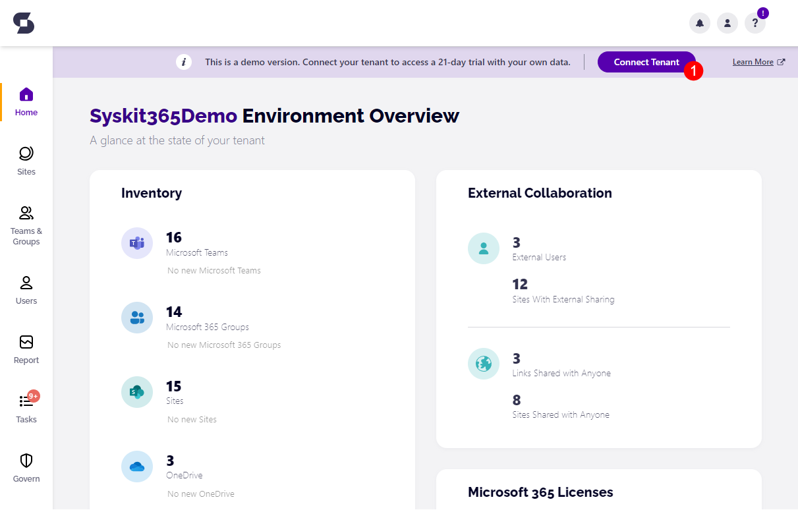
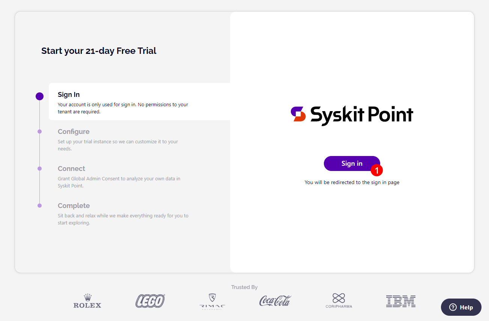
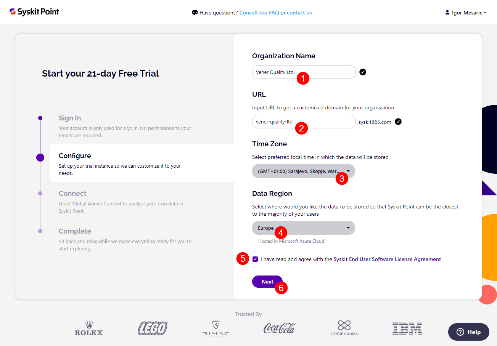
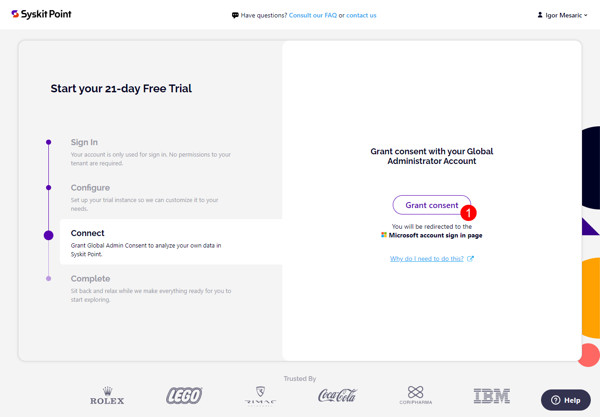
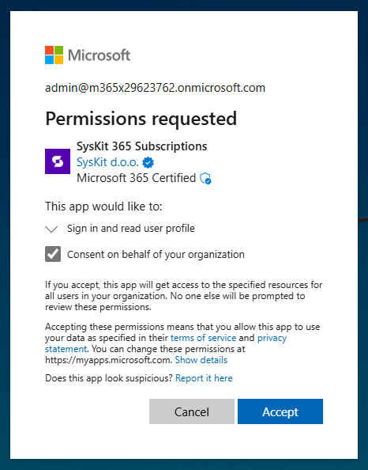
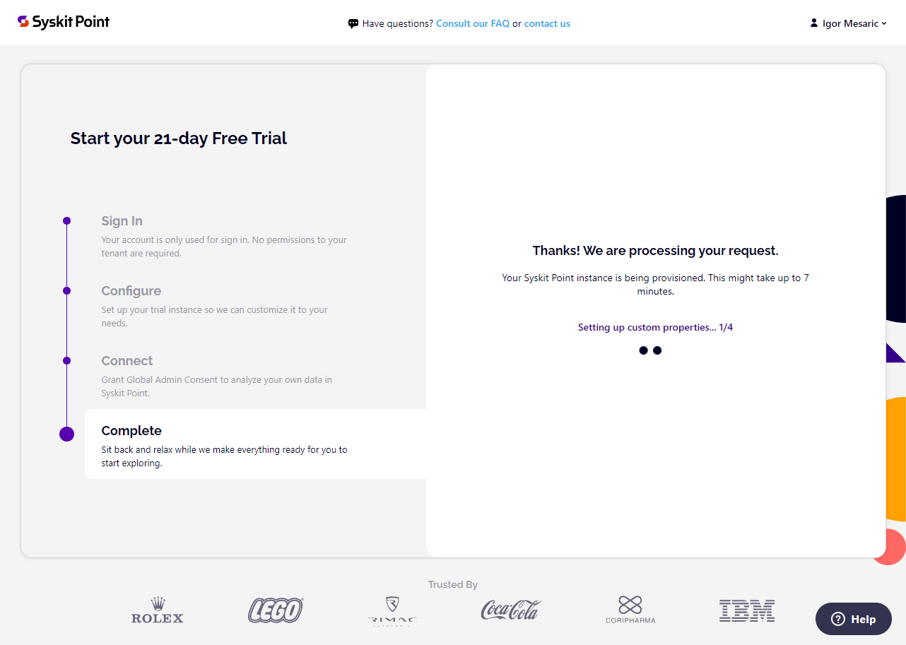
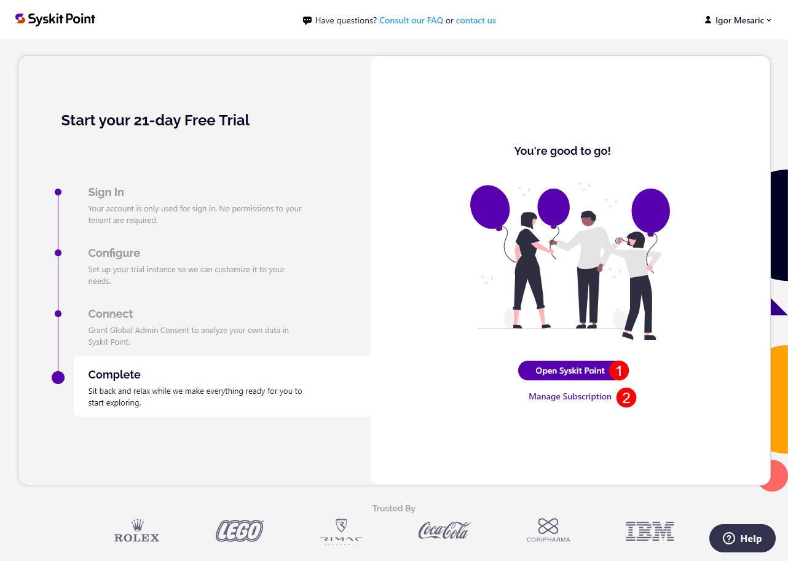

---
description: This article provides a step-by-step guide on how to get a free 21-day trial of Syskit Point.
---

# Free Trial

**The Syskit Point trial** enables you to **test drive Syskit Point for free for 21 days** and discover how to utilize it when managing your Microsoft 365 environment. 

In this article, you can find out **how and where to get your 21 days of Syskit Point trial**.

:::warning
**Please note!**&#x20;
This article shows how to get a free trial of the Syskit Point solution as a service. If your company policies require using a self-hosted solution, please [contact us](https://www.syskit.com/company/contact-us) to acquire a trial key.
:::

Getting started with Syskit Point Cloud has two steps:

1. [**Sign up and explore Syskit Point with demo data**](demo-data.md) - no Microsoft 365 tenant or admin consent needed; get access immediately with any email.
2. **Connect your Microsoft 365 tenant** to start your 21-day free trial with your own data - requires Global Admin consent.

## Sign Up and Access Demo Data

Before connecting your tenant, you first need to sign up and access Syskit Point with demo data.

[Follow the steps in the Demo Data article to sign up.](demo-data.md)

Once you have access to Syskit Point, return here and continue with the Connect Your Tenant step below.

## Connect Your Tenant

:::warning
**Please note!**&#x20;
We recommend Global Administrators perform the initial connection since consent is required multiple times during the initial setup process, giving Syskit Point permissions to collect your Microsoft 365 tenant data.
:::

To connect with your tenant:

* Navigate to [Syskit Point with demo data](https://demo.syskit.com/) acquired in the previous step
* Click the **Connect Tenant button(1)** 

The Subscriptions portal opens, where you will be guided through the initial connection.
If you are not signed in to the Subscriptions portal, **sign in with your account created during sign-up (1)**.

A new page opens showing the Configure step:

* **Enter the Name of your organization (1)**
* **Enter the syskit365 subdomain you want to use (2)**
  * If the entered subdomain is already in use, an appropriate message is displayed
* **Select the preferred time zone (3)**
  * Syskit Point will display date and time data in reports and e-mails as specified here
* **Select the region where Syskit Point data will be stored (4)**; the following regions are currently supported:
  * **USA**
  * **Europe**
  * **Asia-Pacific & Australia**
* **Mark the checkbox (5)** to confirm you read and agree with the [Syskit End User Software License Agreement](https://www.syskit.com/eula/)
* **Click Next (6) when finished**

Next, consent is required on the Connect step, permitting Syskit Point to collect your Microsoft 365 tenant data.
* Click **Grant Consent (1)** to proceed. **Sign in with your Microsoft work account and provide your consent**.
* [Learn more about permission requirements here](../requirements/permission-requirements.md).

 

 

After the consent, your Syskit Point instance starts to provision.
You can track the progress on the Complete step.

After the Syskit Point instance is created, you can find the following in the Complete step:

* **Open Syskit Point button (1)**
  * Opens Syskit Point web app URL in a new browser tab
* **Manage Subscription button (2)**
  * Opens the Subscription portal where you can [manage your Syskit Point subscription](syskit-point-subscriptions.md)

:::warning
**Please note!**&#x20;
The Syskit Point trial comes with limitations. To learn about the limits of your Syskit Point trial, see the [Syskit Point trial limits article](free-trial-limits.md). 
:::