---
description: >-
  This article provides information on everything you need to know about
  licensing Syskit Point for Cloud.
---

# Manage Syskit Point Subscriptions

Once you have your Syskit Point free trial, you can manage the state of your Point Cloud subscriptions at the [**Syskit Point Subscriptions Portal**](https://subscriptions.syskit.com/).

The **My Subscriptions** portal provides insight into the current state of your subscription and allows you to modify or upgrade it.

In this article, you will find information on the following:

* [Purchase Your Syskit Point Cloud Subscription](syskit-point-subscriptions.md#purchase-your-syskit-point-cloud-subscription)
* [Provide Account Contacts](syskit-point-subscriptions.md#provide-account-contacts)
* [Purchase Additional User Licenses](syskit-point-subscriptions.md#purchase-additional-user-licenses)
* [Upgrade Your Subscription Plan](syskit-point-subscriptions.md#upgrade-your-subscription-plan)
* [Manage Subscription Administrators](syskit-point-subscriptions.md#manage-subscription-administrators)
* [Reconnect After Purchasing](syskit-point-subscriptions.md#reconnect-after-purchasing)
* [Purchasing Additional Audit Logs Storage](syskit-point-subscriptions.md#purchasing-additional-audit-logs-storage)
* [Cancel Your Subscription](syskit-point-subscriptions.md#cancel-your-subscription)

:::warning
**Please note!** If you didn't start your free 21-day trial, take a look at the [**Syskit Point trial article**](free-trial.md) for details on getting started. At any point during the 21 days of the free trial, you can purchase a Syskit Point Cloud subscription. To retain your data after your free trial has expired, you need to purchase a Syskit Point subscription within 21 days of your trial period ending.
:::

:::warning
**Self-service subscription management is temporarily unavailable.** Managing an existing subscription through the Syskit Point Subscriptions portal is currently not possible. To request any changes to your subscription — including license upgrades or downgrades, plan changes, credit card updates, cancellations, or access to invoice history — contact us at [support@syskit.com](mailto:support@syskit.com) or [sales@syskit.com](mailto:sales@syskit.com).
:::

## Purchase Your Syskit Point Cloud Subscription

To purchase the subscription, complete the following steps:

* Click the **Buy Now** button, located in the top right corner of your Syskit Point trial screen
* On the **Syskit Subscriptions** site that opens, **click the Sign in (1)** button

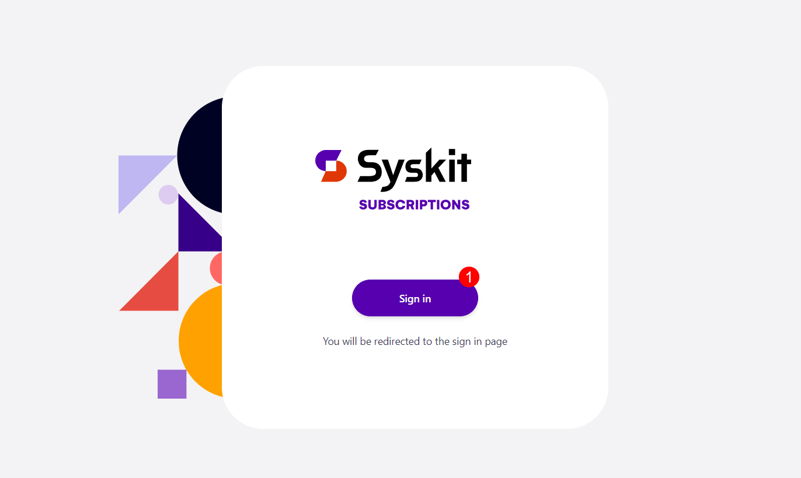

**Syskit Sign in screen opens**, where you can either:

* **Sign in with your Syskit credentials (1)** - created in the [process of acquiring Syskit Point with demo data](free-trial.md#get-syskit-point-with-demo-data); or
* **Sign in with Microsoft Work Account (2)** - used to [connect your Microsoft 365 tenant to get the free trial](free-trial.md#connect-your-tenant)

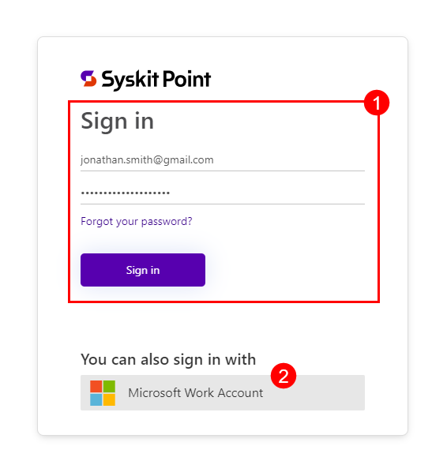

After signing in, a new screen opens showing **information about your Syskit Point subscription**.

The **Overview section (1)** provides insight into general information on the status of your subscription and contains the following details:

* **Name (2)** entered at the start of your trial
* **Status (3)** of your Syskit Point license
* **Next renewal date (4)** of your Syskit Point subscription or expiration date of your free trial
* **Licenses (5)** the number of licenses included in your Syskit Point
* **Purchased Plan (6)** for your subscription
* This shows as Trial while your free trial period is still active
* Next to **Purchased Plan** you can click on the **Buy Now button (7)** to purchase your Syskit Point subscription or manually click the **Subscriptions section (8)** on the left side of the screen under Overview

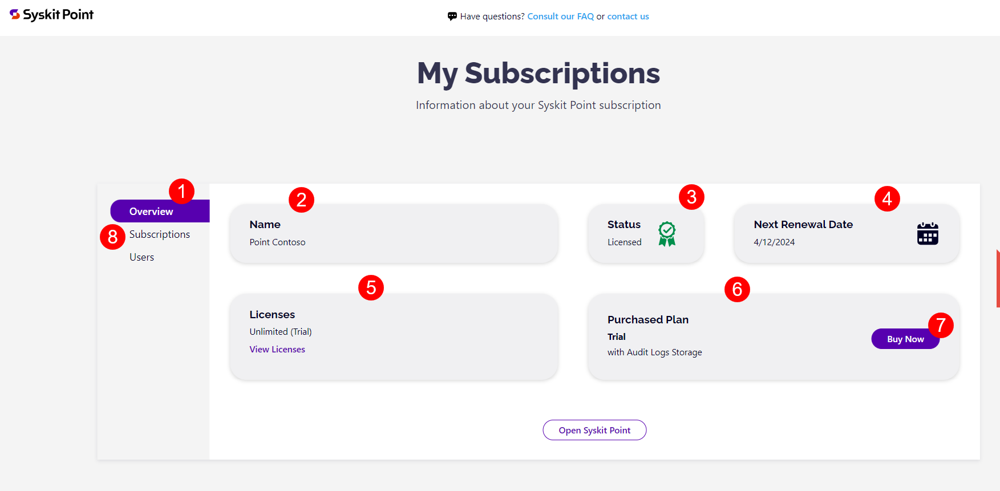

The **Subscription section (1)** is where you can purchase your subscription and select the specific details that suit your needs.

Your preferences for the following information need to be selected:

* **Select a Plan (2)** - clicking on it opens a drop-down menu where you can select which subscription plan suits you best:
* Syskit Point - Management Plan
* Syskit Point - Security and Compliance Plan
* Syskit Point - Governance Plan
* If you are unsure which subscription suits your needs, clicking the **Compare Plans button (3)** underneath opens the [Pricing page](https://www.syskit.com/products/point/pricing/) with more details on each plan
* **Billing Cycle (4)**
  * Annually
* **Currency (5)** - clicking on it opens a drop-down menu where you can select the currency in which you want to be charged:
* USD - US Dollar
* GBP - British Pound
* EUR - Euro
* **Number of Licensed Microsoft 365 Users (6)** - here, you can write the number of users you expect will be utilizing Syskit Point
* The number of licensed users affects the pricing of your Syskit Point subscription
* A minimum of 100 licenses need to be purchased for your Syskit Point subscription. For more details on this, take a look at the [**Licensed Users Count article**](../licensing-activation/licensed-users-count.md).
* This article can also be accessed by clicking **How we calculate licensing (7)**
* **Summary (8)** - located on the right side of the screen, it shows a quick summary of the selection you've made with a cost estimate for your chosen subscription
* Click the **Buy Now button (9)** for the final step to complete your purchase

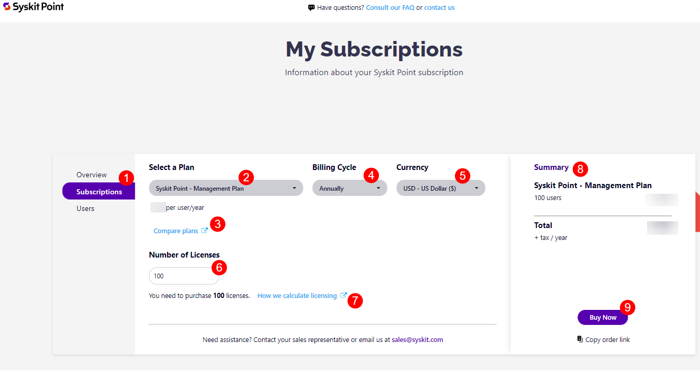

After clicking **Buy Now**, you are redirected to the purchasing site.

* On the left side of the screen, you can find an **overview of your selected subscription (1)**.
* On the right side of the screen, you can **pay with link (2)** or you need to input your **credit card details (3)**.
* **Click the Pay and Subscribe button (4)** to finalize the purchase.

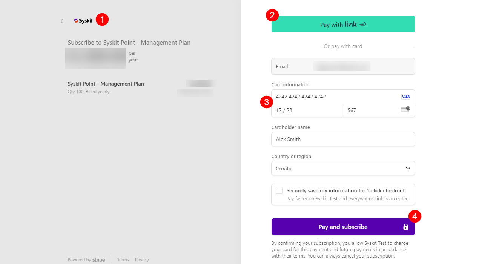

Once you've purchased your Syskit Point subscription, you are redirected to the Syskit Point Subscriptions site.

If your purchase was successful, when you click **Overview**, the information for your **Next Renewal Data** will reflect the renewal period you selected for your subscription.

The **Purchased Plan (1)** section will now show the name of the subscription you purchased.

The section titled **Users (2)** is where you can find a **list of users (2)** you have given Administrator rights to the Subscriptions portal, which means **these users are allowed to manage your subscription by adding additional user licenses, purchasing a different subscriptions plan**, and so on.

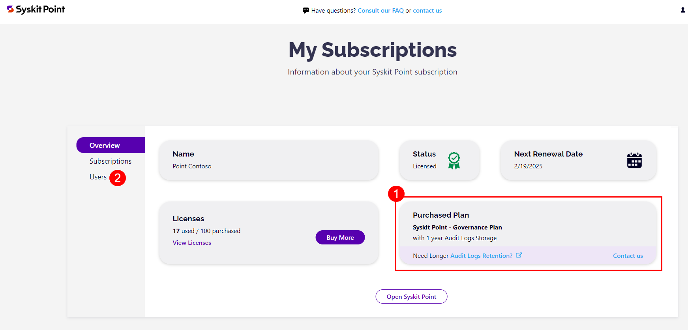

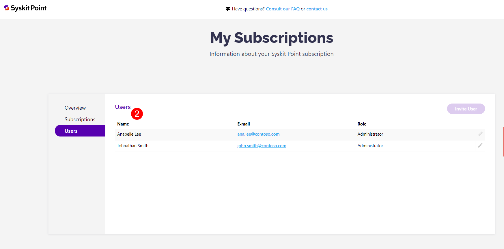

## Provide Account Contacts

Once your license is activated, you are asked to provide your account contacts. Contacts are requested for four roles:

* **Main Contacts (Primary)**
  * The main person(s) working in Syskit Point on a regular basis
  * These contacts will receive all important product and change updates
* **Technical Contacts**
  * The main person(s) working in charge of technical related information
  * These contacts will receive information about product updates
* **Billing Contacts**
  * The main person(s) in charge of billing
  * These contacts will receive copies of the invoices, renewal information and other billing-related updates
* **Legal Contacts**
  * The main person(s) in charge of legal aspects
  * These contacts will receive all important legal changes (e.g. to our EULA or Privacy Policy)

For each role, enter a valid **e-mail** address. You can add more than one e-mail address per role.

The first time your license is activated, adding these contacts is a required step, and all four roles need to be filled in before you can continue. If your license is already active, a banner reminds you to add your contacts until they are submitted.

To keep your contacts up to date, we ask you to confirm them once a year. When it is time to review them, a banner in Syskit Point lets you know.

:::info
**Please note!** No contacts are collected during the free trial. During the trial, we only reach out to the person who started the trial period.
:::

## Purchase Additional User Licenses

:::info
Purchasing additional user licenses through the Syskit Point Subscriptions portal is currently not possible.
:::

To increase the number of user licenses included in your plan, contact us at [support@syskit.com](mailto:support@syskit.com) or [sales@syskit.com](mailto:sales@syskit.com). Please include your organization name and the number of additional licenses you'd like to add, and our team will process the change for you.

For details on how licenses are counted, see the [**Licensed Users Count article**](../licensing-activation/licensed-users-count.md).

## Upgrade Your Subscription Plan

:::info
Changing or upgrading your Syskit Point subscription plan through the Syskit Point Subscriptions portal is currently not possible.
:::

To change or upgrade your Syskit Point subscription plan, contact us at [support@syskit.com](mailto:support@syskit.com) or [sales@syskit.com](mailto:sales@syskit.com). Please include your organization name and the plan you'd like to switch to, and our team will process the change for you.

If you're unsure which plan best suits your needs, see the [Pricing page](https://www.syskit.com/products/point/pricing/) for a comparison of available plans.

## Manage Subscription Administrators

Once your Syskit Point subscription is all set, you might want some help managing it.

**Subscription Administrators** can be invited to join the subscriptions portal. They can manage subscriptions and find information about licensing plans and payments.

To add users as your Syskit Point subscription administrators, complete these steps:

* In the subscriptions portal, go to the **Users section (1)**
* The Users section contains the following information:
* **Name (2)** of the user with subscription administrator rights
* **E-mail (3)** of the user with subscription administrator rights
* **Role (4)** the role of the user with subscription administrator rights; this can currently only be set as administrator, but other options are being explored for the future
* **Status (5)** of the user with subscription administrator rights
* For each user, you can complete the following action:
* **Edit (6)** - clicking this lets you edit the user's name
* **Remove (7)** - clicking this opens a pop-up where you are asked to confirm and **Remove Access** from the selected user &#x20;
* To add a new user as a subscriptions administrator, click the **Invite User (8)** button

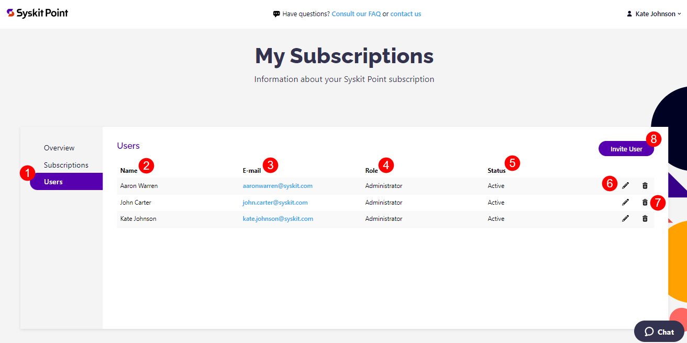

Clicking the Invite User button opens the Invite User pop-up. There, you can:

* **Select user role (1)** - at the moment, only the administrator role is available
* **Enter the e-mail (2)** of the user you want to add as an admin
* **Click Invite User (3)** to send the request

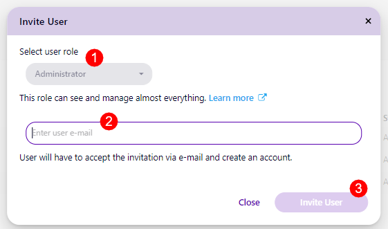

Once the invitation is sent, the user gets an e-mail invitation to become a Subscription admin.

* If the user is already stored in the database, they will not receive an e-mail.

The user needs to click the **Accept Invite (1)** button to join the subscriptions portal.

* The user needs to fill out the form that pops up.
  * Their e-mail is automatically filled out, but the user needs to specify their display name and set up their password for the subscriptions portal.   
* After filling out and submitting the requested details, the Subscriptions Portal opens, where the user can manage the Syskit Point subscription.

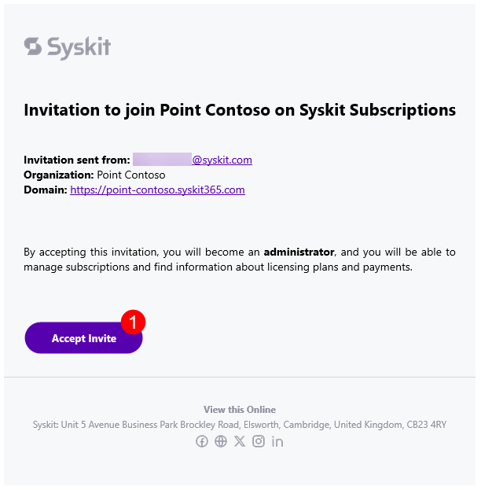

## Reconnect After Purchasing

There are two potential reasons why you may need to reconnect your tenant after purchasing your Syskit Point subscription:

* Your **trial has expired, and 21 days after the trial expiration, your Syskit Point instance is deleted**. If you purchased your Syskit Point subscription more than 21 days after the trial expiration, you will **need to reconnect your tenant**.
* Your **Syskit Point license has expired, and 30 days after the expiration date, your Syskit Point instance is deleted**. When you purchase a Syskit Point subscription again, you will **need to reconnect your tenant**.

In case your Syskit Point is licensed, but your instance was deleted, you will see a message notifying you of that, as shown below.

To reconnect your tenant **click the Connect Tenant button (1)**.

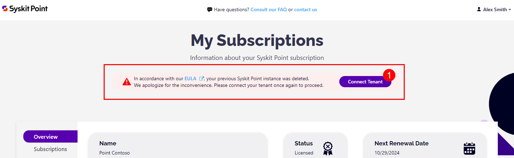

[For more details about connecting your tenant to Syskit Point, take a look at this article.](free-trial.md)

## Purchasing Additional Audit Logs Storage

By purchasing your subscription, you receive one year of Audit Logs storage as stated in the **Purchased Plan section (1)**.

For more information about audit logs, you can click the **Audit Logs Retention link (2)**.

If you want to purchase additional storage years for Audit Logs, click the **Contact Us link (3)** to e-mail our Sales team directly, or fill out the form on our [Contact page](https://www.syskit.com/contact-us/).

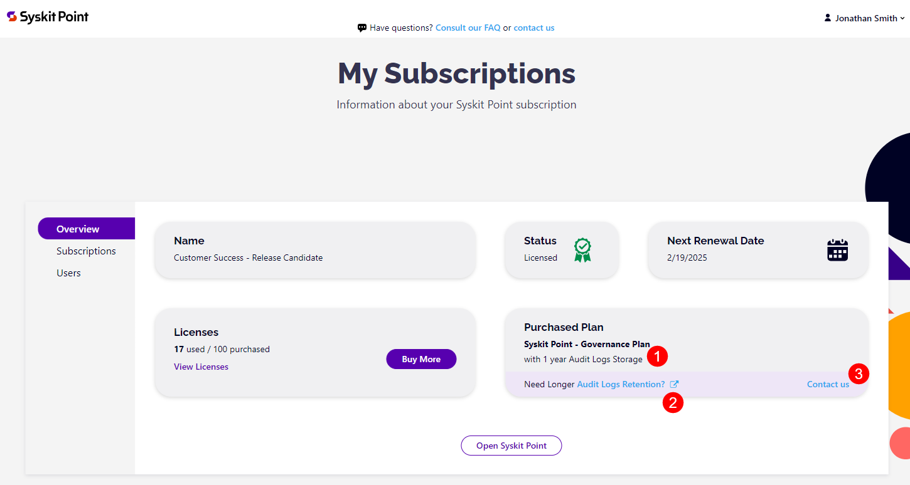

:::info
**Please note!** If you request the removal of additional retention years that you previously purchased, the change will be applied after 3 days. &#x20;

This serves as a safety measure, as once the change is final, all audit logs that exceed your currently purchased retention period will be erased.
:::

## Cancel Your Subscription

:::info
Canceling your Syskit Point subscription through the Syskit Point Subscriptions portal is currently not possible.
:::

To cancel your Syskit Point subscription, contact us at [support@syskit.com](mailto:support@syskit.com) or [sales@syskit.com](mailto:sales@syskit.com). Please include your organization name in the request, and our team will process the cancellation for you.

Once your cancellation is processed, you can continue using Syskit Point until the end of your current billing period. After that, your subscription will end and Syskit Point will no longer be available.

## Related Articles

* [Licensing FAQ](../faq/licensing.md)
* [Purchasing and Discounts FAQ](../faq/purchasing-and-discounts.md)
* [Partner Program FAQ](../faq/partner-program.md)
