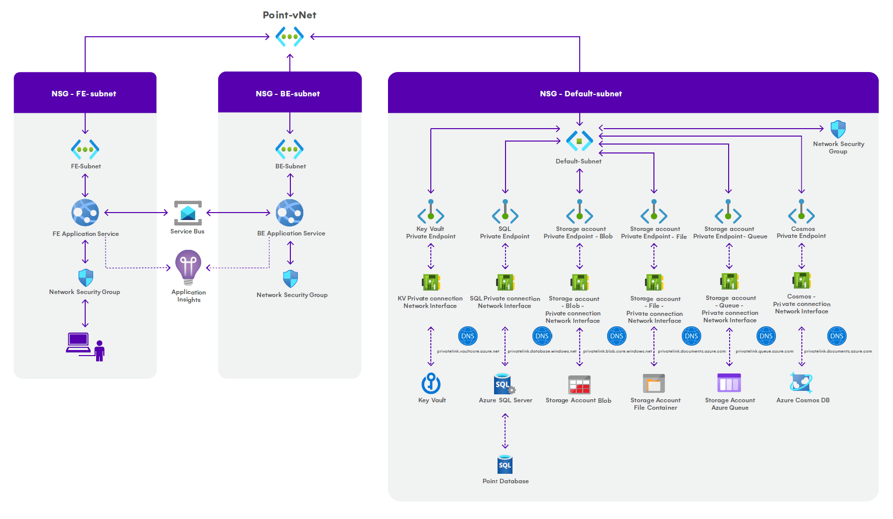

---
description: >-
  This article describes the configuration of Azure network resources used by
  Syskit Point.
---

# Azure Networking

<mark style="color:purple;">Last updated on January 28th, 2025</mark>

:::warning
**Please note!**\
**By default**, **the Front-end and Back-end app services are accessible from the Public Internet**. **The rest of the utilized Azure resources – Key Vault**, **Azure SQL Server**, **Azure Cosmos DB and Storage Account - are secured behind firewalls and private connections**.
:::

When deploying Syskit Point, there are **two options available when considering Azure network resources**:

* **Deploy Syskit Point from Azure Marketplace**
  * consider this to be your **'plug-and-play' option**
  * new **Azure network resources are automatically created and configured** when you deploy Syskit Point, without the need to perform additional configuration
  * **Syskit Point is ready to use and secured after the deployment**
* **Deploy a custom ARM template**
  * **use when you want to integrate Syskit Point into already existing Azure network resources**
  * **custom ARM templates are used when deploying Syskit Point**
  * **no Azure network resources are created** when deploying Syskit Point through custom ARM templates
  * **Syskit Point is ready to use but not secured after the deployment – additional configuration of Azure network resources is required**

:::warning
**Please note!**\
For use cases requiring custom deployment and manual configuration of Azure network resources, don't hesitate to [contact us](https://www.syskit.com/company/contact-us) to provide you with custom ARM templates.
:::

## Architecture Diagram

When Syskit Point is deployed from Azure Marketplace, a virtual network is created named point-vnet, with three subnets:

* **fe-subnet**
* **be-subnet**
* **default-subnet**

The subnets have **Network security groups associated** with the default rules applied. **By default**, **inbound traffic is denied** and **outbound traffic is allowed**. If you wish to limit outbound traffic, please [contact us](https://www.syskit.com/company/contact-us).

**The following applies to fe-subnet**:

* takes up 3 IP addresses + 5 Azure reserved addresses
* used by a Front-end app service that provides end-users with a web interface
* **accessible from the Public Internet**

**The following applies to be-subnet**:

* takes up 3 IP addresses + 5 Azure reserved addresses
* used by a Back-end app service responsible for retrieving data from a Microsoft 365 tenant by utilizing several Microsoft APIs
* **accessible from the Public Internet**

**The following applies to default-subnet**:

* takes up 11 IP addresses + 5 Azure reserved addresses
* used by the following Azure resources:
  * **Key Vault**
  * **Azure SQL Server**
  * **Azure Cosmos DB**
  * **Storage Account – Blob**
  * **Storage Account – File**
* **secured with private connections for each resource**

:::warning
**Please note!** **As the Front-end and Back-end app services are accessible from the Public Internet by default**, [use Azure App Service access restrictions](https://docs.microsoft.com/en-us/azure/app-service/app-service-ip-restrictions) to add another layer of security to Syskit Point app services.
:::

## Firewall considerations

When configuring your firewall, ensure that outbound connectivity to the required endpoints is allowed to enable full functionality of Syskit Point.\
The following destinations must be permitted through your firewall:

| Protocol | Host | Port | Description |
|----------|------|------|-------------|
| HTTPS | my.syskit.com | 443 | Syskit portal for license activation and "Check for updates" functionality, hosted in Azure West Europe. |
| HTTPS | downloads.syskit.com | 443 | Required for future updates, hosting the deployment packages. |
| HTTPS | dc.applicationinsights.azure.com | 443 | Application Insights, owned by Syskit, is used for critical error reporting and performance metrics. https://docs.microsoft.com/en-us/azure/azure-monitor/app/ip-addresses |
| HTTPS | dc.applicationinsights.microsoft.com | 443 | -\\|\\|- |
| HTTPS | *.in.applicationinsights.azure.com | 443 | -\\|\\|- |
| HTTPS | \{PointServiceBus\}.servicebus.windows.net | 443 | HTTPS access to the Azure Service Bus instance deployed in your resource group. |
| AMQP | \{PointServiceBus\}.servicebus.windows.net | 5671 | AMQP over TLS access to the Azure Service Bus. Required for real-time communication. |
| AMQP | \{PointServiceBus\}.servicebus.windows.net | 5672 | AMQP over TLS access to the Azure Service Bus. Required for real-time communication. |
| HTTPS | login.microsoftonline.com | 443 | Azure AD login endpoint to get access tokens necessary for API calls. |
| HTTPS | graph.microsoft.com | 443 | Microsoft [Graph API](https://docs.microsoft.com/en-us/graph/) endpoint. |
| HTTPS | manage.office.com | 443 | [Office 365 Management API](https://docs.microsoft.com/en-us/office/office-365-management-api/office-365-management-apis-overview) endpoint. |
| HTTPS | \{YourDomain\}-admin.sharepoint.com | 443 | Admin portal of your tenant. |
| HTTPS | \{YourDomain\}.sharepoint.com | 443 | SharePoint Online sites of your tenant. |
| HTTPS | \{YourDomain\}-my.sharepoint.com | 443 | OneDrive's location for your tenant. |
| HTTPS | api.keygen.sh | 443 | New licensing system. Reserved for future usage. |
| HTTPS | api.powerbi.com | 443 | Required for Syskit Point Power Platform features. Optional if these features are not in use. |
| HTTPS | api.bap.microsoft.com | 443 | Required for Syskit Point Power Platform features. Optional if these features are not in use. |
| HTTPS | api.powerapps.com | 443 | Required for Syskit Point Power Platform features. Optional if these features are not in use. |
| HTTPS | api.flow.microsoft.com | 443 | Required for Syskit Point Power Platform features. Optional if these features are not in use. |
| HTTPS | *.environment.api.powerplatform.com | 443 | Required for Syskit Point Power Platform features. Optional if these features are not in use. |

:::warning
**Please note!** If you are operating in a non-default Azure environment (e.g., Azure Government), you must adjust the firewall rules accordingly to reflect the appropriate regional endpoints.
:::

:::warning
**Please note!** The &#123;PointServiceBus&#125; placeholder refers to the specific Azure Service Bus namespace deployed in your resource group. Ensure that both HTTPS and AMQP protocols are allowed for this endpoint per the rules above.
:::
