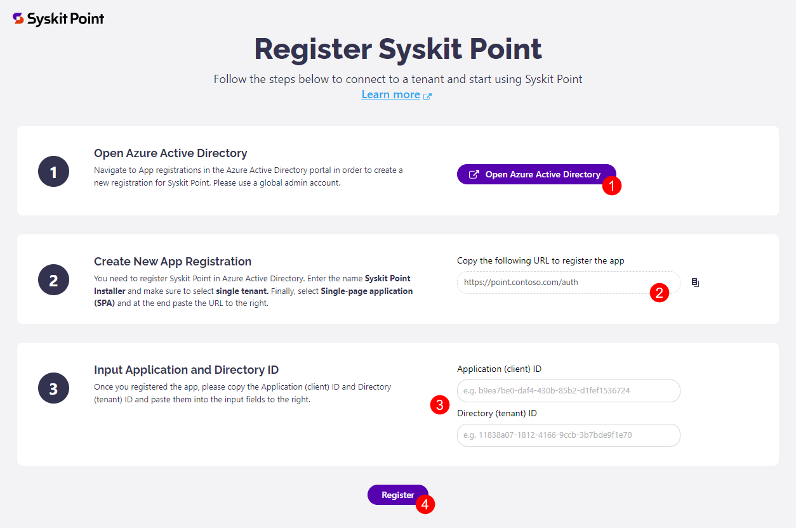

# Connect to Microsoft 365 Tenant

After you [deploy Syskit Point](deploy-syskit-point.md) in your Azure environment, you need to connect Syskit Point to your Microsoft 365 tenant. Before you continue, make sure to prepare the following:

* **Point Web Application URL**
* **Microsoft 365 Global Admin account**

:::warning
**Please note!**  The Global Admin account is used only for the initial setup; Point does not store any passwords you enter here. Syskit Point upgrades do not need a Global Admin account.
:::

## Connect for the First Time

When **connecting to a Microsoft 365 tenant for the first time, you are required to connect with a** [**Global Administrator account**](../../requirements/permission-requirements.md#global-administrator)**.**

Open the **Syskit Point Web App URL** in a browser to start the initial connection process. The **Register Syskit Point** page opens, guiding you through the initial connecting process:

* click the **Open Microsoft Entra ID button (1)** to open the **App registrations** screen in Microsoft Entra ID portal and create the **Syskit Point Installer** app registration
* copy the provided **URL (2)** needed when creating the **Syskit Point Installer** app registration
* input the **Application (client) ID** and **Directory (tenant) ID (3)** available once you create the **Syskit Point Installer** app registration
* click the **Register button (4)** after you enter the required data

To obtain the **Application (client) ID** and **Directory (tenant) ID**, create the **Syskit Point Installer** app registration.

## Create App Registration

Open the **App registrations** screen in Microsoft Entra ID portal by clicking the **Open Microsoft Entra ID button** available on the **Register Syskit Point** screen described in the previous section.

To create the required app registration used by Syskit Point, do the following:

* click the **New registration (1)** button available in the top ribbon; the **Register an application** screen opens
* enter `Syskit Point Installer` in the **Name (2)** field
* select **Accounts in this organizational directory only ( only - Single tenant)** option under **Supported account types (3)** &#x20;
* in the **Redirect URI** section, select the **Single-page Application (SPA) (4)** option and paste the **URL (5)** copied from the second step on the **Register Syskit Point** page described in the previous section
* click **Register (6)**

After the app registration is created, the App Registration's **Overview screen** opens. Here, you can find the following data needed for the initial connection:

* **Application (client) ID (1)**
* **Directory (tenant) ID (2)**

Copy the **Application (client) ID** and **Directory (tenant) ID** values, and paste them to the input fields in the third step in the Register Syskit Point page.

## Consent

After you provide information on the **Register Syskit Point** page and click the **Register** button, you will be prompted to sign in.

For this, **you need to use a Microsoft 365 Global Admin account**. This account will be used only for the initial setup; Syskit Point does not store any passwords you enter here. The Global Admin account will not be required in future Syskit Point upgrades.

:::warning
**Why do I need to provide a global admin account?**  You can find answers in the [following article](../../requirements/permission-requirements.md#microsoft-365).
:::

When you first connect to your tenant, Syskit Point will request permissions to collect data from your Microsoft 365 environment.

To continue, check the **Consent on behalf of your organization option (1)**, and click the **Accept button (2)**.

A new page opens where you can define additional connection settings.

## Connection Settings

On the **Connect Tenant** page, you can choose which information you would like to collect when it comes to your Microsoft 365 environment:

* **Automatic Discovery** – by default, Syskit Point continuously monitors your Microsoft 365 environment and shows you the latest data. You cannot modify this setting.
* **Autodiscover OneDrive (1)** – by default, Syskit Point will collect information and report on the users' OneDrive activity, content, and sharing. To stop collecting OneDrive data, uncheck this option.
* **Protect OneDrive privacy (2)** – When enabled, Syskit Point will only show general information about the user's OneDrive, such as used storage. Syskit Point Admins won't be able to access any OneDrive content and personal data. By default, this option is disabled.
* **Store audit logs (3)** – Syskit Point will also collect all audit logs to monitor internal and external user activities and changes and store them on a hard drive. To stop storing audit logs, uncheck this option.
* **Protect user privacy (4)** - When enabled, user activity data will be hidden from Syskit Point and protected from Administrator supervision. By default, this option is disabled.

:::tip
You can change connection options anytime from the **Settings** > **General** > **Connected Tenant** > **Manage Connection** screen in Syskit Point application.
:::

:::warning
**Please note!**  For Syskit Point to collect, process, and save audit logs, you must enable auditing in your tenant. [Navigate here to find out how to turn on auditing.](../../configuration/turn-on-auditing.md)
:::

Click the **Connect (5)** button after defining the connection options. A new screen will open and show the progress of the initial connection. **Please do not refresh the page** as it will provide important information needed for troubleshooting in the unlikely event of an error.

After all initial connection steps are completed, you will be redirected to the [Sign in page](../../get-to-know-syskit-point/navigate-through-syskit-point.md#sign-in-screen).

## Related Topics

* [Deploy Syskit Point](deploy-syskit-point.md)
* [Activate Syskit Point](../activation/activate-syskit-point.md)
* [Set Up Custom Domain and SSL Certificate](set-up-custom-domain-and-ssl-certificate.md)

If you have additional questions or concerns, please [contact us](https://www.syskit.com/contact-us/).
