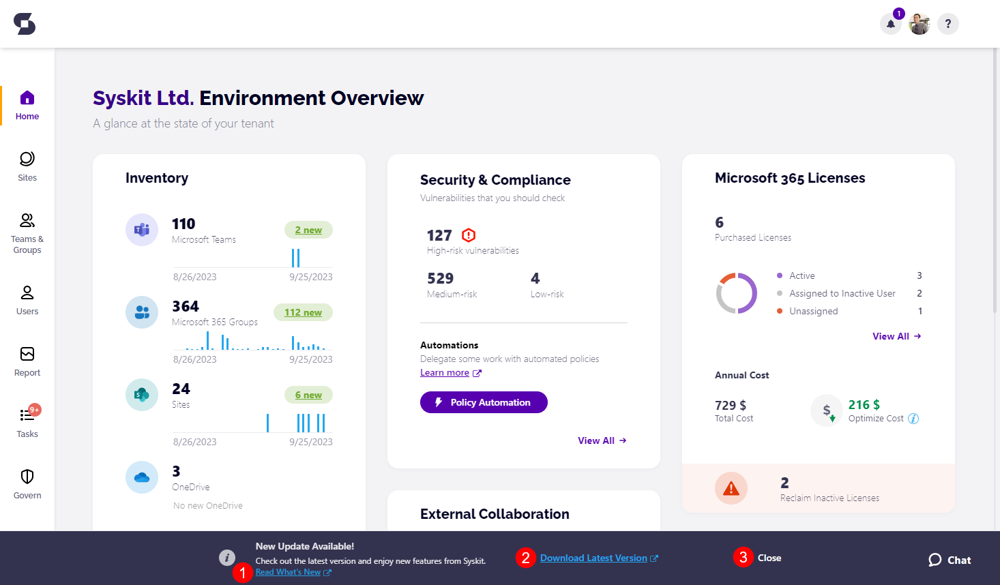
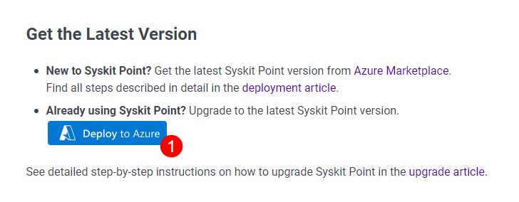
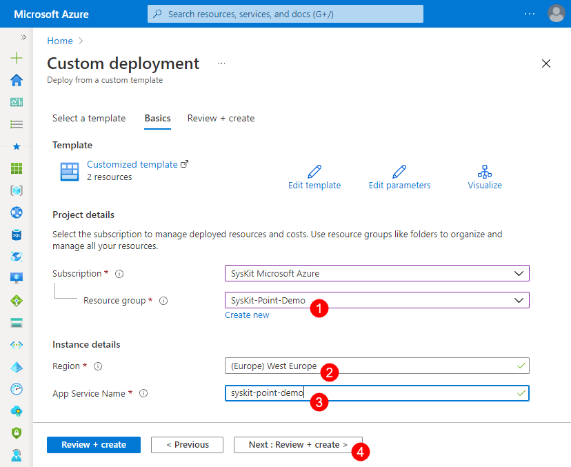
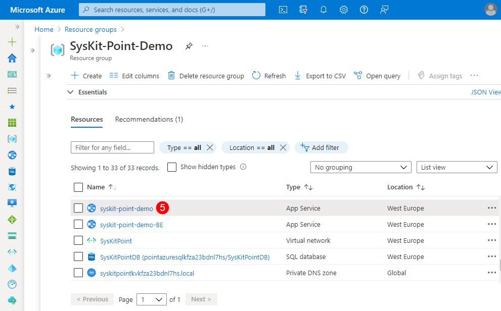

# Upgrade Syskit Point

Since **Syskit Point** frequently gets new features, we highly recommend deploying the latest version to use its maximum potential.

:::warning
**Please note!**\
This article describes Syskit Point upgrades for Syskit Point Enterprise customers only.
:::

## Checking for Updates

**Syskit Point automatically checks for updates** every day, outside working hours.

**Upgrade banner is displayed at the bottom of the Home screen to all users signed into the Syskit Point web app** in case there is a new Syskit Point version detected, which comes with one or several changes from the following categories:
* **Major features**
  * The new version of Syskit Point comes with new reports, actions, policies, etc., or significant improvements in existing features.
  * This is usually reflected by changing the 2nd number in Syskit Point version; for example, old version is `2024.1.44`, and new version is `2024.2.45`.
* **Hotfixes**
  * Hotfix version is released in order to remedy critical issues in Syskit Point or breaking changes coming from the Microsoft 365 platform.
  * Expect the third number in the Syskit Point version to change; for example, the old version is `2024.1.44`, and the new version is `2024.1.45`.
* **Security Updates**
  * A new version of Syskit Point resolves security vulnerabilities found in 3rd party dependencies or Syskit Point codebase itself. 
  * Here, you can also expect the third number in the Syskit Point version to change; for example, the old version is `2024.1.46`, and the new version is `2024.1.47`.

:::warning
**Please note!**\
The upgrade banner will not show in the case of Syskit Point releases with new versions containing minor changes in functionality or non-critical fixes.

[For a list of all Syskit Point Enterprise releases, follow this link](../../releases/enterprise/).
:::

The **Read What's New** **link (1)** opens a new tab in your browser at the [Releases](../../releases/) section in Syskit Point documentation, where you can find out about new features, improvements, and bug fixes by each product version.

Clicking the **Download Latest Version (2)** link will redirect you to the latest **Release Note page** displaying the **Deploy to Azure** button.

**To hide the Update message**, **click the Close link (3)** visible on the right side. The message will stay hidden until the next time you log in to Syskit Point.

## Upgrading to the Latest Version

After you **open the latest Release note**, **click** the **Deploy to Azure button (1)**. 

:::warning
**Please note!** When entering the App service name, **make sure NOT to enter the app service name ending with '-BE'**. **Entering the backend app service name in the upgrade process results in an invalid upgrade and Syskit Point not working correctly.**
:::

The **Custom deployment** screen in Azure Portal opens. Here you need to:

* **Select the Resource group (1)** wherein the current Syskit Point version is deployed
* **Select Region (2)** - use the location of your currently deployed Syskit Point resources
* **Enter App service Name (3)** - enter the App Service resource Name; you can **find the App Service name (5)** by navigating to the Overview screen of the Syskit Point resource group
* **Click Next: Review + create > (4)** - Review + create screen opens showing entered data; check that the entered data is correct and click **Create**

## Next Steps

After the deployment is completed, you can:

* **Access the Syskit Point web app**
* [Check if a re-consent is needed after the upgrade](../../requirements/permission-requirements-change-log.md)

:::info
**Hint!**\
Use the [What's new](https://www.syskit.com/products/point/whats-new/) page as an additional source of information on new features available in the latest version of Syskit Point.
:::
