# Free Up Storage

The more your content grows over time, the harder it becomes to manage large amounts of data in your environment. 
Over time, SharePoint sites might contain duplicate, outdated, or otherwise unnecessary files. Removing these files helps you:

* Lower storage costs and optimize performance.
* Improve Copilot accuracy and reliability.
* Keep SharePoint sites organized and easier to manage

The two **biggest drivers of storage** growth are **version bloat and inactive files**. Microsoft charges for the full size of each version; a single edited file can generate gigabytes of versions per year. 

Meanwhile, stale files (old drafts, abandoned projects, content no one has accessed in years) accumulate indefinitely. Together, these factors cause storage to grow continuously, even when active content creation hasn't increased. 

**Regularly cleaning up file versions and archiving inactive files is the most effective way to reclaim storage, reduce costs, and improve data quality.**

In Syskit Point, there are several ways to free up space and complete the cleanup. In this article, you'll find details on the:

* [Delete Files Action](#delete-files)
* [Archive Files Action](#archive-files)
* [Clean Up Action on Storage Metrics report](#clean-up-action-on-site-storage-metrics-report)
* [Clean Up Action on Site Storage Metrics report](#clean-up-action-on-site-storage-metrics-report)
* [Clean Up Action on File Storage Details report](#clean-up-action-on-file-storage-details-report)

:::info
**Please note!** If a file or site **has a hold or retention policy applied**: 
* The Delete Files and Clean Up File Versions actions are not supported. These actions will fail, and storage will not be freed.
* The Archive Files action is still supported. Files can be archived while retention policies continue to apply.

:::

## Delete Files

The Delete Files action allows you to delete files and send them to the site's recycle bin. You can complete the action by following these steps:

* **Go to Reports > Storage > Storage Metrics report**
  * Alternatively, you can also access the report by clicking the **View All** button on the **Storage Dashboard tile**
* On the report, **click the SharePoint site** you want to delete files for
  * This opens the **Site Storage Metrics report**
* On the Site Storage Metrics report, **select the file you want to remove (1)**
* **Click the Delete Files (2)** action, which opens the Delete Files confirmation modal
* On the Delete Files confirmation modal, **type Delete in the box (3)** and **click Delete (4)** to confirm your decision and remove the unwanted files

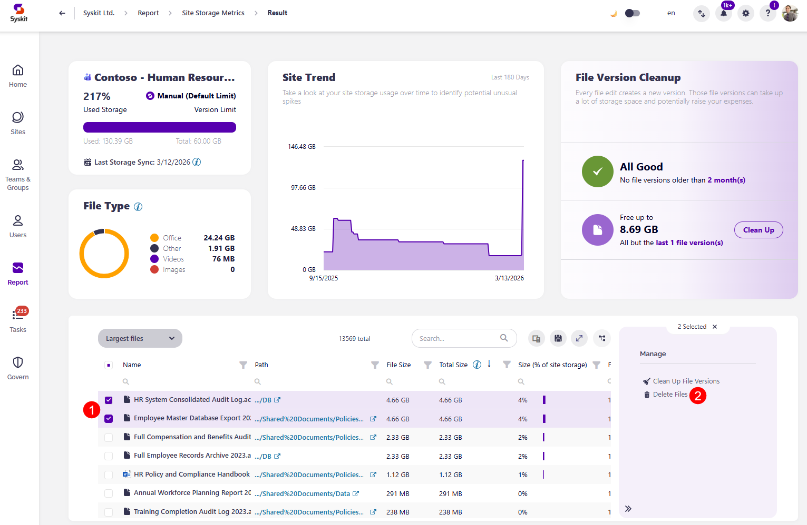

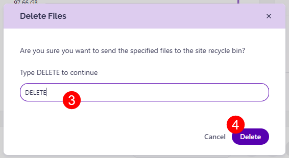

Once a file is **deleted**, it is removed to the Recycle Bin for the workspace. 

### Open Recycle Bin

The **Open Recycle Bin action** opens the recycle bin for the SharePoint site you are on, allowing you to empty the recycle bin or restore files.

You can access it by following these steps:

* **Go to Reports > Storage > Storage Metrics report**
  * Alternatively, you can also access the report by clicking the **View All** button on the **Storage Dashboard tile**
* On the report, **click the SharePoint site** for which you want to access deleted files
  * This opens the **Site Storage Metrics report (1)**
* **Click the Open Recycle Bin (2)** action, which opens the SharePoint site's recycle bin

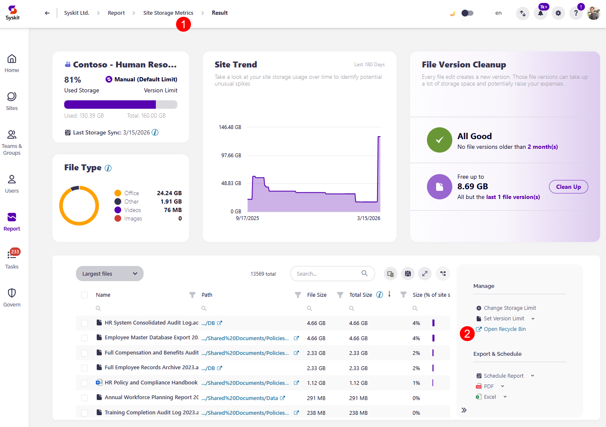

## Archive Files

:::info

**Please note** that the use of this feature depends on a Microsoft 365 functionality that is currently available in Public Preview and needs to be manually enabled on your tenant. General availability is expected in July 2026. [For more details, take a look at this Microsoft article.](https://learn.microsoft.com/en-us/microsoft-365/archive/archive-manage?view=o365-worldwide#manage-file-level-archive-preview)

:::

The Archive Files action lets you move inactive or unused SharePoint files to cold storage by using [Microsoft 365 Archive](https://learn.microsoft.com/en-us/microsoft-365/archive/archive-setup?view=o365-worldwide). This helps you reduce active SharePoint storage usage while keeping files available for search, compliance, and future access. 

Archived files are not removed from SharePoint; they remain visible in the document library, marked with an archive icon, and are searchable through Microsoft 365. However, the files must be **reactivated** before they can be opened and **read**. 

When a file is archived, it:
* Is moved to a cold storage tier within SharePoint
* No longer consumes active SharePoint storage quota
* Retains metadata, permissions, and compliance policies

You can archive a file by following these steps:

* **Go to Reports > Storage > Storage Metrics report**
  * Alternatively, you can also access the report by clicking the **View All** button on the **Storage Dashboard tile**
* On the report, **click the SharePoint site** you want to archive files for
  * This opens the **Site Storage Metrics report**
* On the Site Storage Metrics report, **select the file you want to archive (1)**
* **Click the Archive Files (2)** action, which opens the Archive Files confirmation modal
* **Select the checkbox (3)** to trim file versions before archiving
* On the Archive Files confirmation modal, **click the Archive button (4)** to confirm your decision and archive the file

:::info

**Please note**: Multiply your savings by trimming old file versions from the file you plan to archive. This helps reduce the number of versions stored in the archive, as by default, the Microsoft 365 Archive retains all file versions. 

:::

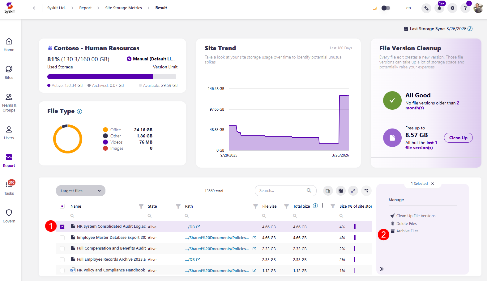

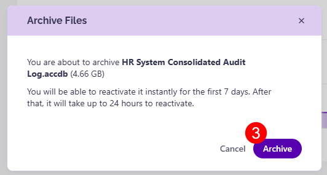

:::info

**Please note the following**: 
* Archived files are not included in Microsoft Copilot results until they are reactivated. 
* Files with **retention labels can be archived and retention policies continue to apply**
* **File versions can still be cleaned** up even **when** a file is **archived**. 
* The **Archive Files action** is only available for SharePoint sites, **OneDrive is not supported**
* [For a full list of limitations, check the official documentation.](https://learn.microsoft.com/en-us/microsoft-365/archive/archive-overview?view=o365-worldwide#file-archive-preview-limitations)

:::

Once a file is **archived**, it is placed into cold storage and can be reactivated if the need arises.

### Reactivate Archived Files

The **Reactivate Archived Files action** lets you reactivate archived files to make them accessible again. 

Any user with read permission can restore files directly in Microsoft 365, while Administrators can reactivate files in bulk from Syskit Point.

* Files archived within the last 7 days can be reactivated instantly
* Files archived more than 7 days ago might take up to 24 hours to become available again

You can access your archived files by following these steps:

* **Go to Reports > Storage > Storage Metrics report**
  * Alternatively, you can also access the report by clicking the **View All** button on the **Storage Dashboard tile**
* On the report, **click the SharePoint site** for which you want to reactivate archived files
  * This opens the **Site Storage Metrics report**
* **Select the Archived Files view (1)** from the dropdown filter 
* **Select the archived file (2)** you want to reactivate
* **Click the Reactivate Files button (3)** located on the right side of the report
* The Reactivate Archived Files modal opens, where you can **click Reactivate (5)** to reactivate the file

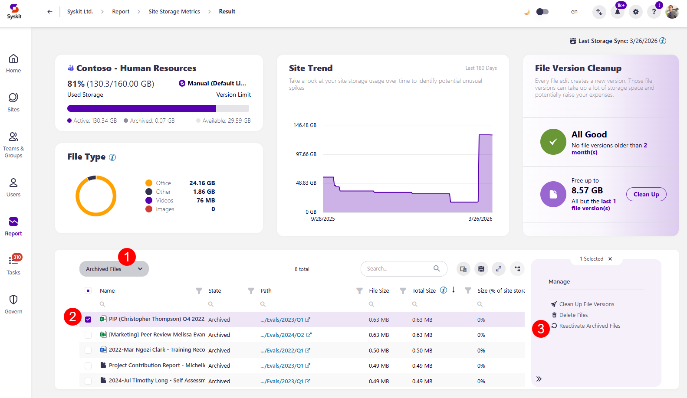

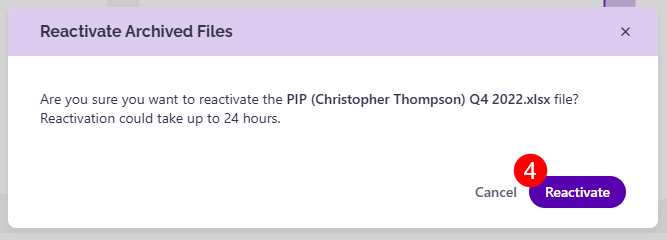

:::info

**Please note**: 
* After reactivating the file, it can take up to 24 hours for the file to become active, with the state of the file marked as Reactivating until then. 
* There is no reactivation fee when reactivating archived files.
* Files that are reactivated cannot be archived again for 30 days.

:::

## Clean Up Action on Storage Metrics Report

:::info

**Please note**: The Clean Up actions can be completed even on files that have been archived.

:::

**The Storage Metrics report** is where you can complete a bulk cleanup action. The report can be generated in the following way:
 
 * **Click the View All** button on the Storage tile located on the dashboard.
   * Alternatively, **click the Reports button** located on the left side of the screen, **select Storage** from the dropdown filter, and **click the Storage Metrics report**.

Once the Storage Metrics Report is generated, complete the next steps: 

  * **Select one or more sites (1)** you want to remove storage from. 
  * **The Clean Up File Versions action (2)** is now available on the right side of the screen.
  * **Clicking the arrow** next to the Clean Up File versions action provides several clean-up actions:
    * **Old File Versions (3)** - lets you clean up old file versions based on the value you set up in Settings.
    * **Number of File Versions (4)** - lets you clean up several old file versions based on the value you set up in Settings.
      * For more details on setting up these values, look at the [Configure Storage Management article](../configuration/configure-storage-management.md).
    * **All but the last file versions (5)** - lets you clean up all versions of the files, except for the most recent one. Clean Up Action on Site Storage Metrics Report

:::info
**Please note**: Completing the cleanup action from the Storage Metrics report cleans up all files located at the selected site or sites. Freeing up space for one or more specific files on the site is possible via the [Site Storage Metrics](#clean-up-action-on-site-storage-metrics-report) and [File Storage Details](#clean-up-action-on-site-storage-metrics-report) reports.
:::

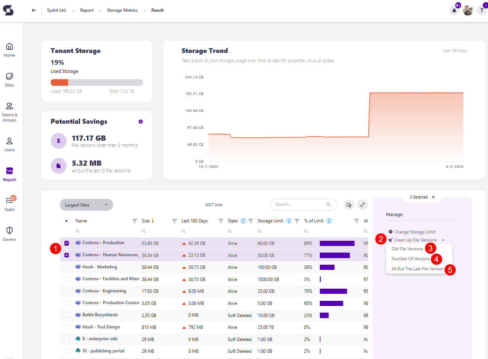

* **Clicking any of the Clean Up options opens the Clean Up File Versions pop-up (1)**
  * The information on the pop-up slightly varies depending on whether you're cleaning up file versions older than X months, cleaning up all but the last X file versions, or cleaning up all but the latest file version; however, the options available for the cleanup are the same.
* To permanently delete the file(s), check the **Permanently delete checkbox (2)**; doing this instantly frees up space for your site.
    * If the checkbox is not selected, the file(s) are sent to the site's Recycle bin for the defined retention period; doing this does not instantly free up space for your site, and the space is only cleared once the file(s) are removed from the recycle bin. 
* **Type Clean Up (3)** in the available space to proceed.
* **Click the Clean Up button (4)** to finalize. 

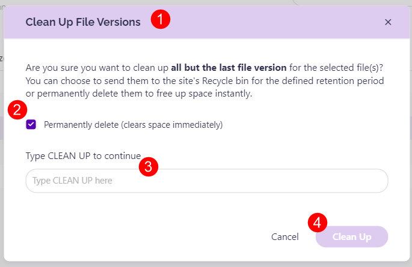

## Clean Up Action on Site Storage Metrics Report

You can complete the cleanup action from the Site Storage Metrics report by doing the following: 
  * When the Storage Metrics Report is generated, **click the name of the site** you want to remove storage from. This opens the **Site Storage Metrics report**.
  * **Click the Report button** on the left of the screen and **select Storage from the dropdown menu**. There, you can **click the Site Storage Metrics report** to access it. 

There are three ways to clean up the storage space across your sites. 

 * In the File Version Cleanup tile, you can:
   * **Choose to Clean Up file versions older than X month(s) (2)**
   * **Choose to Clean Up all but the last X file version(s) (3)**
     * The exact numbers shown here can be customized in your Syskit Point settings; for more details on this, take a look at the [Configure Storage Management article](../configuration/configure-storage-management.md)

  * **Selecting the site (4)**, or the files included in the site, and clicking the **Clean Up File Versions button (5)**, located on the right side of the screen under the **Manage section**. 

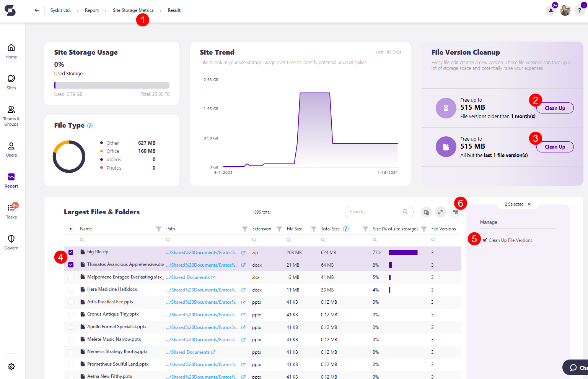

Once you click the **Clean Up button** on the File Version Cleanup tile or the **Clean Up File Versions button** in the Manage section, a **Clean Up File Versions pop-up opens (1)**.
  * To permanently delete the file(s), check the **Permanently delete checkbox (2)**; doing this instantly frees up space for your site.
    * If the checkbox is not selected, the file(s) are sent to the site's Recycle bin for the defined retention period; doing this does not instantly free up space for your site, and the space is only cleared once the file(s) are removed from the recycle bin. 
  * **Type Clean Up (3)** in the available space to proceed.
  * **Click the Clean Up button (4)** to finalize.

:::info
**Please note**: If you do not permanently delete files, they are sent to the site's Recycle bin for the defined retention period. The retention period for your site's Recycle bin depends on the period you previously defined in SharePoint. For more details on this, [take a look at this Microsoft 365 article.](https://support.microsoft.com/en-us/office/manage-the-recycle-bin-of-a-sharepoint-site-8a6c2198-910e-42dc-9a9c-bc5bc4f327da)

:::

## Clean Up Action on File Storage Details Report

You can also complete the cleanup on the File Storage details screen. To navigate there, repeat the above steps until you reach the Site Storage Metrics report. 

From there:

 * Under the Largest Files & Folders section, **click the name of the file** you want to generate the File Details report for.
 * Once the report is generated, **select one or more of the file versions (1)**, and the **action to Delete Version (2)** is then available on the right side of the screen under the **Manage section**. 

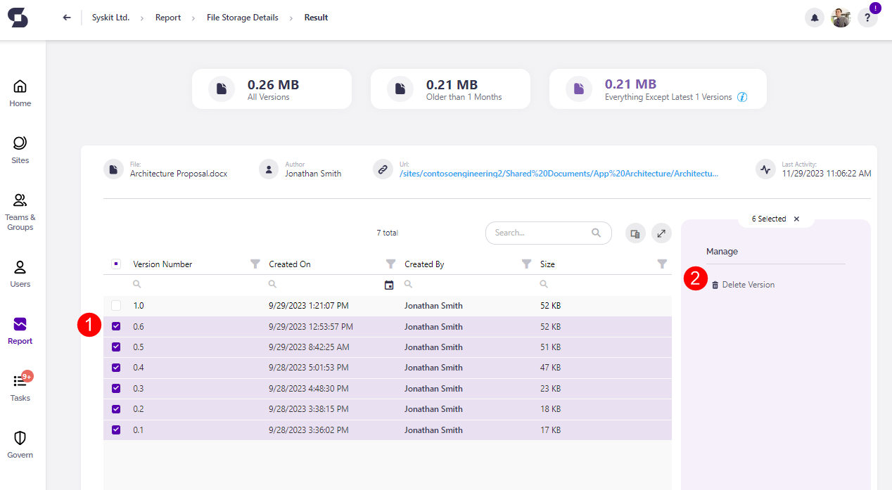

:::info
**Hint!** The latest version is never deleted, even if you select all versions and run the Delete Version or Clean Up File Versions action.
:::

You can also manage storage directly from SharePoint by clicking the **link in the Storage Metrics URL column**. 
  * The SharePoint site-specific Storage Metrics report opens in your browser.