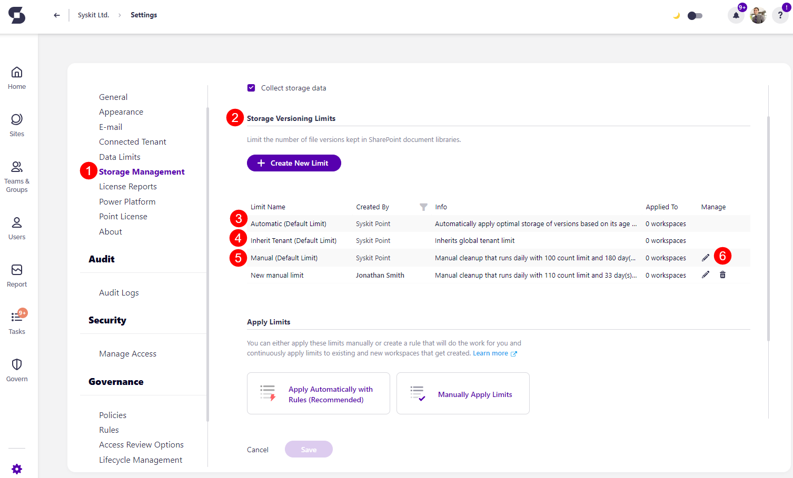
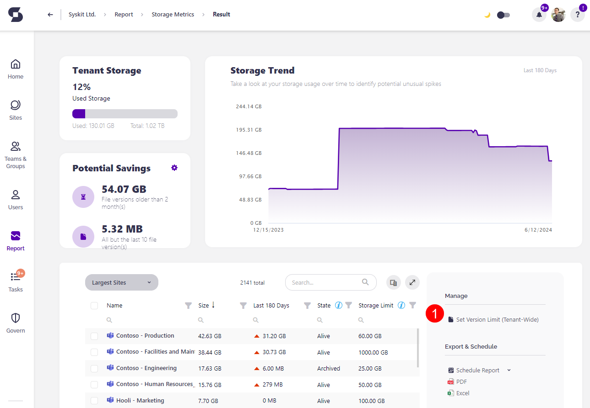
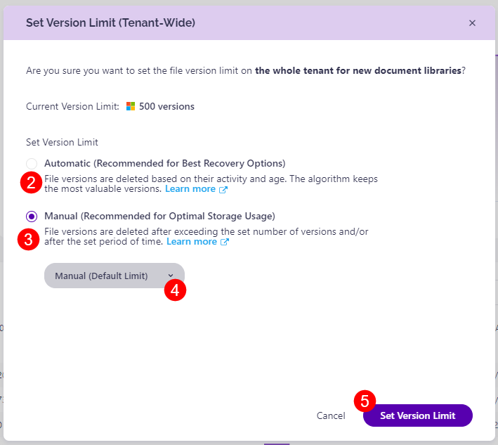
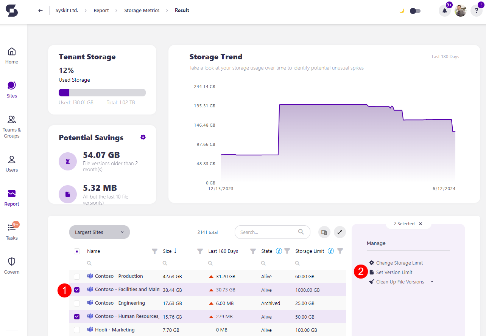

# Storage Versioning Limits 

Having to manually keep up with file versions in your workspaces can be unnecessarily time-consuming. Now, you can **set up versioning limits for your storage**, and automate actions based on the limit settings.

**Storage Versioning Limits help you limit the number of file versions kept in SharePoint document libraries**. File versions are deleted after exceeding the number of versions you set, the time period you set, or both.

:::warning
**Please note!** \
**A service account must be connected to Syskit Point to enable the automatic application of Versioning limits to workspaces via rules.** \
The service account doesn't require additional permissions to apply Versioning limits. &#x20;

[See the Connect Service Account article for more details on connecting the service account in Syskit Point](../configuration/connect-service-account.md)
:::

## Create Storage Versioning Limits

First, go to the **Settings** of your Syskit Point. Click on **Storage Management (1)** and navigate to the **Storage Versioning Limits (2)** section.

There are three default limits set up:

* **Automatic (Default Limit) (3)** - automatically applies optimal storage of versions based on their age and probability of getting restored
* **Inherit Tenant (Default Limit) (4)** - inherits global tenant limit
  * The Automatic and Inherit Tenant limits cannot be edited.
* **Manual (Default Limit) (5)** - Manual cleanup that runs daily with a 100 count limit and 180 day time limit
  * The Manual limit can be **edited (6)** to adjust the count and time limits based on your personal preferences.

To create a new storage versioning limit, click the **Create New Limit (6)** button.

The Create New Manual Storage Limit pop-up opens. There, you can select:

* **Limit Name (1)** - here, you should enter the name for the versioning limit
* **Count Limit (2)** - select the checkbox if you want to place a count limit on your workspaces
  * Select the **count limit (3)** you want to place as the maximum limit for the number of versions a file can have
  * Once a file exceeds the number of versions you place, the oldest versions start getting removed
* **Time Limit (4)** - select the checkbox if you want to place a time limit on your workspaces
  * Select the **time limit (5)** you want to place as the maximum limit for how old a version can be before getting removed
  * File versions older than the time limit you set get removed once the threshold you set is passed.
* **Click Save (6)** to finalize your selection and create the new storage versioning limit.

:::info
**Please note** the following:

* If **Count Limit is selected**, after the versions surpass the set number, they are automatically deleted from older to newest. (ex. if 100 versions are selected for the count limit, then after the 101 version is created, the older version is deleted).

* If **Time Limit is selected**, versions older than the set period will automatically be deleted. (ex. If 30 days are set as the time limit, then versions older than 30 days are deleted).  

* If both Count Limit and Time Limit are selected, then both are taken into account for version limits. For example, with a 100-count limit and 30-day time limit selected, the following happens: 
  * All versions older than 30 days are deleted even if there are fewer than 100 versions.
  * If 100 versions are reached before the 30-day time limit, the older versions are automatically deleted even though they are still within the time limit.

* The new rule **will not affect any versions created before** the versioning limits are applied. 

:::

&#x20;

:::info
**Please note** that the **manual storage limit runs daily**. &#x20;
:::

## Apply Storage Versioning Limits

Once you have created your storage versioning limits, **you can apply them manually** by selecting the workspaces yourself or **automatically** by creating a rule that continuously applies limits to existing and new workspaces that get created.

### **Apply Automatically with Rules**

* Selecting this redirects you to **Rules**, where you can create rules that will continually apply the limit to existing and new workspaces.
* [For details on how to create Rules, take a look at this article.](../governance-and-automation/automated-workflows/policy-automation.md)

### **Manually Apply Limits**

Selecting this opens the Storage Metrics report, where you can:

* **Set Version Limit (Tenant-Wide)(1)** by clicking the button on the right side of the screen.
* **Clicking Set Version** Limit opens the pop-up where you can set the file version limit on the whole tenant for new document libraries.
  * The options available are Automatic & Manual. &#x20;
* **Selecting Automatic (2)** means that file versions are deleted based on their activity and age, with the algorithm keeping the most valuable versions.
* **Selecting Manual (3)** means that file versions are deleted after exceeding the set number of versions and/or after a set period of time based on the metrics you previously set.
  * If you select manual, you can also **select the storage versioning limit (4)** that you want to apply tenant-wide
* **Click Set Version Limit (5)** to finalize your selection and apply the changes.

* **Set Version Limit** on one or more sites by **select one or more workspaces (1)**.
* Click the **Set Version Limit (2)** button on the right side.

This opens the Set Version Limit pop-up, where you can set the file version limit for all new file versions on the selected workspace(s).

There, you can decide between Automatic, Manual, or Reset to Tenant Limit.

* **Selecting Automatic (1)** means that file versions are deleted based on their activity and age, with the algorithm keeping the most valuable versions.
* **Selecting Manual (2)** means that file versions are deleted after exceeding the set number of versions and/or after a set period of time based on the metrics you previously set.
  * If you select manual, you can also **select the storage versioning limit (3)** that you want to apply tenant-wide
* **Selecting Reset to Tenant Limits (4)** means the workspace(s) inherit the versioning limit policy set at the tenant level.

You can also decide whether you want to **clean up existing file versions (5)** before setting the storage versioning limit.

* **Select the checkbox (6)** to clean up existing file versions
* After selecting the checkbox, you can **choose the type of file version cleanup (7)**:
  * Old File Versions - cleans up files older than 2 months
  * Number of Versions - cleans up all but the last 10 file versions
  * All But the Last File Version - cleans up all file versions but the last one
* Finally, **if you want to permanently delete the file versions (8)** and clear the space immediately, you can select the checkbox
* **Click Set Version Limit (9)** to finalize your selection and apply the changes.

### **Remove Manually Applied Limits**

After manual versioning limits have been applied, they can still be removed from sites.

To remove version limits, **open the Storage Metrics report**.

* **Select one or more workspaces (1)** for which you want to remove the manually applied storage version limits.
* On the right side of the screen, **click the arrow (2)** next to the Set Version Limit action.
* **Click the Remove Version Limit action (3)** that shows up.
* This makes a pop-up appear that asks you to confirm your decision to remove manually applied limits by **clicking the Remove Version Limit button (4)**.

## Manual Cleanup after Storage Versioning Limits

In some instances, even after setting up storage versioning limits, you **might need to perform a manual storage cleanup**. 

The **Storage Versioning Limits only apply to new file versions created after the policy is enabled**. Older file versions are not automatically deleted **unless a manual cleanup is performed first**. For example:

* If you only set a **version count limit** (for example, keep 100 versions), and run the manual cleanup once **before** enabling the policy, the **manual cleanup removes all excess file versions** and from then on the **cleanup is handled automatically** for new versions

* If you are using the version count limit in combination with the time limit, the feature **only applies the time-based deletion to versions created after the policy was set**, so versions that were not old enough at the time of the initial cleanup will not be deleted later, unless you repeat manual cleanup over time
  * If you are using the **Time Limit**, we recommend **repeating manual cleanup periodically during the first year**.

:::info
**Please note**: Even with storage cleanup automation turned on, you might notice that Potential Savings are still growing. This is expected due to:
* **Some older file versions may remain if they were not manually deleted during the initial cleanup**
* **There is a delay in storage sync, which can happen in large environments** which means that file versions that were already deleted in SharePoint could still appear in reports until the next sync is completed
  * Depending on the size of the environment, the storage sync can take **up to a month**
  * If you have a large tenant, you can use **on-demand sync to target specific environments or sites** instead of waiting for the full sync cycle to be completed

:::