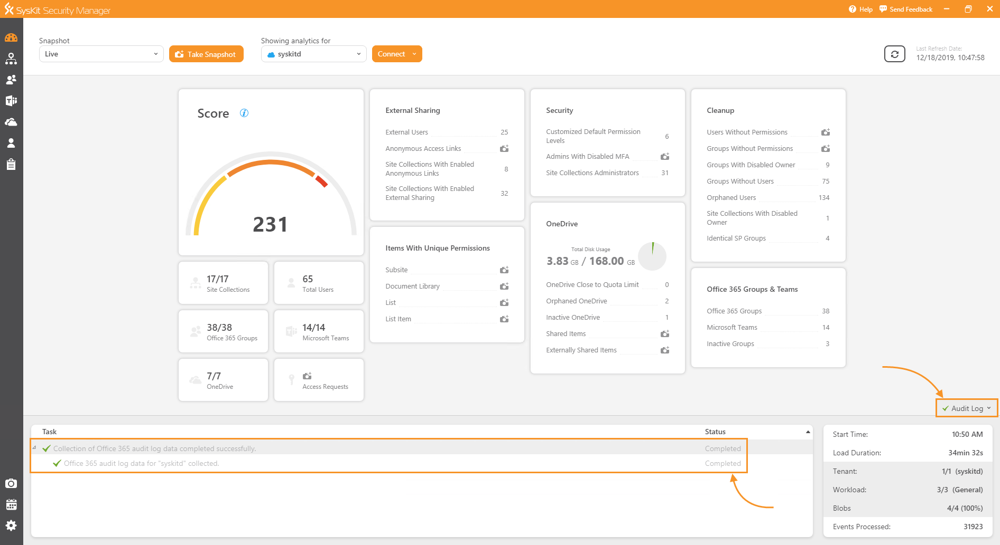
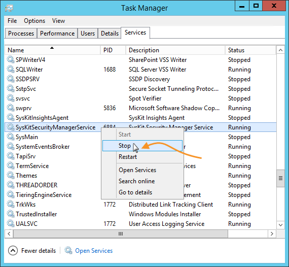
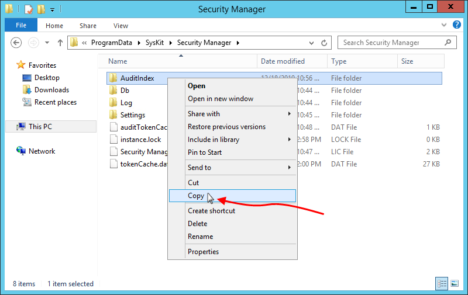
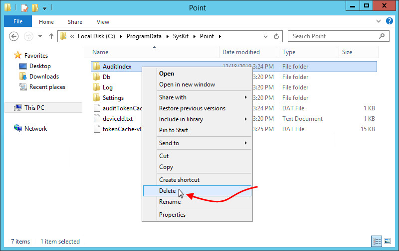

# Migrate Audit Logs

Although you cannot upgrade SysKit Security Manager to SysKit Point, you can migrate already collected Audit logs.


**Please note!**  
Before you begin with the migration, make sure your SysKit Security Manager application is upgraded to the [latest version](https://docs.syskit.com/security-manager/product-updates/security-manager-7-1-0-release-note).


## Get Existing Audit Logs

On the machine where SysKit Security Manager is installed, **make sure that the Audit log collection is NOT in progress.** You can do so by checking the **Audit Log status bar**. If you see a green checkmark, you can continue to the next step.


**Please note!**  
Make sure the Audit logs collection is not in progress. **Stopping the service while Audit logs are being processed can corrupt the Audit Index.**


Open the Task Manager on the machine where SysKit Security Manager is installed. **Stop the SysKit Security Manager service** - you can find it under the name **SysKitSecurityManagerService**.

Find the Audit Index location used by SysKit Security Manager to store Audit logs data. By default, this is set to **C:\ProgramData\SysKit\Security Manager\AuditIndex**. If unsure, you can find the Audit logs location path in SysKit Security Manager by navigating to **Settings** &gt; **Audit** &gt; **Audit Logs**.

Once located, **copy the AuditIndex folder** to a safe temporary location or a thumb drive in case SysKit Point is installed on another machine.

## Move Audit Logs to SysKit Point Folder


**Please note!**  
Before you continue with the migration, please make sure that the SysKit Point service is stopped. You can find it under the name **SysKitPointService**.

After the migration, **duplicate Audit Log entries may appear** in audit reports because of Audit Log technical limitations.


### **New SysKit Point Installation**

If you don't have an existing SysKit Point installation, first, install SysKit Point by following the instructions[ given here.](../installation-and-configuration/deploy-on-premises/install-syskit-point-on-premises.md)

Before continuing to the [configuration steps](../installation-and-configuration/deploy-on-premises/configure-syskit-point-on-premises.md), **copy and paste the AuditIndex folder you retrieved from SysKit Security Manager to** **C:\ProgramData\SysKit\Point.**

Continue with the [configuration of SysKit Point](https://github.com/SysKitTeam/docs-point/tree/c44f31675c526c6b132a4d2ee69fd9848955fc9d/faq/installation-and-configuration/deploy-on-premises/configure-syskit-point-on-premises/README.md). When you complete the configuration and open SysKit Point web-app, you should be able to view existing Audit logs in the Audit Logs Overview report. To open the report, navigate to the **Report Center**, click the **Audit Logs Overview** tile, and run the report**.**

### Existing SysKit Point Installation

If you already installed SysKit Point, navigate to the default SysKit Point Audit logs location. The default path is **C:\ProgramData\SysKit\Point. Here, you can find an existing AuditIndex folder.** To ensure proper migration and to avoid corruption of index logs, before copy-pasting SysKit Security Manager AuditIndex folder, **delete the existing AuditIndex folder from the SysKit Point audit location.**

**Copy and paste the AuditIndex folder you retrieved from SysKit Security Manager to** **C:\ProgramData\SysKit\Point.**

Start the SysKit Point service and open the SysKit Point web-app in your web browser. You should be able to view existing Audit logs in the Audit Logs Overview report.

