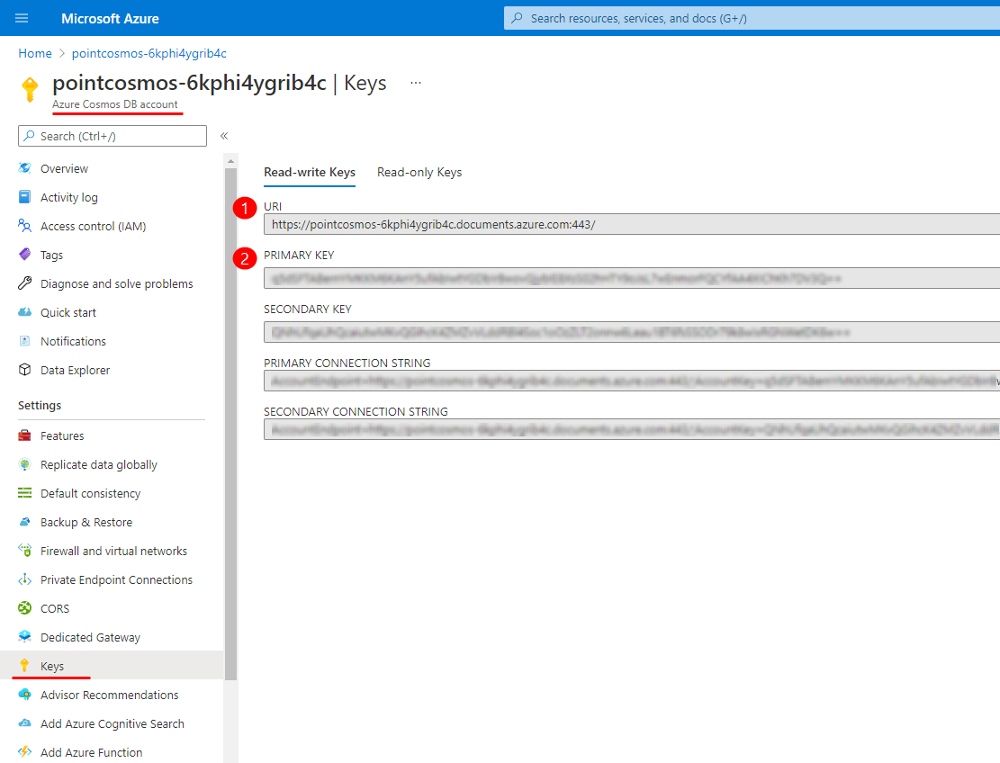

# Migrate Lucene to Cosmos

After you successfully finished **SysKit Point cloud deployment** and you have the **Cosmos database**, you can proceed with the migration of the Lucene Index.


**Please note!**  
Necessary steps:
1. You have to stop **SysKit Point Service** on the server where the app is installed during the whole process of migration.
2. You have to stop both **Web App Service** and **BE App Service** that were created with SysKit Point deployment. Open **Microsoft Azure > your Resource group > here you will find App services**. Open each of them and in the **ribbon bar** on the **Overview screen** click the **Stop** button. See the picture.


These are the steps:

1. Download the [**SysKit.Point.MigrationTool.exe**](https://downloads.syskit.com/point/files/SysKitPoint-MigrationTool.zip) to the server where the **SysKit Point** is installed.
2. Inside the **%ProgramData%\SysKit\Point** folder create a new file **migrationConfig.json**.
3. Modify the file and add the configuration parameters - here is the example of minimal configuration file:

   ''' 
{
    "DatabaseId": "PointAudit",

    "TenantGuid": "024f552d-bcbc-4680-a63f-0716e6f3ed7d",

    "Endpoint": "https://pointcosmos-6kphi4ygrib4c.documents.azure.com:443/",
    
    "Key": "q5dSFTABernYMKKM6KAnY6ufAbIwtYGDbIrBwgvGjybIE8XsS02hHTY9oJsL7wEnmorFQCYfAA4XIChKh7DV3Q==",

    "AuditIndexLocation": "C:\\\ProgramData\\\SysKit\\\Point\\\AuditIndex"
    
    }'''

     Hint!
Tenant ID can be found in the **Azure Active Directory admin center > Overview screen**. Follow the [link](https://aad.portal.azure.com/#blade/Microsoft_AAD_IAM/ActiveDirectoryMenuBlade/Overview).

    Endpoint **(1)** and key **(2)** can be found in the **Microsoft Azure > Azure Cosmos DB account > Settings > Keys**. See the picture below. 

4. Check the size of your Lucene Index. The migration process can be performed at once or in phases. 

    For large indexes, it is recommended to do it in phases. Here are the duration estimates:

      | Disk Size (GB) | RU/s | Duration (h) |
      | :---| :--- | :--- |
      | 1 | 2500 | 2.15 |
      | 10 | 2500 | 21.5 |
      | 50 | 2500 | 135 |
      | 100 | 2500 | 445 |
      | 1 | 10000 | 0.6 |
      | 10 | 10000 | 6.6 |
      | 50 | 10000 | 44 |
      | 100 | 10000 | 125 |

      | RU/s | Throughput(GB/h) |
      | :---| :--- |
      |2500 | 0.465 |
      | 10000 | 1.65 |
    
 
5. If you want to separate the migration into smaller phases, add additional parameters to the **migrationConfig.json** to specify the Start and End dates like this: 

    
{
    "MigrateFromDate": "2021-05-27", //NEWER DATE

    "MigrateUntilDate": "2021-05-26" //OLDER DATE
  }


6. Run the migration tool by starting **SysKit.Point.MigrationTool.exe** file.

7. On the select operation step, enter value **2** to start the migration of the Lucene index.

8. Let the migration run. You can see the progress by checking the log files at **%ProgramData%\SysKit\Point\IndexMigrationLogs**. Make sure not to lock them, which could cause migration errors.  

9. After the migration has finished, decrease the **RU/s** to the initial value before the migration.

Contact the [SysKit support team](https://www.syskit.com/contact-us/) for more information.