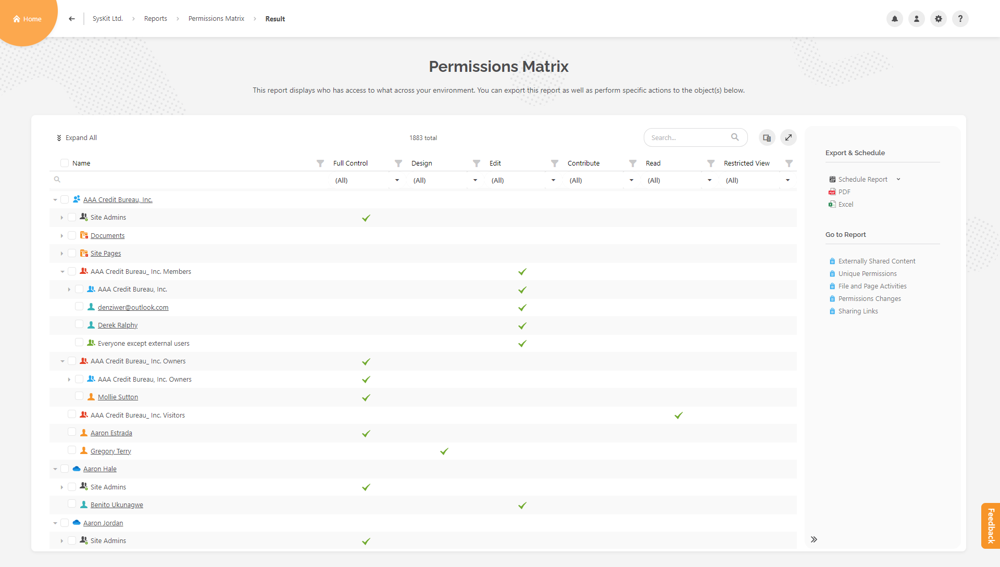
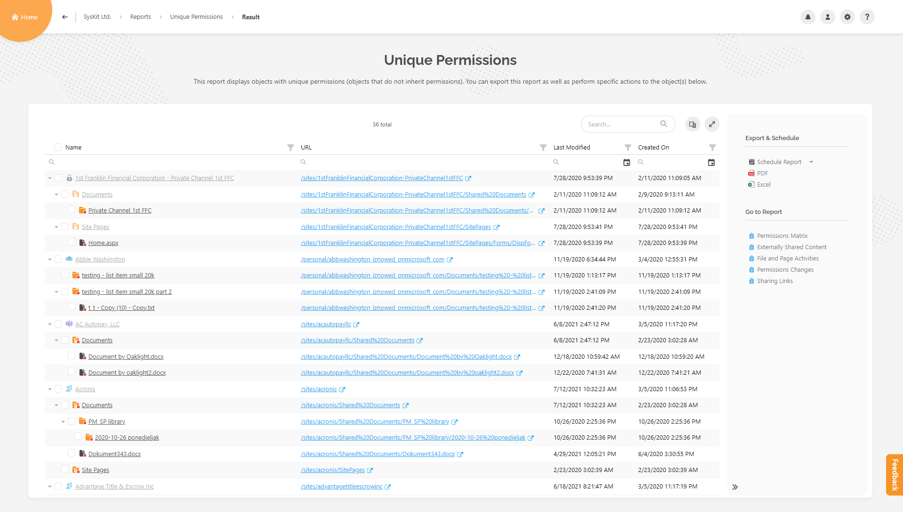
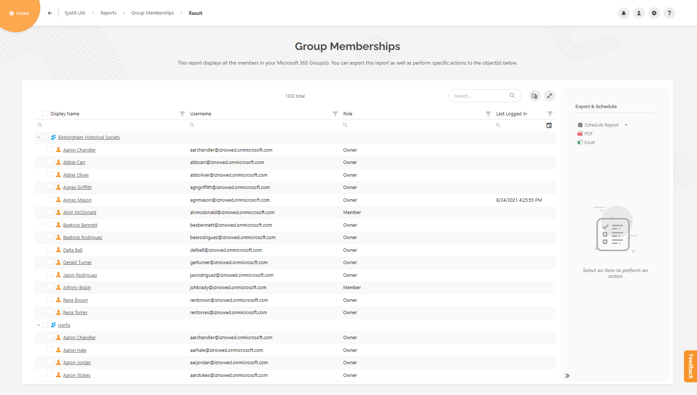
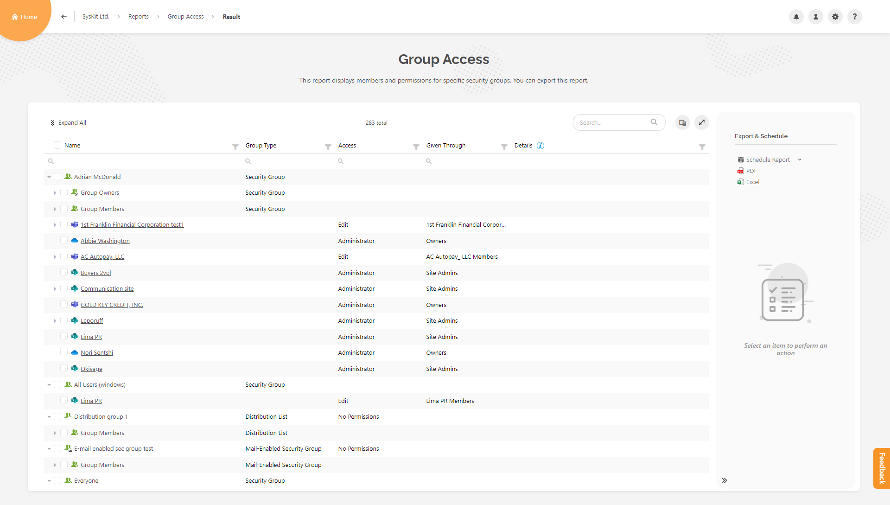
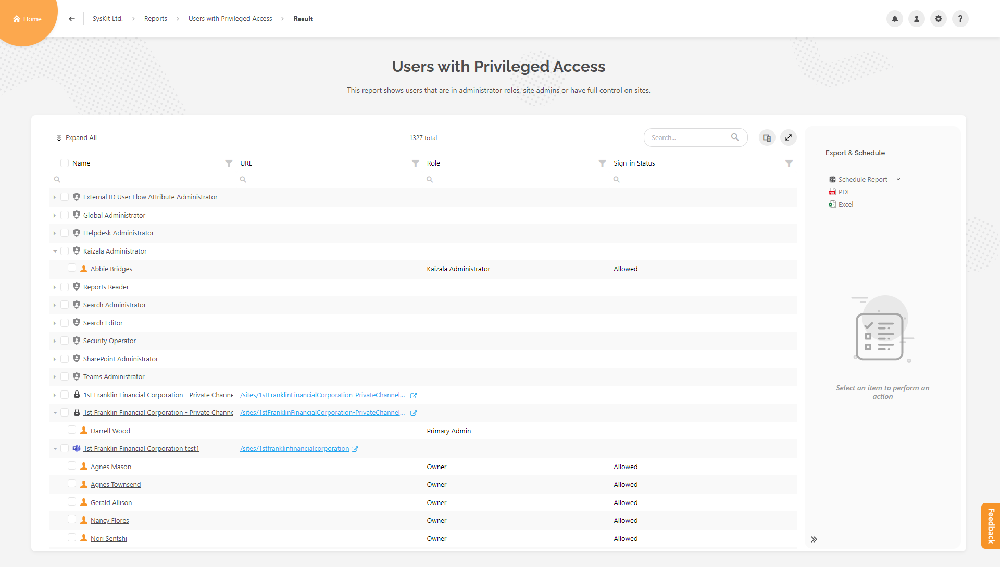
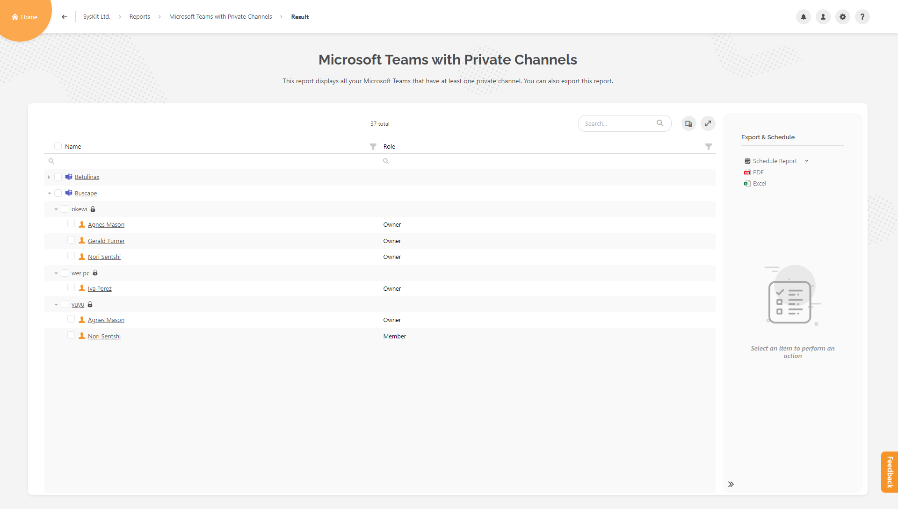
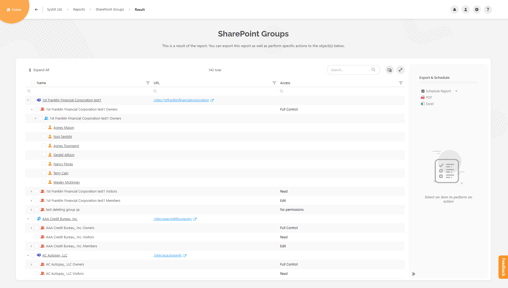

# Access Reports

This article contains information on eight access reports available through the **Report Center**:

* [Permissions Matrix Report](#permissions-matrix-report)
* [User Access Report](#user-access-report)
* [Unique Permissions Report](#unique-permissions-report)
* [Group Memberships Report](#group-memberships-report)
* [Group Access Report](#group-access-report)
* [Users with Privileged Access Report](#users-with-privileged-access-report)
* [Microsoft Teams with Private Channels Report](#microsoft-teams-with-private-channels-report)
* [SharePoint Groups Report](#sharepoint-groups-report)

## Permissions Matrix Report

The Permissions Matrix report gives insight into who has access to what content, across your environment.

It provides the option to view site hierarchy and permissions down to the document level.

### Generate Report

This report can be accessed from:

* **The Sites Overview screen, and The Microsoft Teams & Groups Overview screen**; select the resource and click on the suitable action in the side panel.
* **The details screen** of specific resource
* **The Report Center**
* **Other reports** available in SysKit Point
   * For example: User Access Report, Externally Shared Content Report, Unique Permissions Report

### Report Data

The default columns displayed in the report are:
		
* **Name** of the resource
* **Permissions levels**; depending on availability, several are shown in your environment.
   * For example: **Full Control, Design, Edit, Contribute, Read, Restricted View**

		
There are also additional columns in the **column chooser**:
		
* **URL**
* **Object Type**
* **Email**
* **Principal Type**
* **Is External User**
* **Is Deleted**
* **Is Licensed**
* **Sign-in Status**

### Report Actions

Here you can remove and manage users' access directly from this report. Select the item or user and choose the available action from the side panel.

Some of the actions are:

*	**Remove sharing link**
*	**Remove user access**
*	**edit user permissions**
*   **delete unique permissions**

This report can be exported (PDF and XLSX) and scheduled.

## User Access Report

With this report, you will see where exactly the user has access, and if permissions are given directly or through Microsoft 365 Group, Security group, or SharePoint group.

### Generate Report

You can access this report from:

*	Users Overview screen - select the user and click on the proper action in the side panel
*	details screen of specific resource - Users report on sites details screen
*	the Report Center
*	some other reports available in SysKit Point - for example, External Users report

### Report Data

Default columns displayed in the report are:
		
* **Name** of the user/resource
* **Access** - permissions level of the user
* **Given Through**
* **Details** - shows where the user got the permission from

		
There are also additional columns in the **column chooser**:
		
* **URL**
* **Object Type**
* **Site Type**

There is a **toggle button** above the grid that changes the data to **see only publicly accessible content**.

### Report Actions

Here you can remove and manage users' access directly from this report. Select the item or user and choose the available action from the side panel.

Some of the actions are:

*	**Remove user access**
*	**edit user permissions**
*   **remove user/group from SharePoint group**
*   **change admins**

This report can be exported (PDF and XLSX) and scheduled.

## Unique Permissions Report

This report shows you a list of objects (sites, lists, folders, files, etc.) with unique permissions (objects that do not inherit permissions).

### Generate Report

You can access this report from:

*	Sites Overview screen and Microsoft Teams & Groups Overview screen - select the resource and click on the proper action in the side panel
*	details screen of specific resource - Unique Permissions report in Overview tile
*	the Report Center
*	some other reports available in SysKit Point - for example, Permissions Matrix report, Externally Shared Content report, User Access report

### Report Data

Default columns displayed in the report are:
		
* **Name** of the resource
* **URL**
* **Last Modified**
* **Created On**

		
There are also additional columns in the **column chooser**:
		
* **Object Type**
* **Unique Permissions**

### Report Actions

Select the resource and choose the available action from the side panel.

Available actions are:

*	**Stop Sharing** - for OneDrive
*   **Delete Unique Permissions** - for other resources

This report can be exported (PDF and XLSX) and scheduled.

## Group Memberships Report

This report shows you all members, owners, and guest users across your Microsoft Teams and Microsoft 365 groups. 

### Generate Report

You can access this report from:

*	Microsoft Teams & Groups Overview screen - select the resource and click on the proper action in the side panel
*	teams/groups details screen - Members tile
*	the Report Center

### Report Data

Default columns displayed in the report are:
		
* **Display Name** of the resource
* **Username**
* **Role**
* **Last Logged In**

		
There are also additional columns in the **column chooser**:
		
* **Email**
* **Department**
* **State or Province**
* **City**
* **Country or Region**

### Report Actions

Here you can remove and manage users' access directly from this report. Select the item or user and choose the available action from the side panel.

The actions are:

*	**Change Owners**
*	**Add Owners/Members**
*	**Change to Member/Promote to Owner**
*   **Remove from Group**

This report can be exported (PDF and XLSX) and scheduled.

## Group Access Report

View the permissions and access rights for each security group. For example, with this report, you can detect where "Everyone" and "Everyone except external users" groups have access.

### Generate Report

You can access this report from:

*	the Report Center
*   from SharePoint Groups report

### Report Data

Default columns displayed in the report are:

* **Name** of the user/resource
* **Group Type**
* **Access** - permissions level of the user
* **Given Through**
* **Details** - shows where the user got the permission from

		
There are also additional columns in the **column chooser**:
		
* **URL**
* **Object Type**
* **Site Type**

### Report Actions

Here you can remove and manage users' access directly from this report. Select the item or user and choose the available action from the side panel.

The actions are:

*	**Add Owners/Members**
*	**Change to Member/Promote to Owner**
*   **Remove from Group**
*   **Remove User Access**

This report can be exported (PDF and XLSX) and scheduled.

## Users with Privileged Access Report

This report shows all users with privileged access on the tenant - users in Global administrator roles, Exchange admins, Teams admins, Compliance admins, etc. You can also detect SharePoint site admins and users with full control permission level.

### Generate Report

You can access this report from:

*	the Report Center

### Report Data

Default columns displayed in the report are:

* **Name** of the user/resource
* **URL**
* **Role**
* **Sign-in Status**

		
There are also additional columns in the **column chooser**:
		
* **Email**
* **Is External User**
* **Privacy**
* **Site Type**

### Report Actions

Here you can remove and manage users' access directly from this report. Select the item or user and choose the available action from the side panel.

Available action:

*	**Change Owners**

This report can be exported (PDF and XLSX) and scheduled.

## Microsoft Teams with Private Channels Report

This report shows you all Microsoft Teams with private channels, who created them, and who are the members that have access to this content.

### Generate Report

You can access this report from:

*	the Report Center

### Report Data

Default columns displayed in the report are:

* **Name** of the user/resource
* **Role**

		
There are also additional columns in the **column chooser**:
		
* **Email**
* **URL**
* **Is External User**

### Report Actions

There is no available action for this report.

This report can be exported (PDF and XLSX) and scheduled.

## SharePoint Groups Report

List of all SharePoint groups and their members across the selected groups, teams, and sites.

### Generate Report

You can access this report from:

*	the Report Center

### Report Data

Default columns displayed in the report are:
		
* **Name** of the resource
* **URL**
* **Access**

		
There is one additional column in the **column chooser**:
		
* **Email**

### Report Actions

There is no available action for this report.

This report can be exported (PDF and XLSX) and scheduled.

