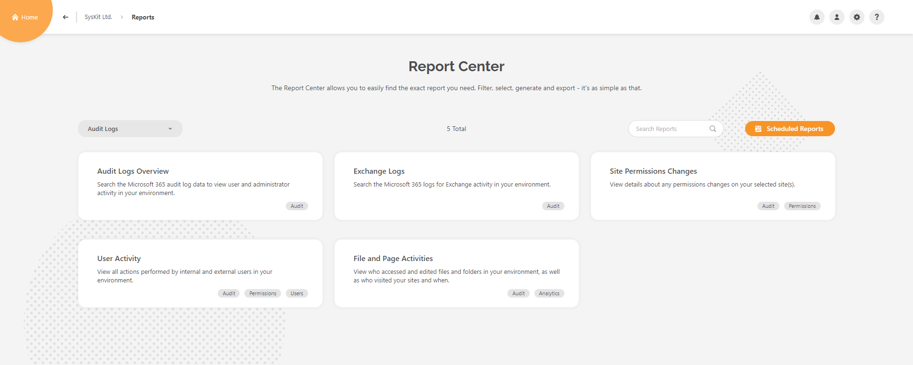
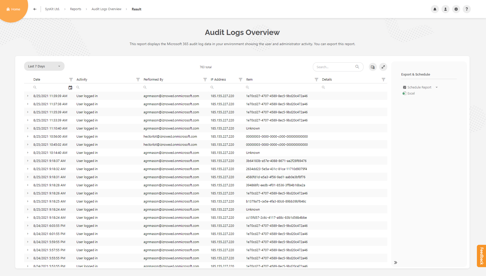
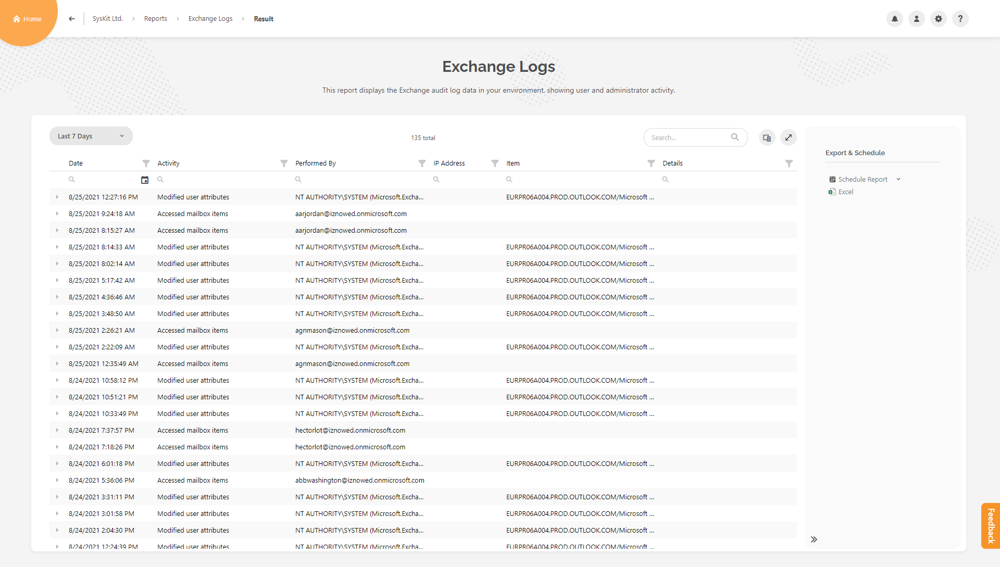
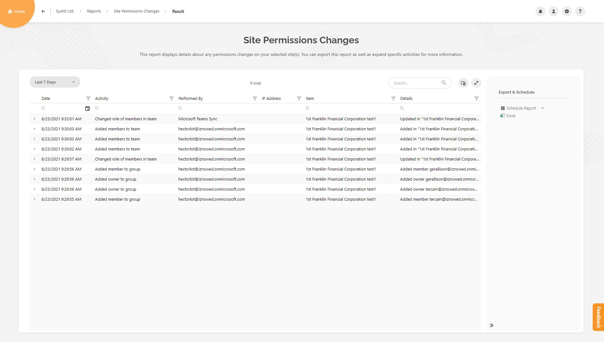
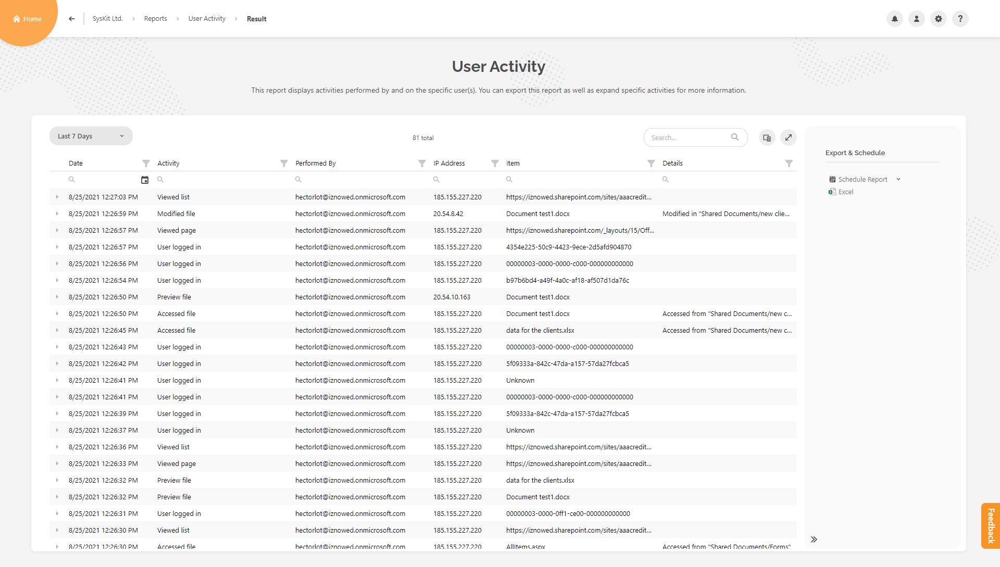
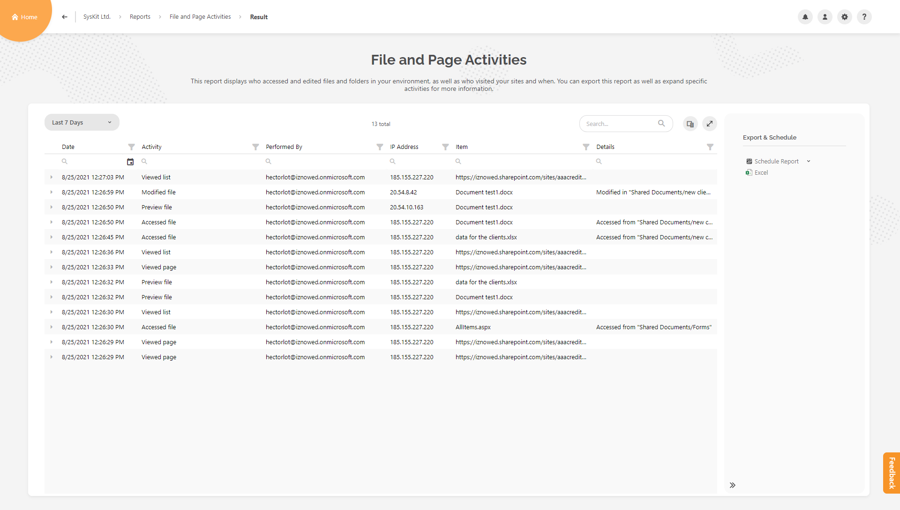

# Access Reports

This category contains five reports that you can access through **Report Center**.

Use the **dropdown filter**, as shown below in the picture, and select the **Audit Logs** category.

## Audit Logs Overview report

Search the Microsoft 365 unified audit log data to view user and administrator activity in your environment. This report provides a detailed overview of all users' activities in your environment. Quickly detect and troubleshoot potential issues, security breaches, or suspicious behavior. 

### Generate Report

You can access this report from:

*	the Report Center

### Report Data

Default columns displayed in the report are:
		
* **Date**
* **Activity** type
* **Performed By**
* **IP Address**
* **Item**
* **Details**

		
There are no additional columns in the **column chooser**.

Expend each row to see more details.

### Report Actions

There are no available actions for this report.

This report can be exported (XLSX file type only) and scheduled.

## Exchange logs report

Search the Microsoft 365 logs for Exchange activity in your environment. You can search per every mailbox in your Exchange Online.

### Generate Report

You can access this report from:

*	the Report Center

 Please note!
By default, Exchange logs are not collected; at least one Exchange activity must be selected for SysKit Point to collect and store Exchange log data. 

Click [here](../../configuration/customize-audit-logs-collection.md) to find out more.

### Report Data

Default columns displayed in the report are:
		
* **Date**
* **Activity** type
* **Performed By**
* **IP Address**
* **Item**
* **Details**

		
There are no additional columns in the **column chooser**.

You can filter this report for specific mailboxes in the initial **Options screen** before generating the report.

Expend each row to see more details.

### Report Actions

There are no available actions for this report.

This report can be exported (XLSX file type only) and scheduled.

## Site Permissions Changes report

View details about any permissions changes on your selected site(s). If somebody removed a member from a Team or broke sharing inheritance, you will be able to see it here. 

### Generate Report

You can access this report from:

*	Sites Overview screen and Microsoft Teams & Groups Overview screen - select the resource and click on the proper action in the side panel
*	details screen of specific resource
*	the Report Center
*	some other reports available in SysKit Point - for example, Permissions Matrix report, Externally Shared Content report, Unique Permissions report, Sharing Links report

### Report Data

Default columns displayed in the report are:
		
* **Date**
* **Activity** type
* **Performed By**
* **IP Address**
* **Item**
* **Details**

		
There are no additional columns in the **column chooser**.

Expend each row to see more details.

### Report Actions

There are no available actions for this report.

This report can be exported (XLSX file type only) and scheduled.

## User Activity report

View all actions performed by internal and external users in your environment. You can select the single user and understand what he has been doing in your environment, from logging in to viewing a file. If the admin or manager added or removed permissions for a particular user, you would also see that in this report.

### Generate Report

You can access this report from:

*   Users Overview screen - select the user and click on the proper action in the side panel
*   user details screen
*	site details screen of specific resource - Users report in Overview tile
*	group/team details screen of specific resource - Members tile
*	the Report Center
*	some other reports available in SysKit Point - for example, Permissions Matrix report, Externally Shared Content report, External Users report

### Report Data

Default columns displayed in the report are:
		
* **Date**
* **Activity** type
* **Performed By**
* **IP Address**
* **Item**
* **Details**

		
There are no additional columns in the **column chooser**.

Expend each row to see more details.

### Report Actions

There are no available actions for this report.

This report can be exported (XLSX file type only) and scheduled.

## File and Page Activities report

View who accessed and edited files/folders in your environment, as well as who visited your sites and when.

### Generate Report

You can access this report from:

*	Sites Overview screen and Microsoft Teams & Groups Overview screen - select the resource and click on the proper action in the side panel
*	details screen of specific resource
*	the Report Center
*	some other reports available in SysKit Point - for example, Permissions Matrix report, Externally Shared Content report, Sharing Links report, Unique Permissions report

### Report Data

Default columns displayed in the report are:
		
* **Date**
* **Activity** type
* **Performed By**
* **IP Address**
* **Item**
* **Details**

		
There are no additional columns in the **column chooser**.

Expend each row to see more details.

### Report Actions

There are no available actions for this report.

This report can be exported (XLSX file type only) and scheduled.