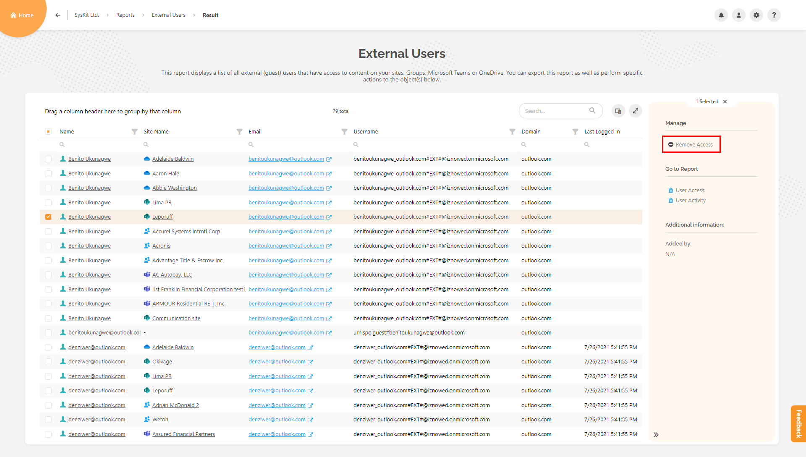

# External Sharing Reports

This category contains the following reports:
* **Externally Shared Content**
* **External Users**
* **Sharing Links**

To generate a report:
* **Navigate to the Report Center** by clicking the Reports tile on the Home screen
* **Select the External Sharing category (1)** from the left hand filter
* **Click a report tile (3)** of he report you want to generate

## Externally Shared Content

This report shows content shared with external users via sharing links or by granting the access directly.

### Selection & Filters

After clicking the **Externally Shared Content** report tile, a selection step opens where you can:
* **Filter displayed workspaces** by **changing the view (1)**, **selecting the workspace type (2)**, or **searching (3)**   
* **Select one or multiple workspaces (4)**
* **Select content level to be shown (5)**; choose between the following options:
    * **subsites**
    * **document libraries & lists**
    * **folders**
    * **files & folders**
* **Click the Run Report button(6)** to generate the report
### Report Data

The generated report displays all externally shared content based on the workspace and filter selection. The following columns are visible:		
* **Name** of the workspace, content, groups, and external users that are shown in the tree grid
* **Permissions levels** showing the level of access for external users on the content; for example, **Full Control**, **Design**, **Read**, **Edit**, **Contribute**
		
You can find and choose to display additional columns in the **column chooser**:		
* **URL**
* **Object Type**
* **Email**
* **Principal Type**
* **Is External User**
* **Is Deleted**
* **Is Licensed**
* **Sign-in Status**

### Report Actions

When the report is displayed, you can do the following actions by clicking the corresponding link from the right-side panel:
* **Schedule the Report**
* **Export the report** to an **Excel** or a **PDF file**
* **Open related reports**

You can also manage the access directly from this report by selecting an object or a user, and choose the available action from the side panel.
The following access management actions can be performed:
* **Change Owners/Admins**
* **Remove Sharing Links**
* **Grant**, **Remove**, and **Edit** user access
* **Break** and **Restore** permission inheritance
* **Add** users to groups, **Remove** users from groups, and **Delete** SharePoint groups

## External Users Report

This report contains all external users (registered in your tenant and outside your tenant) who have access to sites, Microsoft 365 Groups, Microsoft Teams, OneDrive, and Private Channels.

### Generate Report

You can access this report from:

*	the Report Center

### Report Data

Default columns displayed in the report are:
		
* **Name** of the user
* **Site Name**
* **Email**
* **Username**
* **Domain**
* **Last Logged In** time

		
There is one additional column in the column chooser:
		
* **Site Type** - shows the type of workspace for resource

### Report Actions

Here you can:

*	**Remove user access from a resource**
*	**see when the user last logged in**
*	**from which domain they are coming from**

This report can be exported (PDF and XLSX) and scheduled.

## Sharing Links report

This report helps you identify all the files and folders and their sharing links. 

This way, external users can be located and removed easily.

### Generate Report

You can access this report from:

*	detail screen of specific resource - Sharing Links tile
*	the Report Center
*	some other reports available in SysKit Point - for example, Permissions Matrix report, Externally Shared Content report, Unique Permissions report

### Report Data

Default columns displayed in the report are:
		
* **Name** of the resource
* **URL**
* **Link**
* **Link Type**
* **Created On**
* **Expiration Date**

An external user can be identified if you look for the color of the user icon. If it's a **green-blue color**, it's an **external user**.

### Report Actions

You can perform these actions:
*	**Remove sharing link**
*	**Remove user access**

This report can be exported (PDF and XLSX) and scheduled.
