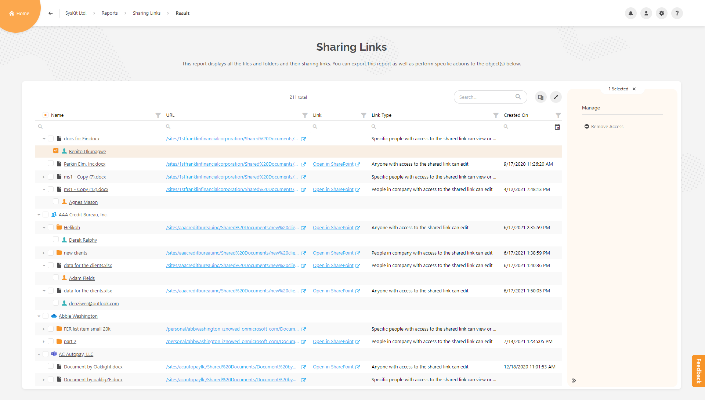

# External Sharing Reports

This category contains three reports that you can access through **Report Center**.

Use the **dropdown filter**, as shown below in the picture, and select the **External Sharing** category.

## Externally Shared Content Report

This report shows you external users that have access to your content via sharing links or have been granted access directly.

Here you can remove and manage their access directly from this report. Select the item or user and choose the available action from the side panel.

You can:
*	**Remove sharing link**
*	**Remove user access**
*	**edit user permissions**

In the **column chooser (1)**, you can find extra columns that you can add to the report.

## External Users Report

This report contains all external users (registered in your tenant and outside your tenant) who have access to sites, Microsoft 365 Groups, Microsoft Teams, OneDrive, and Private Channels.

Here you can:
*	**Remove user access from a resource**
*	**see when the user last logged in**
*	**from which domain they are coming from**

## Sharing Links report

This report helps you identify all the files and folders and their sharing links. 

This way, external users can be located and removed easily.

You can perform these actions:
*	**Remove sharing link**
*	**Remove user access**

An external user can be identified if you look for the color of the user icon. If it's a **green-blue color**, it's an **external user**.

