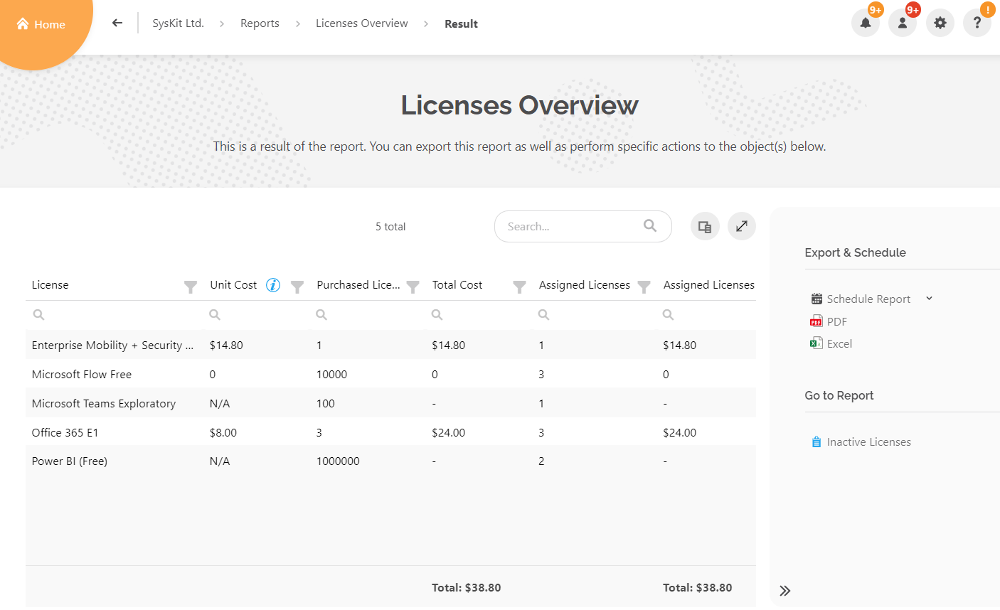
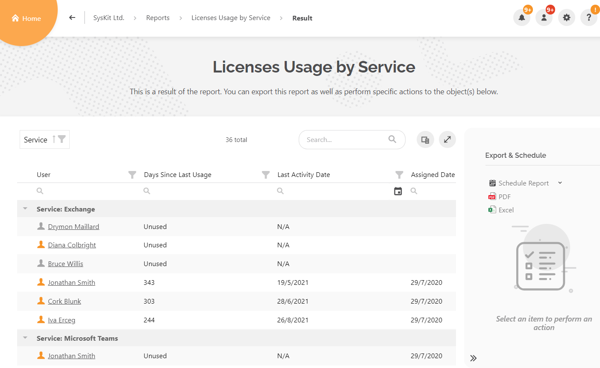
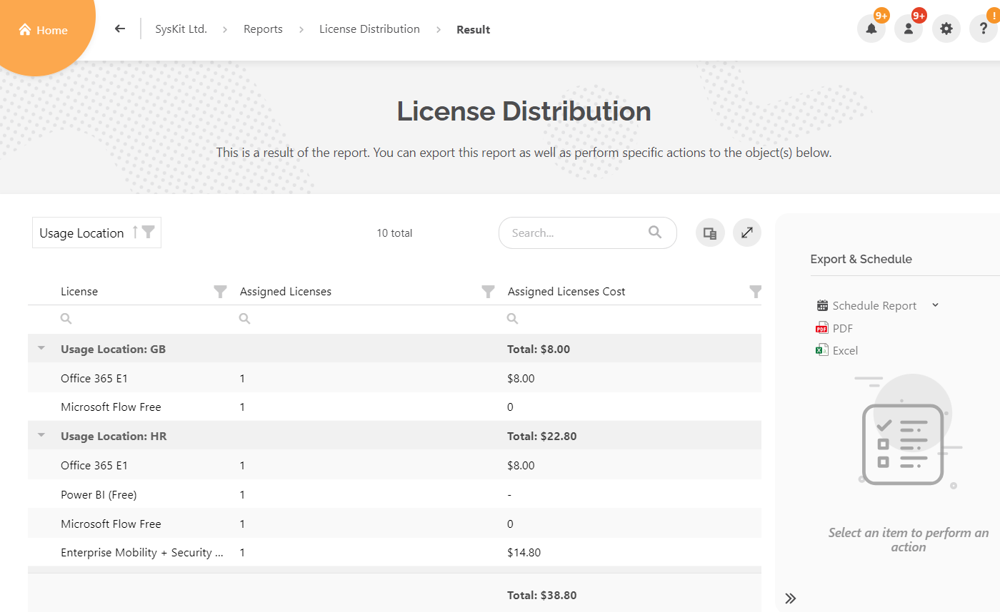
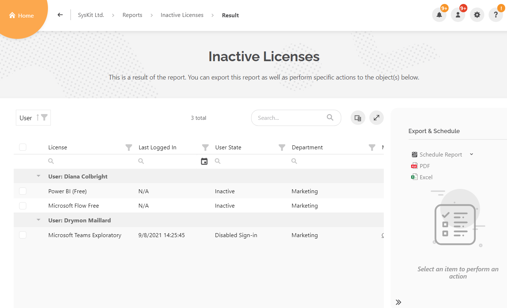

# Licenses Reports

Reports in this section **help manage your Microsoft 365 
licenses**. 

In this article you can locate information on the following license reports:
* [Licenses Overview Report](#licenses-overview-report)
* [Licenses Usage by Service Report](#licenses-usage-by-service-report)
* [License Distribution](#license-distribution)
* [Inactive Licenses Report](#inactive-licenses-report)

Use them to **discover assigned, unassigned or inactive Microsoft 365 licenses** and check their overall cost. 

These reports can also be used to **identify underutilized licenses to drive adoption and reduce the cost of the licenses** by assigning less expensive ones to users.

## Licenses Overview Report

The **Licenses Overview report** helps discover the assigned, unassigned and inactive Microsoft 365 licenses on your Microsoft 365 tenant. 
It also **shows the overall cost of all the current licenses** you've purchased from Microsoft. 

This report can be **used to help calculate future license costs**. 

### Generate the Licenses Overview Report

 * **Click on the Reports tile**; it is located on the SysKit Point home screen.
 * **Select Licenses in the filter**; it can be found in the upper left corner.
 * **Click on the Licenses Overview report** to generate the report.

### Licenses Overview Report Data

Now that your report is successfully generated, the following data will be displayed in the columns:

* **License**; shows the name of all licenses purchased in the Microsoft 365 subscription
* **Unit Cost**; shows the monthly price of the license per user
* **Purchased Licenses**; shows the number of licenses purchased
* **Total Cost**; shows the total cost per purchased license
* **Assigned Licenses**; shows the number of currently assigned licenses
* **Assigned Licenses Cost**; shows the cost per assigned license
* **Unassigned Licenses**; shows the number of currently unassigned licenses
* **Potential Savings (Unassigned)**; shows the potential savings you can obtain on unassigned licenses
* **Inactive Licenses**; shows the number of currently assigned licenses on inactive, blocked, or deleted users
* **Potential Savings (Inactive)**; shows the potential savings you can obtain on inactive licenses

The **total cost for All licenses, Assigned Licenses, and Total potential savings on unassigned and inactive licenses are located at the bottom** of the generated report.

Selecting a line in the generated report provides the option to create an Inactive Licenses report for the selected license.

The Licenses Overview report can be **exported as PDF and XLSX files**. There is also the **option to schedule the report**.

## Licenses Usage by Service Report

The **Licenses Usage by Service** report helps **identify underutilized licenses** to drive adoption and reduce costs by assigning less expensive licenses to users. 

Use this report to quickly **check if users are fully utilizing their assigned licenses**. This helps determine if they should have **less expensive licenses assigned to save costs**.

### Generate the Licenses Usage by Service Report

* **Click on the Reports tile**; located on the SysKit Point home screen.
 * **Select Licenses in the filter**; can be found in the upper left corner.
 * **Click on the Licenses Usage by Service** tile to generate the report.

### Licenses Usage by Service Report Data

Once the Licenses Usage by Service report is successfully generated, by default, **the result is grouped by the Service (Exchange, Microsoft Teams, OneDrive, SharePoint, Skype for Business, and Yammer) column**. 

The following data can also be found in the columns:

* **User**; shows the names of users and their usage of licenses per service
* **Days Since Last Usage**; shows how many days have passed since the service was used last time by said users
  * If the user never used it, the column will say Unused
* **Last Activity Date**; shows the exact date when the service was last used 
  * If the user did not use it at all, the column will show N/A
* **Assigned Date**; shows the exact date when the license for the service was assigned to said user

**Additional columns can be enabled via Column Chooser** next to the search box on the report.

The Licenses Usage by Service report can be **exported as PDF and XLSX files**. There is also the **option to schedule the report**.

## License Distribution

The **License Distribution** report enables **viewing the license distribution and cost by department or location**. 

Use this report to see how licenses are distributed within the organization's departments and the total cost for currently assigned licenses. 

This report can also be **used to help calculate possible savings that can achieve by removing inactive licenses**. 

### Generate License Distribution Report

* **Click on the Reports tile**; located on the SysKit Point home screen.
 * **Select Licenses in the filter**; can be found in the upper left corner.
 * **Click on the License Distribution** tile to generate the report.
* **Select one of the two options** when redirected to the filter screen; the report data can be filtered by **Department or Usage Location**.
* **Click the Run Report button** to generate the desired report.

### License Distribution Report Data

When the License Distribution report is successfully generated, it will be grouped by either Department or Usage Location. 

It shows all of the **licenses in the Microsoft 365 environment assigned by your company departments or various locations**.

Other columns that are enabled by default are:

* **License**; the name of the purchased Microsoft 365 license
* **Assigned Licenses**; the number of currently assigned licenses per license
* **Assigned Licenses Cost**; the total cost of assigned licenses 
  * It also shows the **Total cost of licenses distributed by Departments or Locations**
* **Inactive Licenses**; the number of currently assigned licenses to inactive, blocked, or deleted users in Azure Active Directory
* **Possible savings (Inactive)**; the potential savings on inactive licenses

The License Distribution report can be **exported as PDF and XLSX files**. There is also the **option to schedule the report**.

## Inactive Licenses Report

The **Inactive Licenses** report helps with **finding and reclaiming licenses assigned to inactive or blocked users** to optimize your Microsoft 365 license cost easily.

Use this report to **easily remove the assigned licenses from disabled users**. The license can then be **assigned to new users or removed in order to reduce costs**.

### Generate Inactive Licenses report

 * **Click on the Reports tile**; it is located on the SysKit Point home screen.
 * **Select Licenses in the filter**; it can be found in the upper left corner.
 * **Click on the Inactive Licenses report** to generate the report.

### Inactive Licenses Report Data

Once the **Inactive Licenses** report is successfully generated, it is **grouped by the User column**. 

It shows all of the **licenses assigned to a specific inactive user**. 

Other columns that are enabled by default are:

* **License**; the name of the License currently assigned to an inactive user
* **Last logged in**; the exact date when the user was last active
* **User State**; shows if the user is inactive, has a blocked sign-in, or is deleted from Azure Active Directory
* **Department**; Shows the name of the company Department that said user was a part of
* **Manager**; shows the user that was the said user's manager 
  * Only if that information is available in Azure Active Directory

The Inactive Licenses report **provides the ability to select licenses assigned to an inactive user easily**. 

On the side panel, an action called **Remove Licenses becomes available**, making it possible to remove currently assigned licenses.

The Inactive Licenses report can be **exported as PDF and XLSX files**. There is also the **option to schedule the report**.

