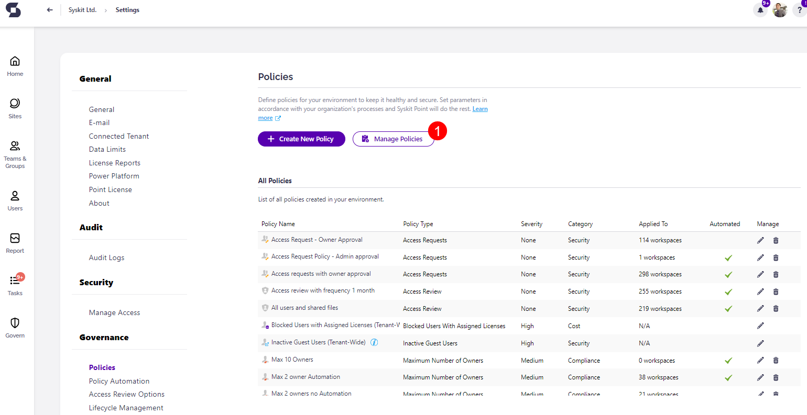
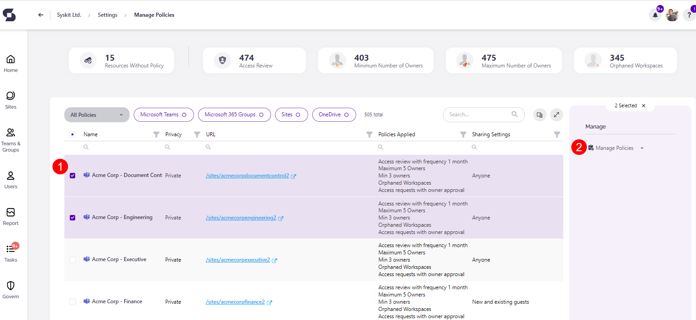
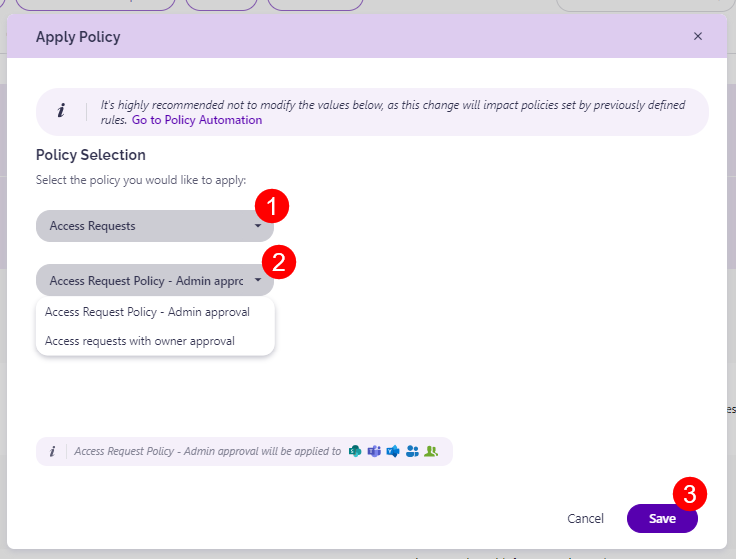
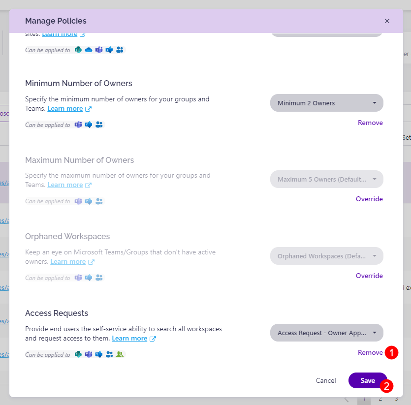
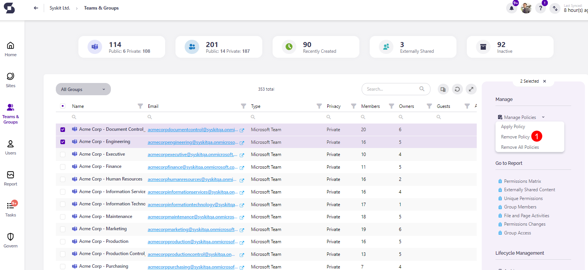
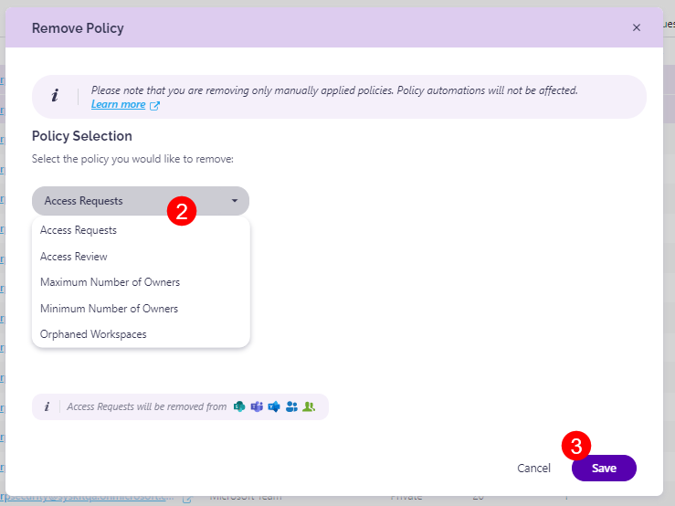
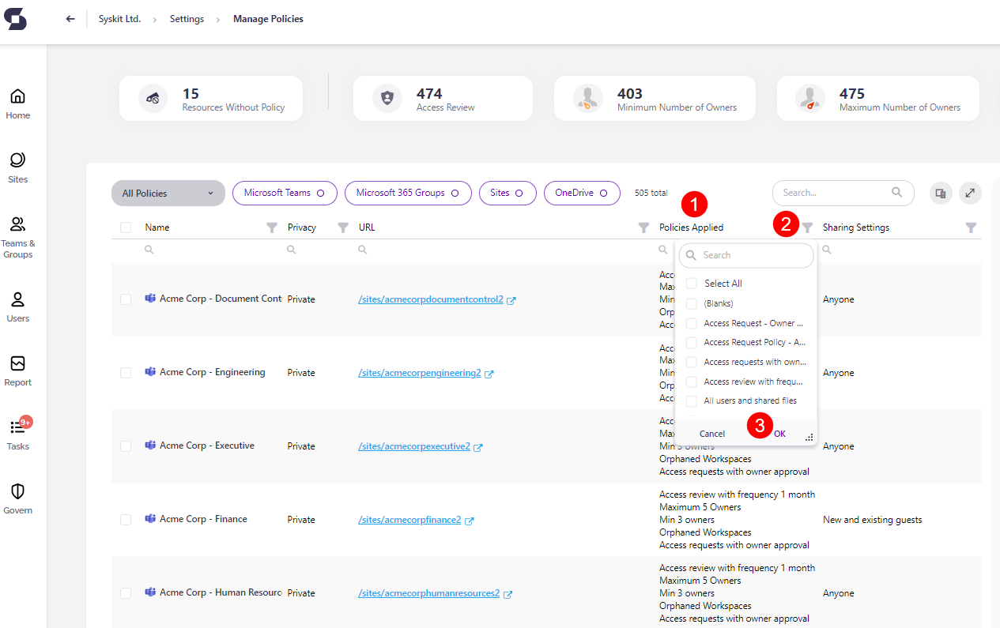

#  Apply Access Requests policy

When an Access Requests policy is created, in order to enforce it for specific workspaces, it needs to be manually applied. 

In the Settings for Syskit Point, go under Governance and select Policies.  

Click the **Manage Policies button (1)** to apply the policy. 


The Access Request policy is not automatically applied to workspaces, distribution lists, or security groups. You can either manually apply the policy to workspaces or set up [Rules](../automated-workflows/policy-automation.md) to apply your policies automatically. 


customer je shvatio da će policy biti automatski dodan na sve distribution liste i sec grupe
nasi docsi objasnjavaju kako applyati policy kroz settings, i manually apply, a tamo nema dist lista i sec grupa
treba malo razjasniti taj dio

TODO:
dodati please note da se access request policy ne applya automatski out of the box

## Applying the Policy to Workspaces

Select one or more workspaces that the Access Requests policy should be applied to by **clicking the checkbox (1)** on the left side of the screen.
  * Selecting one or more workspaces shows the **Manage Policies (2)** option on the right side of the screen under the Manage category
  * **Click Manage Policies (2)** 

  
A pop-up screen appears, prompting you to select the type of policy that should be applied to the selected workspaces.
* **Select Access Requests (1)** from the drop-down menu; this adds the option to select a specific policy
* **Select the policy (2)** that should be applied to the specific workspaces
  * This shows a text below explaining what aspects of the workspaces the Access Requests policy applies to
 * **Click Save (3)** once you are satisfied with your selection

 
  

## Remove Access Requests Policy from Workspaces

If you want to remove an Access Requests Policy that has been applied to a workspace, take the following steps:
  * **Select the workspace** 
  * **Click Manage Policies**; located on the right side of the screen under Manage
    * The Manage Policies pop-up screen will appear with a list of all policies that can be applied to a workspace
  * Under the Access Requests section, **click the Remove button (1)**; located under the drop-down menu for the specific policy
  * **Click Save (2)** to apply the change

 

This will remove the Access Requests policy that was assigned.


Instead of removing the policy, you can also select a different Access Requests policy to apply from the drop-down menu. 


If you want to remove an Access Requests Policy that has been applied to multiple workspaces, take the following steps:
  * **Select the workspaces** 
  * **Click the arrow next to Manage Policies**; located on the right side of the screen under Manage
  * This will open a selection of what actions can be done for the workspaces:
     * Apply Policy
     * Remove Policy
     * Remove All Policies
  * **Select Remove Policy (1)**
  * On the screen that appears, **select Access Requests (2)** from the drop-down menu
  * **Click Save (3)** when done; this will remove the Access Requests policy applied to the selected workspaces

## Filter workspaces with Access Requests Policies

For a quick search of which workspaces already have the Access Requests policy applied, complete the following:

  * On the Manage Policies screen, navigate to the column that lists **Policies Applied (1)**
  * From the **column chooser (2)** next to Policies Applied select the Access Requests policies and **click OK (3)**
    * Clicking OK will filter and show only the workspaces that have the Access Requests policy

