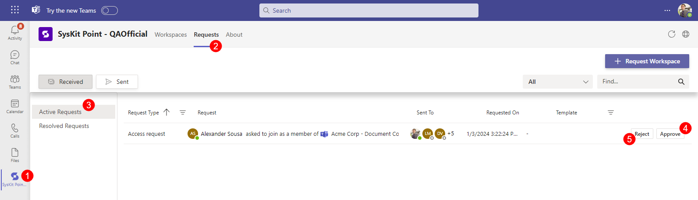
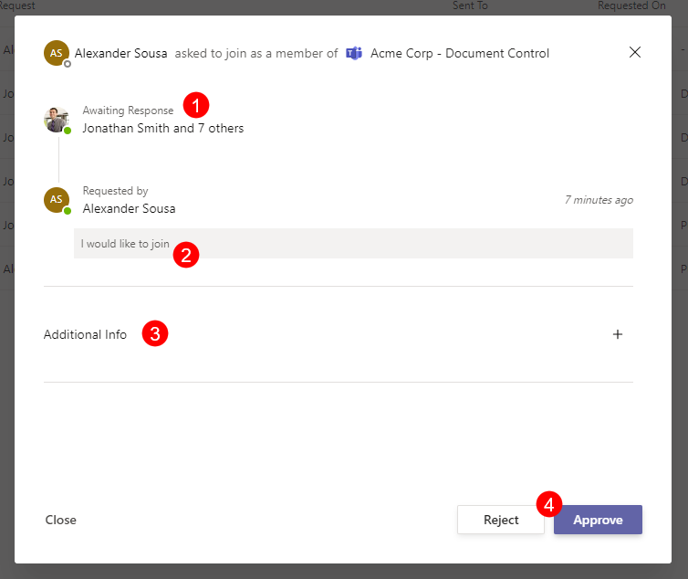

#  Access Requests Approval

After a user requests access to a workspace, it will need to be approved based on the approval process selected when creating the Access Requests policy.

This can be any of the following:
 * Manager approval
 * Manager and admin approval
 * Admin approval
 * Automatically Approve
 * Owner approval

Or it can be based on a new approval process that was created for the Access Requests policy. 

You can read more about this in the [Create Access Requests policy article](create-access-requests-policy.md).

## Approving Access Requests for Workspaces

To approve workspace Access Requests that you have received, complete the following steps:  
 * Open your **Microsoft Teams app** and navigate to the **Syskit Point Teams app (1)**
 * **Click the Requests section (2)**; there you can see **Active Requests and Resolved Requests**
* **Select Active Requests (3)** for any current workspace requests that need your approval
  * To approve the received request, **click the Approve button (4)** on the right side of the screen
  * To reject the received request, **click the Reject button (5)**

  
For more details on why the request was made, click on the request itself.

  * This opens a screen that shows **who the request can be approved by (1)**, and the **reason for wanting to join that  workspace (2)** as stated by the requester
  * You can also click on **Additional Information (3)** for more details about the workspace itself
    * Here, you will find the description, owners, members, group e-mail, and other information about the workspace for which access was requested
  * On this screen, you can also **Approve or Reject (4)** the request by clicking the buttons in the bottom right corner

