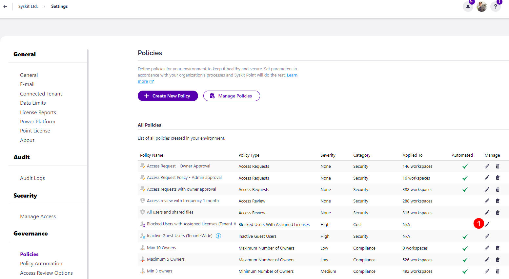
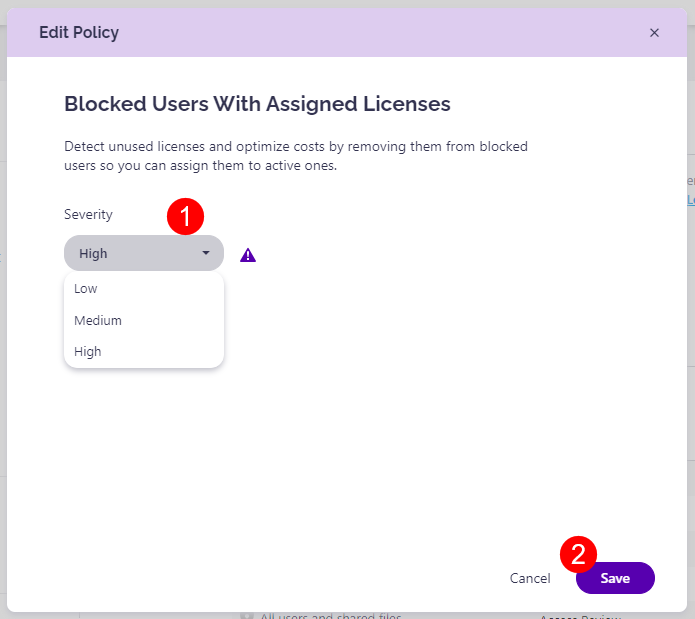

# Blocked Users with Assigned Licenses

Syskit Point provides a predefined **Blocked Users with Assigned Licenses policy** that is applied tenant-wide. This policy helps you detect unused licenses and optimize costs by removing them from blocked users. 

To edit the policy, navigate to the Policies settings screen and **click the Edit Policy (1)** icon.

The **Edit Policy** dialog opens where you can select the **Severity level (1)**.
  * The severity level set by default for this policy is **High**
  
You can select between three levels of severity: 

  * High
  * Medium
  * Low

Once you've selected the one that best suits your needs for this policy, **click the Save button (2)** to store your preference. 

