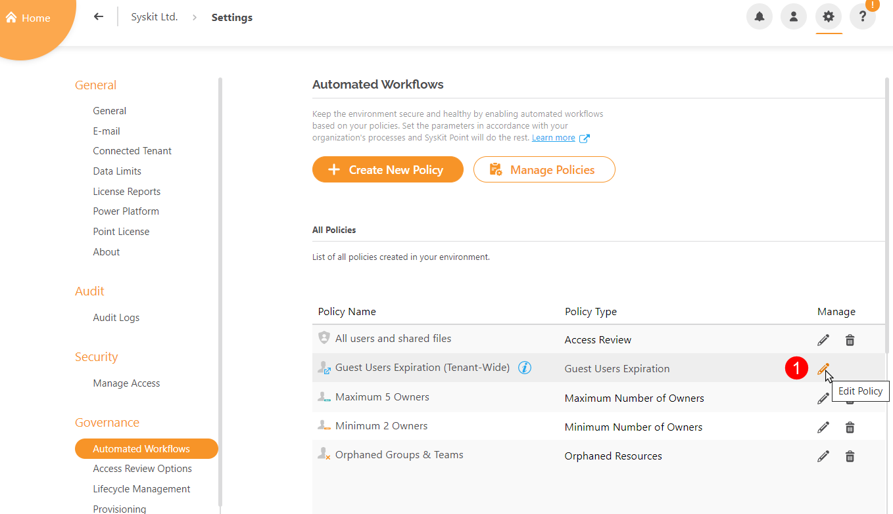
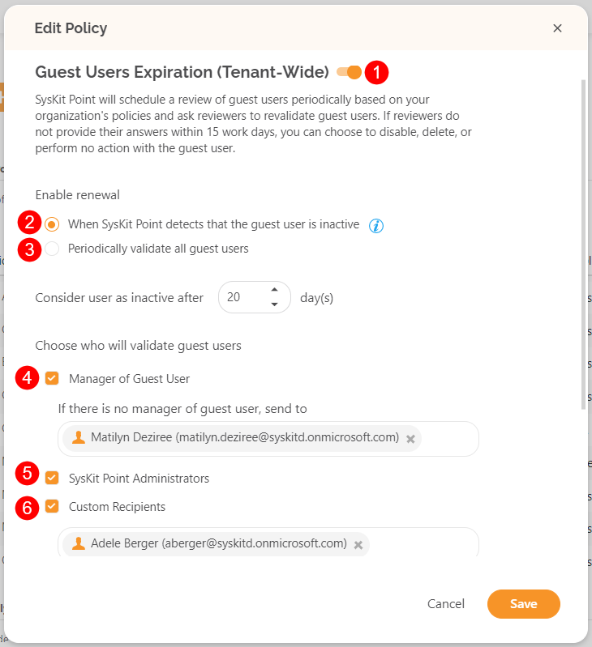
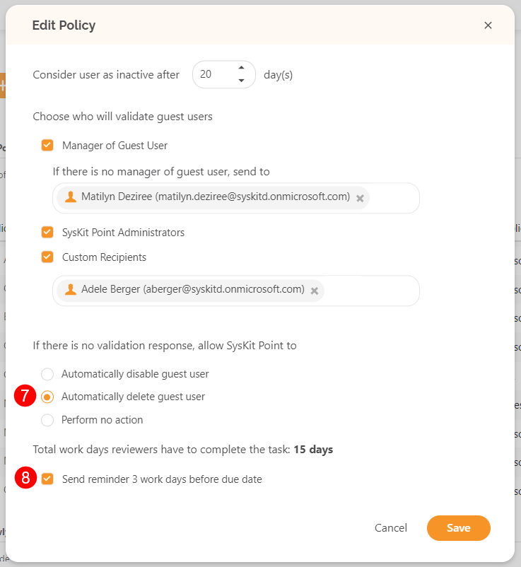

# Guest Users Expiration

SysKit Point provides a predefined **Guest Users Expiration policy** that is applied tenant-wide. 
To activate the policy, navigate to the Automated Workflows settings screen and **click the Edit Policy (1)** icon.

The **Edit Policy** dialog opens where you can:
* **Enable the policy (1)** by clicking the toggle next to the policy name; this policy is disabled by default.
* **Choose between two renewal options**:
    * **Require guest users renewal when SysKit Point detects that a guest user is inactive (2).**
      * When selected, you can **define the number of days after which a guest user is considered inactive** if no sign-ins are detected; this option is selected by default, and the number of days is set to 20.
    * **Validate all guest users periodically (3)**
      * When selected, you can configure how often the validation is required; this is set to 3 months by default
* **Select who will validate guest users:**
    * **Manager of Guest User (4)**; when the option is selected, **the person responsible for the validation, in case the Guest User does not have a defined manager, needs to be chosen**
    * **SysKit Point Administrators (5)**; this option is selected by defaut
    * **Custom Recipients (6)**; when selected, use the input field to select custom users that will be responsible for the validation of Guest Users
* **Enable SysKit Point to automatically delete Guest Users (7)** if there is no answer from the defined users; this option is disabled by default
* **Enable SysKit Point to send a reminder three workdays before the due date (8)**; this option is enabled by default

Click **Save** once you are done with the policy configuration.  

Based on your configuration, **SysKit Point will start the automated workflow periodically or when an inactive Guest User is detected**. 


**Please note!**
**You should have at least one user in your tenant with the Azure AD Premium P1 license assigned to detect sign-in times for guest users accurately.**


For details on how collaborators can [**resolve Guest User Expiration tasks** navigate to the following article](../../point-collaborators/resolve-governance-tasks/guest-user-expiration.md).