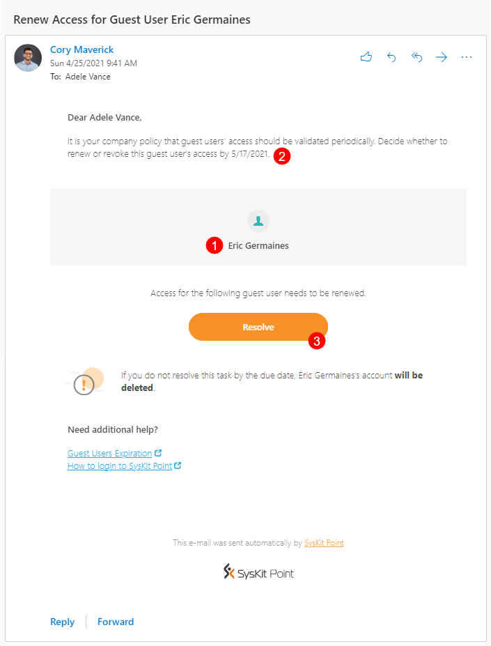
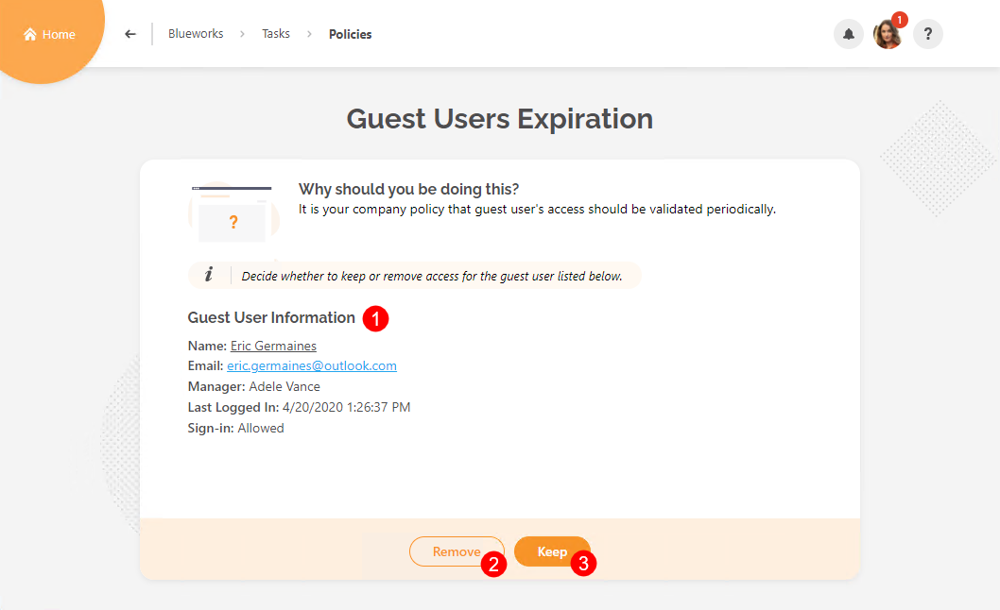
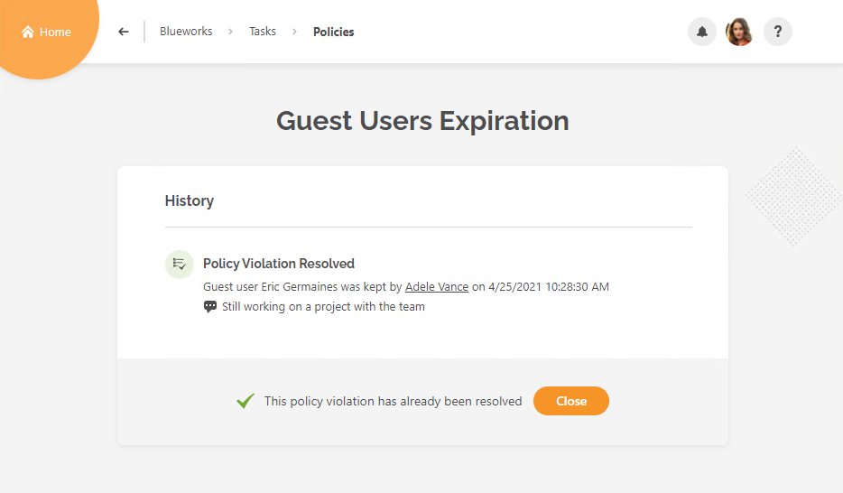
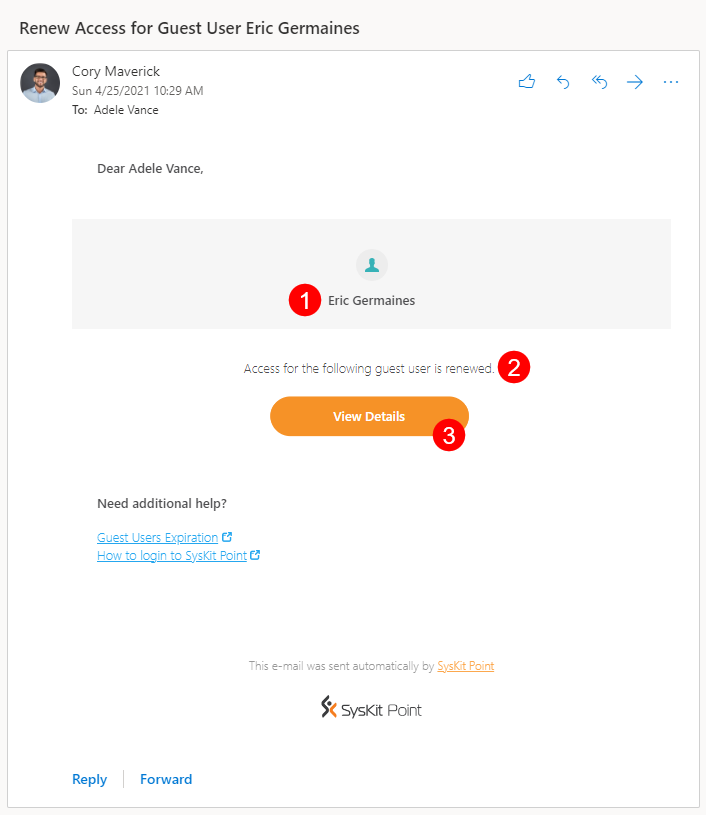

# Guest Users Expiration

**This article shows how you can resolve a Guest Users Expiration policy violation** triggered when Syskit Point detects that a guest user is inactive or if the renewal process is defined to be performed periodically. 


Syskit Point Administrators can [decide whether the guest user validation will be performed periodically or when Syskit Point detects that a guest user is inactive](set-up-automated-workflows.md). 


In both cases, Syskit Point will send you an e-mail to revalidate the guest user’s access.

## Guest User Access Renewal E-mail

Syskit Point sends an e-mail to guest users’ managers or other users defined in the Guest Users Expiration policy. 

You can find the following information in the e-mail:
* **Guest user whose access should be revalidated (1)**
* **Due date to resolve the task (2)**; you have 15 workdays to resolve the policy violation
* **Resolve button (3)** that takes you to Syskit Point, where you can resolve the policy violation

**Click the Resolve button to open the policy violation task** in Syskit Point.

## Guest Users Expiration Task

Along with the e-mail, Syskit Point creates a policy violation task that provides you with information and actions needed to resolve the policy violation. 
The following is available on the task screen:
* **Guest User Information (1)**; here, you can find **information about the guest user**, most importantly, the time they last signed into Microsoft 365
* **Remove button (2)**; when clicked, you need to enter a comment and confirm the action, which **results in the guest user being deleted in the Azure Active Directory**
* **Keep button (3)**; when clicked, you need to enter a comment and confirm the action, which **results in the guest user keeping the access**


**Please note!**
When keeping the guest user's access, the following is expected, depending on the policy settings:
* **If the guest user access is renewed periodically**, the **guest user keeps the access until the next renewal is triggered**; this happens **every 3 months by default** but can be configured by Syskit Point Admins
* **If the guest user access renewal is required when a guest user is detected to be inactive**, the **guest user keeps the access for the next 20 days by default**; Syskit Point Admins can configure this value as well


## Guest Users Task Resolved

**After you resolve the policy violation, the History screen opens**, giving you an overview of actions performed within the automated workflow.

**After you resolve the policy violation**, **you will also receive a confirmation e-mail** showing the following information:
* **Guest user whose access was revalidated (1)**
* **Result of the validation (2)**, showing if the access was renewed or removed
* **View Details button (3) that opens the History screen in Syskit Point**, showing all the information about actions performed in the automated workflow

