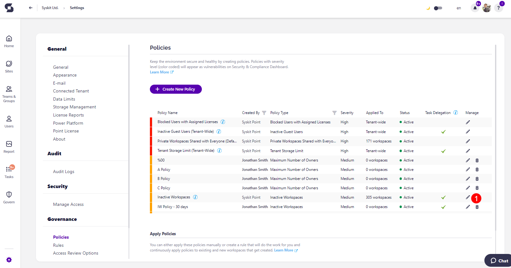
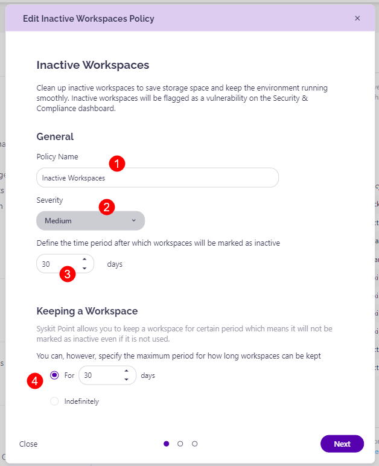
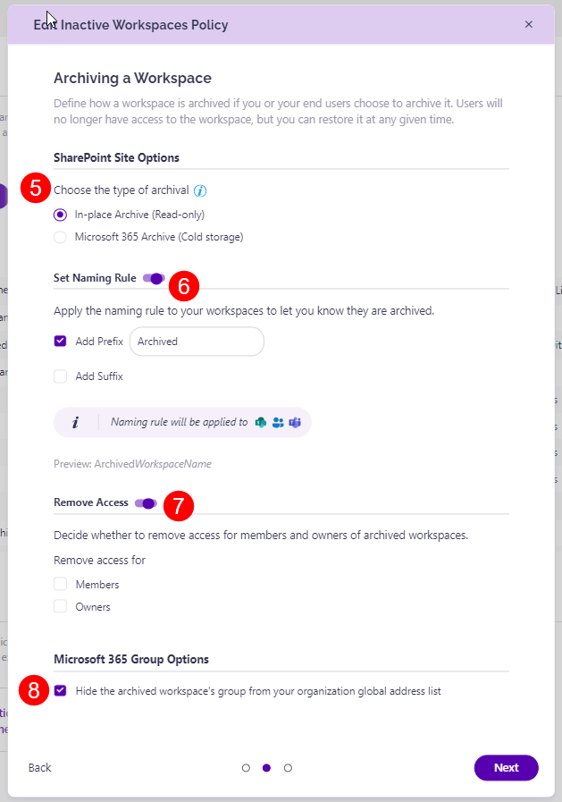
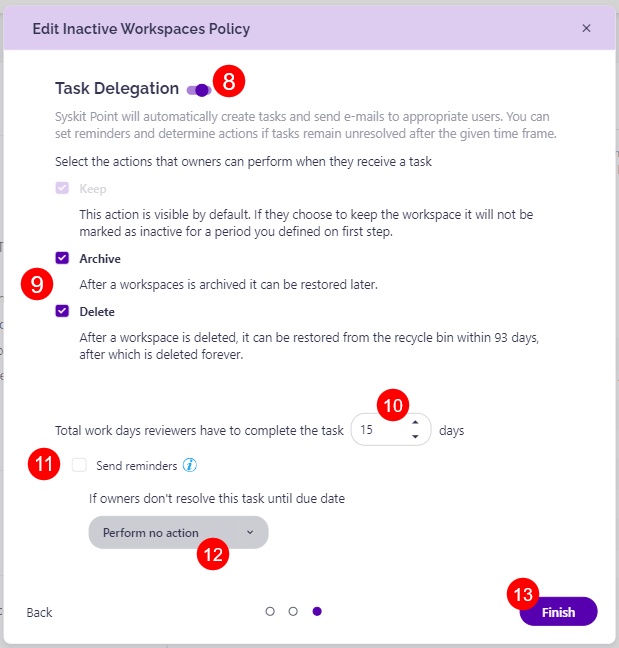

# Inactive Workspaces

Syskit Point provides a built-in **Inactive Workspaces policy** that is applied to all workspaces via the [default rule](../automated-workflows/policy-automation.md#default-rule). This policy helps you clean up **inactive workspaces to save storage space and keep your environment running smoothly**. Once an inactive workspace is detected, it is flagged as a vulnerability and can be found in the **Security & Compliance dashboard**. 

While the default Inactive Workspaces policy detects inactivity for all workspaces, you can also **create additional Inactive Workspace policies that are edited based on your preferences** and can only be applied to certain workspaces.

**Targeting certain types of workspaces (such as all groups or all sites)** or only specific workspaces can be accomplished by **creating a new rule** that reflects your needs and applies a policy based on defined conditions. [Take a look at the Rules article for details on how to create a rule.](../../governance-and-automation/automated-workflows/policy-automation.md)

Alternatively, **you can also manually apply the policy** to only select workspaces. 
 
To edit the policy, navigate to the Policies settings screen and **click the Edit Policy (1)** icon.

The **Edit Policy** dialog opens where you can:
* **Edit the policy name (1)**
* **Select the severity level (2)** for the policy
* **Select the time period (3)** after which the workspaces are marked as inactive
* **Select the time period (4)** for how long a workspace can be **Kept**
* **Choose the type of archival (5)**: 
  * In-Place Archival (Read-Only) - choosing this archives the site through Syskit Point and places it into a read-only state 
  * Microsoft 365 Archive (Cold storage) - choosing this archives the site through Microsoft 365 Archive and places it into a storage tier for archived sites
    * [Learn more about Microsoft 365 Archive in the designated section below.](#microsoft-365-archive).

* **Enable Set Naming Rule (6)** by clicking the toggle next to it
    * This lets you **apply the naming rule to your workspaces** to let you know they are archived
    * You can select to:
        * Add Prefix
        * Add Suffix
* **Enable Remove Access (7)** by clicking the toggle next to it
    * Selecting this removes access for members and owners of archived workspaces   
    * You can choose to remove access for:
        * Members
        * Owners
* **Select to hide the archived workspace's group (8)** from your organization's global address list
* **Enable Task Delegation (9)** by clicking the toggle next to it
    * **Select the actions that owners can perform when they receive a task (10)**:
        * **Keep**
            * This action is visible by default, and if the workspace is kept, it won't be marked as inactive for the period defined in the first step
        * **Archive**
            * If this action is selected and the workspace is archived, it can still be restored later
        * **Delete**
            * If this action is selected, and a workspace is deleted, it can be restored from the recycle bin within 93 days, after which it is deleted for good
    * **Enter the number of total work days reviewers have to complete the task (11)**:
        * **Click the checkbox if you want a reminder sent (12)** 3 work days before the due date 
        * **Select what Syskit Point should do if owners do not resolve this task until due date (13)**:
            * Perform no action
            * Automatically Archive
            * Automatically Delete
* Click **Finish (14)** once you are done with the policy configuration   

**Syskit Point will start the task delegation workflow based on your configuration when an inactive workspace is detected**. 

For details on how collaborators can [**resolve Inactive Workspaces tasks**, navigate to the following article](../../point-collaborators/resolve-governance-tasks/inactive-workspaces.md).


**Please note**, this policy can be applied to the following workspaces:
* **Microsoft Teams**
* **Microsoft 365 Group**
* **Yammer Group**
* **SharePoint Site**



## SharePoint Site Archival Options

With the introduction of the Microsoft 365 Archive option, there are some key differences you should keep in mind when choosing how to archive a workspace.

Here are a few things you should keep in mind when it comes to the archive feature both in Microsoft 365 and Syskit Point:

* **Microsoft 365 Archive** allows site-level archiving of SharePoint sites. When a site is archived, it is moved into a storage tier designated for archived sites, pausing active user access but retaining compliance settings.

* **Microsoft 365 Archive** [charges site reactivation at a per-GB rate](https://learn.microsoft.com/en-us/microsoft-365/archive/archive-pricing?view=o365-worldwide).

* When **a workspace is archived through the In-place method**, the workspace is put into a **read-only state**, access to the workspace is removed for members and/or owners, permission inheritance is restored on all objects, and all memberships on the workspace are removed in Microsoft 365 but saved in the Syskit Point database to support the restore action. 

* If a **SharePoint site has already been archived through the Microsoft 365 Archive** option, it is **not flagged** as an Inactive Workspace. 

* If an **Inactive Workspaces task was created and the site was then archived** through Microsoft 365 Archive, the **task is automatically resolved**. 

[To learn more about Microsoft 365 Archive and how to utilize it, take a look at their article](https://learn.microsoft.com/en-us/microsoft-365/archive/archive-overview?view=o365-worldwide).


## Detection for Inactive Workspaces

To decide whether something is inactive in your Microsoft 365 environment, we collect activity data for **SharePoint, Exchange, Yammer, and Microsoft Teams**. If any type of activity is detected, the workspace will not be declared inactive. The amount of time that needs to pass for a workspace to be considered inactive is determined by administrators when creating or editing the Inactive Workspaces policy. 

The following type of activity is checked to determine if a workspace is inactive:

* **SharePoint activity** - collected via Microsoft 365 audit logs. **The last activity is based on the latest date when a file was viewed, edited, or downloaded**.
* **Exchange activity** - collected via Microsoft 365 Groups activity report available in the Microsoft 365 admin center. **The last activity is based on the latest date when an email was delivered to a group**.
* **Yammer activity** - the collection is also accomplished through the Microsoft 365 admin center usage report for Yammer groups activity. **The last activity is based on the latest date a message was read, posted, or liked by the group**.
* **Microsoft Teams** - activity is collected using protected APIs in Microsoft Graph. **The last activity is based on the latest date when a message was posted or replied to**.
* **Planner** - detected via Microsoft 365 Audit Logs Planner activity. **The last activity is based on the latest date when a plan within the workspace was created, deleted, modified, read, or shared.** 

When using the Inactive Workspaces policy in Syskit Point, keep the following in mind:
 
* **Vulnerabilities are NOT raised for the first 10 days** after Syskit Point is first connected to your tenant.
* **Only Alive workspaces are checked** (Archived and Deleted workspaces are ignored)
* **Vulnerabilities are NOT raised for sites that have not been fully synced** (discovered by Autodiscover but not synced by Site sync) 
* **Audit logs collection needs to be working** without any issues 
* **Vulnerabilities are NOT raised for recently created sites**


**Please note!**  
Activity is being monitored from the Syskit Point deployment onward! This applies to SharePoint and Exchange workloads since historical data for these workloads is unavailable in usage reports.


## Microsoft 365 Archive

Microsoft 365 Archive is a built-in feature that allows organizations to move inactive SharePoint sites into cold storage, reducing storage costs while retaining access when needed. This feature is managed directly through Microsoft 365 and has to be **enabled in the Microsoft 365 Admin Center** before it can be used.

[To learn more about how to enable and manage Microsoft 365 Archive, take a look at their official documentation.](https://learn.microsoft.com/en-us/microsoft-365/archive/archive-overview?view=o365-worldwide)


**Please note!**  
* During the free restoration period, both collaborators and admins can restore a Microsoft 365 archived site
* If a cold storage site is restored after the free period expires, the restoration can only be completed by the admins, and you are charged at a per GB rate by Microsoft 365



## Relevant Articles

* [**Security and Compliance Checks: Inactive Workspaces**](../security-compliance-checks/inactive-workspaces.md)
* [**Resolve Inactive Workspace Tasks**](../../point-collaborators/resolve-governance-tasks/inactive-workspaces.md)