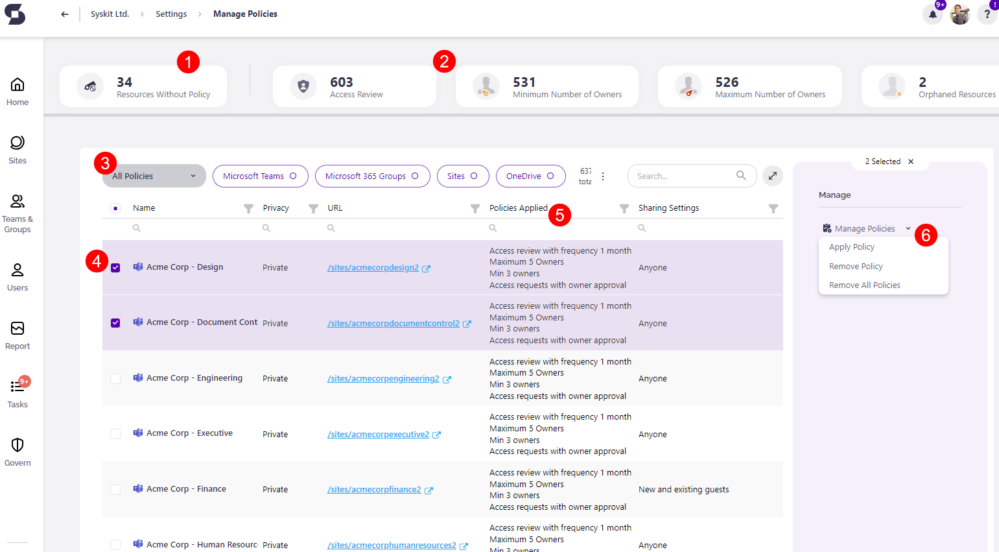

# Creating a Policy
To create a new policy, navigate to the Policies settings screen, and click the **Create New Policy (1)** button.

The **Create New Policy** dialog opens, where you can select the type of policy to create.
You can choose from the following:
* **Access Review**
* **Minimum Number of Owners**
* **Maximum Number of Owners**
* **Orphaned Workspaces**
* [**Access Requests**](../../governance-and-automation/access-requests/README.md)
  * For more details on access requests in Syskit Point take a look at the [Access Requests section](../../governance-and-automation/access-requests/README.md).

**After you select the policy type**, you will be able to **define all policy settings**, described in more detail in the previously linked individual articles. 

[You can also find more information on Access Review policies in the following article.](../permissions-review/enable-permissions-review.md)

## Manage Policies

**When the policies are defined**, the last thing left to do is to **apply them to Microsoft Teams, Microsoft 365 Groups, OneDrive, and Sites**. 

To do so, navigate to the Automated Workflows settings screen, and click the **Manage Policies (1)** button.

The Manage Policies screen opens where you can:
* **Find resources that don't have any policies applied (1)**; when the tile is clicked, the report only displays resources that have no policies applied
* **Find the number of resources that have a specific policy type applied (2)**; when a tile is clicked, the report only displays resources with the selected policy applied
* **Filter the report per policy or resource type (3)**
* **Select one or multiple resources (4)**
* **View all policies applied on a specific resource (6)**
* **Click the Manage Policies button (6)**; if multiple resources are selected, clicking the arrow next to Manage Policies provides the options to choose between:
   * **Apply Policy**
   * **Remove Policy**
   * **Remove All Policies** 

After clicking the **Manage Policies (6)** button, the **Manage Policy** dialog opens, where you can **select a policy** and **apply** the chosen policy on the selected resources grouped by the policy type.


**Once a policy is applied, Syskit Point automates detection for a policy violation**. 


You can find an article on how to create or edit each policy used for Automated Workflows here:
* [**Minimum Number of Owners**](minimum-number-of-owners-admin.md)
* [**Maximum Number of Owners**](maximum-number-of-owners-admin.md)
* [**Orphaned Workspaces**](orphaned-resources-admin.md)
* [**Guest Users Expiration**](guest-users-expiration-admin.md)
