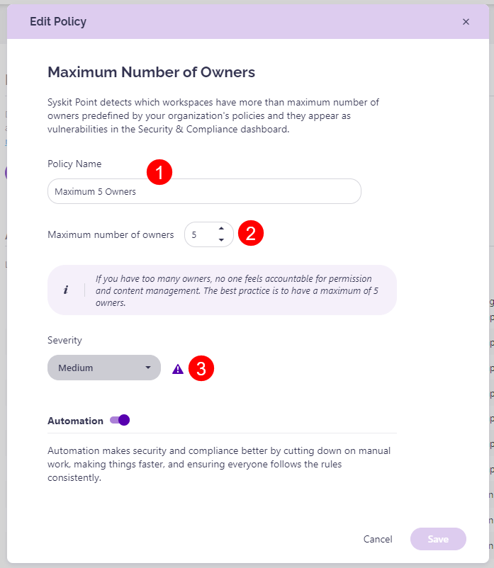

# Maximum Number of Owners

A predefined policy - set as **Maximum 5 Owners** - is located on the Automated Workflows screen. 

Click the **Edit (1)** icon to view all defined options for the policy. 

The **Edit Policy** dialog opens where you can:
* **Define the policy name (1)**
* **Define the maximum number of allowed owners (2)**; this is set to 5 by default
* **Choose the severity level (3)**; this option is enabled by default
* Select your **automation preferences** and click the checkbox to:
  * **Send task to existing owners (4)**, if a policy violation is detected; this option is enabled by default
  * **Send reminder to reviewers (5)** 3 work days before due date; this option is enabled by default
  * **Choose what to do if owners don't resolve the policy violation until the due date (6)**. The following options are available:
    * **Reassign Task**; when selected, you can define who will get the task - **Manager of the Reviewer**, **Syskit Point Administrators**, or **custom recipients**; this option is selected by default, and the tasks are reassigned to Manager of Reviewer
    * **Automatically Remove Owners**; if selected, **Syskit Point will remove existing owners starting from users with the oldest sign-in date** until the defined maximum number of owners is reached to comply with the policy
* Click **Save (7)** once you are done with the policy configuration.  

For details on how collaborators can [**resolve Maximum Number of Owners policy violation tasks**, navigate to the following article](../../point-collaborators/resolve-governance-tasks/maximum-number-of-owners.md).