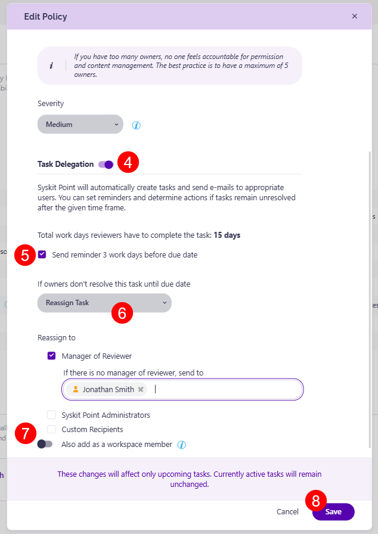

# Maximum Number of Owners

Syskit Point detects workspaces with too many owners, which can lead to diffusion of responsibility.


**Please note!** 
The default Maximum 5 Owners policy now also applies to SharePoint Sites. 
You can expect to see the changes after the next AutoDiscover sync following the upgrade to the latest Point version.
Custom Maximum Number of Owners policies created by Syskit Point admins can also be applied to SharePoint sites using Rules or manually.



The following users are counted as Owners in Syskit Point:
* **Microsoft 365 Group Owners** for Microsoft 365 Groups & Microsoft Teams workspaces.
* **Members** of the **SharePoint sites' default Owners SharePoint Group** for **SharePoint Site** workspaces.


A predefined policy - set as **Maximum 5 Owners** - is located on the Policies screen. This policy applies to **Microsoft Teams, Microsoft Groups, and SharePoint Sites**.

By default, task delegation is turned off for this policy. However, workspaces with too many owners **are still detected** and shown on the [**Security & Compliance Dashboard**](../security-compliance-checks/workspaces-too-many-owners.md). **This means that Syskit Point detects a vulnerability on a workspace** based on the applied policy, but it does not create tasks or send any emails to workspace owners. 

Click the **Edit (1)** icon to view all defined options for the policy. 

The **Edit Policy** dialog opens where you can:
* **Define the policy name (1)**
* **Define the maximum number of allowed owners (2)**; this is set to 5 by default
* **Choose the severity level (3)**; this option is enabled by default
* **Enable Task Delegation (4)** by clicking the toggle next to it and selecting your task delegation preferences:
  * **Send reminder to reviewers (5)** 3 work days before due date; this option is enabled by default
  * **Choose what to do if owners don't resolve the policy vulnerability until the due date (6)**. The following options are available:
    * **Reassign Task**; when selected, you can define who will get the task - **Manager of the Reviewer**, **Syskit Point Administrators**, or **custom recipients**; this option is selected by default, and the tasks are reassigned to Manager of Reviewer
      * You can **click the Also add as a workspace member toggle (7)** there if you want to add this user as a workspace member; selecting this adds the selected user(s) as members to the workspace(s) with the policy assigned in case they are not already members
        * This option is useful for situations where the reviewer's manager does not have access to the workspace; by providing membership access, the manager can gather more information on the workspace and make an informed decision on the best way to resolve the vulnerability. 
    * **Automatically Remove Owners**; if selected, **Syskit Point will remove existing owners starting from users with the oldest sign-in date** until the defined maximum number of owners is reached to comply with the policy
* Click **Save (7)** once you are done with the policy configuration.  

For details on how collaborators can [**resolve Maximum Number of Owners policy vulnerability tasks**, navigate to the following article](../../point-collaborators/resolve-governance-tasks/maximum-number-of-owners.md).


**Please note**, this policy can be applied to the following workspaces:
* **Microsoft Teams**
* **Microsoft 365 Group**
* **Viva Engage Community**
* **SharePoint Site**

