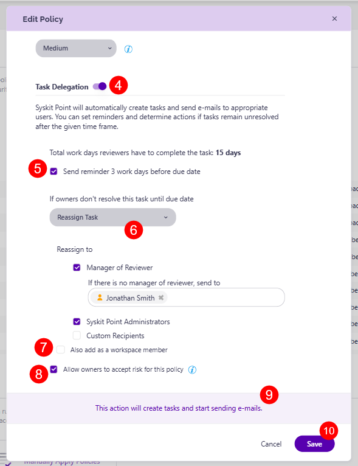

# Minimum Number of Owners

Syskit Point detects workspaces that don't have enough owners, which can make your workspaces less secure and difficult to manage.


**Please note:** This policy now also applies to SharePoint Sites after the next AutoDiscover sync. 

When it comes to detecting owners for workspaces, the following applies:
* **Owners of Microsoft 365 Groups & Microsoft Teams** are counted as **Group Owner**.
- **Owners of SharePoint Sites** are counted as **users** that are a **member** of the **sites' default Owners SharePoint Group**.


 
The Policies screen contains a predefined policy - **Minimum 2 Owners**. 

By default, task delegation is turned off for this policy, but workspaces with not enough owners **are still detected** and shown on the [**Security and Compliance Dashboard**](../security-compliance-checks/workspaces-not-enough-owners.md). **This means that Syskit Point detects a vulnerability on a workspace** based on the applied policy, but it does not create tasks or send any emails to workspace owners. 

Click the **Edit (1)** icon to view the policy's defined options.

The **Edit Policy** dialog opens where you can:

* **Define the policy name (1)**
* **Define the minimum number of required owners (2)**; this is set to 2 by default
* **Choose the severity level (3)**; this option is enabled by default

* **Enable Task Delegation (4)** by clicking the toggle next to it and selecting your task delegation preferences:  
  * **Send reminder to reviewers (5)** 3 work days before due date; this option is enabled by default  
  * **Choose what to do if owners don't resolve the policy vulnerability until the due date (6)**. The following options are available:   
    * **Perform no Action**; task remains active, and owners can continue to resolve them
    * **Reassign Task**; when selected, you can define who will get the task - **Manager of the Reviewer**, **Syskit Point Administrators**, or **custom recipients**; this option is selected by default, and the tasks are reassigned to Manager of Reviewer; you must define a fallback user in case there is no manager of the reviewer   
      * You can **click the Also add as a workspace member toggle (7)** there if you want to add this user as a workspace member; selecting this adds the selected user(s) as members to the workspace(s) with the policy assigned in case they are not already members
        * This option is useful for situations where the reviewer's manager does not have access to the workspace; by providing membership access, the manager can gather more information on the workspace and make an informed decision on the best way to resolve the vulnerability. 
    * **Automatically Archive**; if selected, **Syskit Point will archive all workspaces (Microsoft Teams, Microsoft Groups, or SharePoint Sites)** where owners don't resolve the task within 15 workdays
    * **Automatically Delete**; if selected, **Syskit Point will delete workspaxes** where owners don't resolve the task within 15 workdays
  * **A message (8)** is displayed within the dialog in case you enable the Task Delegation option; Syskit Point will create tasks and send emails to owners the next time the underlying daily Policy Monitor job runs
* Click **Save (9)** once you complete the policy configuration.


**Please note:** By default, the Minimum Number of Owners Orphaned policy vulnerability is detected when less than 2 active owners are assigned to a workspace (Microsoft Teams, Microsoft Groups, or SharePoint Sites). If there are no active owners assigned to a workspace, the [Orphaned Workspaces](orphaned-resources-admin.md) vulnerability is detected instead.

If 1 owner is assigned to a workspace when resolving the Orphaned Workspaces vulnerability, Syskit Point will detect the Minimum Number of Owners vulnerability.


For details on how collaborators can [**resolve Minimum Number of Owners policy vulnerability tasks**, navigate to the following article](../../point-collaborators/resolve-governance-tasks/minimum-number-of-owners.md).
