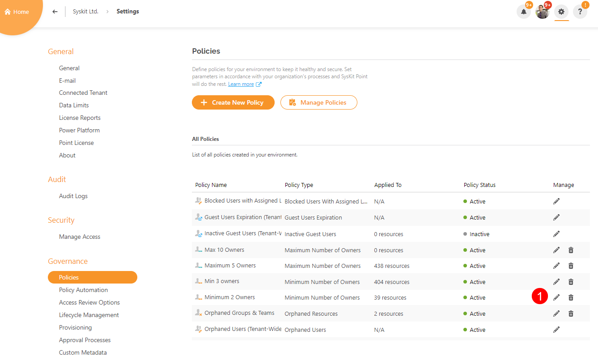
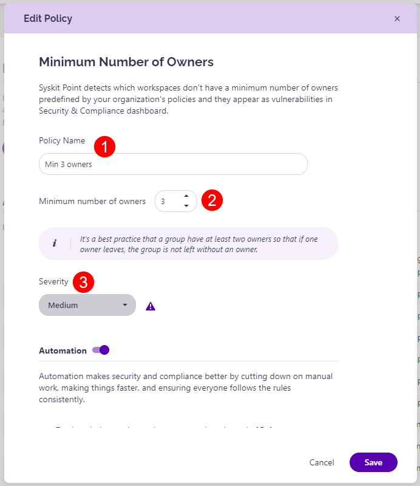

# Minimum Number of Owners

A predefined policy - **Minimum 2 Owners** - is located on the Automated Workflows screen. 
Click the **Edit (1)** icon to view all defined options for the policy. 

The **Edit Policy** dialog opens where you can:
* **Enable or disable the policy (1)**; by default, this policy is enabled but not applied to any resources
* **Define the policy name (2)**
* **Define the minimum number of required owners (3)**; this is set to 2 by default
* **Select whether SysKit Point will send a reminder three workdays before the due date (4)**; this option is enabled by default
* **Decide what to do if owners don't resolve the policy violation until the due date**. The following options are available:
    * **Reassign Task (5)**; when selected, you can define who will get the task - **Manager of the Reviewer**, **SysKit Point Administrators**, or **custom recipients**; this option is selected by default, and the tasks reassigned to Manager of Reviewer
    * **Automatically Archive (6)**; if selected, **SysKit Point will automatically archive the team/group** that has fewer owners than defined in the policy settings
    * **Automatically Delete (7)**; if selected, **SysKit Point will automatically delete the team/group** that has fewer owners than defined in the policy settings

Click **Save (8)** once you are done with the policy configuration.  

For details on how collaborators can [**resolve Minimum Number of Owners policy violation tasks**, navigate to the following article](../../point-collaborators/resolve-governance-tasks/maximum-number-of-owners.md).